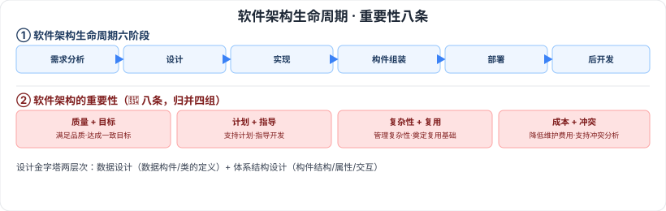

# 7.1 软件架构概念

> 来源：网络取材（主线索 lcp0578/book-note 仓库，见 CLAUDE.md「网络取材来源」）· 对应《系统架构设计师教程（第二版）》第 7 章 · 第 1 节
>
> ⚠️ **本节分级未经本次会话检索验证**（WebSearch 额度耗尽，见第 6 章说明）。软件架构是本科目最核心的主题之一，按通用软考常识定级；内容严格取自网络取材主线索原文。

---

## 7.1.1 软件架构的定义

🟡 软件体系结构设计通常考虑设计金字塔中的两个层次：

- **数据设计**：体现传统系统中体系结构的数据构件和面向对象系统中类的定义（封装了属性和操作）
- **体系结构设计**：主要关注软件构件的结构、属性和交互作用

---

## 7.1.2 软件架构设计与生命周期

🟡 六阶段：**需求分析阶段 → 设计阶段 → 实现阶段 → 构件组装阶段 → 部署阶段 → 后开发阶段**。

---

## 7.1.3 软件架构的重要性 🔴

🔴 软件架构设计是**降低成本、改进质量、按时和按需交付产品**的关键因素。八条具体体现：

1. 架构设计能够满足系统的品质
2. 结构设计使受益人达成一致的目标
3. 架构设计能够支持计划编制过程
4. 架构设计对系统开发的指导性
5. 架构设计能够有效地管理复杂性
6. 架构设计为复用奠定了基础
7. 架构设计能够降低维护费用
8. 架构设计能够支持冲突分析

---

## 记忆钩子

- 生命周期六阶段是常规软件开发流程 + "架构专属"的构件组装阶段：需求 → 设计 → 实现 → **构件组装**（架构特有）→ 部署 → 后开发。
- 重要性八条可以归并成四组记："**质量+目标**"（满足品质、达成一致目标）、"**计划+指导**"（支持计划编制、指导开发）、"**复杂性+复用**"（管理复杂性、奠定复用基础）、"**成本+冲突**"（降低维护费用、支持冲突分析）。

## 关键词

`软件架构` `数据设计` `体系结构设计` `软件架构生命周期` `构件组装` `架构重要性`
