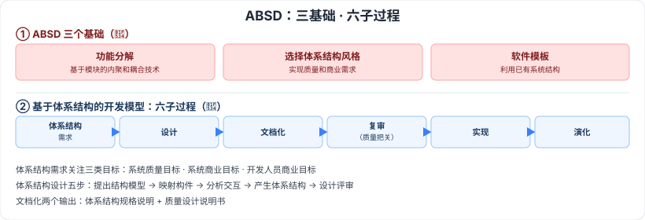

# 7.2 基于架构的软件开发方法（ABSD）

> 来源：网络取材（主线索 lcp0578/book-note 仓库，见 CLAUDE.md「网络取材来源」）· 对应《系统架构设计师教程（第二版）》第 7 章 · 第 2 节
>
> ⚠️ **本节分级未经本次会话检索验证**（WebSearch 额度耗尽）。ABSD 是软件架构设计方法论的核心内容，按通用软考常识定级；内容严格取自网络取材主线索原文。

---

## 7.2.1 体系结构的设计方法概述

🔴 **ABSD（Architecture-Based Software Design）**方法是由体系结构驱动的，即由构成体系结构的**商业、质量和功能需求**的组合驱动。

### ABSD 三个基础 🔴

1. **功能的分解**：使用已有的基于模块的**内聚和耦合**技术
2. **通过选择体系结构风格来实现质量和商业需求**
3. **软件模板的使用**：利用一些软件系统的结构

🟡 ABSD 方法是**递归的**，且迭代的每一个步骤都是清晰定义的。

---

## 7.2.2 概念与术语

🟡 三组核心概念：**设计元素、视角与视图、用例和质量场景**（原始材料未展开各自定义）。

---

## 7.2.3 基于体系结构的开发模型 🔴

六个子过程：**体系结构需求 → 设计 → 文档化 → 复审 → 实现 → 演化**。

---

## 7.2.4 体系结构需求

🟡 需求：用户对目标软件系统在**功能、行为、性能、设计约束**等方面的期望。

**需求获取**关注三类目标：系统的质量目标、系统的商业目标、系统开发人员的商业目标。

流程：需求获取 → 标识构件 → 架构需求评审。

---

## 7.2.5 体系结构设计

🟡 五个步骤：

1. 提出软件系统结构模型
2. 把已标识的构件映射到软件体系结构中
3. 分析构件之间的相互作用
4. 产生软件体系结构
5. 设计评审

---

## 7.2.6 体系结构文档化

🟡 主要输出两个文档：**体系结构规格说明**、**测试体系结构需求的质量设计说明书**。

---

## 7.2.7 体系结构复审

🟡 目的：标识潜在风险，及早发现体系结构设计中的缺陷和错误，包括：体系结构能否满足需求、质量需求是否在设计中体现、层次是否清晰、构件划分是否合理、文档表达是否明确、构件设计能否满足功能与性能要求等。

---

## 7.2.8 体系结构实现

🟢 体系结构实现过程（原始材料仅有流程图引用，无文字展开）。

---

## 7.2.9 体系结构的演化

🟢 体系结构演化过程（原始材料仅有流程图引用，无文字展开）。

---

## 记忆钩子

- ABSD 三基础记"分-选-用"：功能**分**解、**选**体系结构风格、**用**软件模板。
- 六子过程是一条闭环：**需求 → 设计 → 文档化 → 复审 → 实现 → 演化**，"复审"卡在设计和实现之间，是质量把关的关键节点。

## 关键词

`ABSD` `基于体系结构的软件设计` `内聚耦合` `体系结构风格` `软件模板` `设计元素` `视角与视图` `质量场景` `体系结构需求` `体系结构文档化` `体系结构复审` `体系结构演化`
