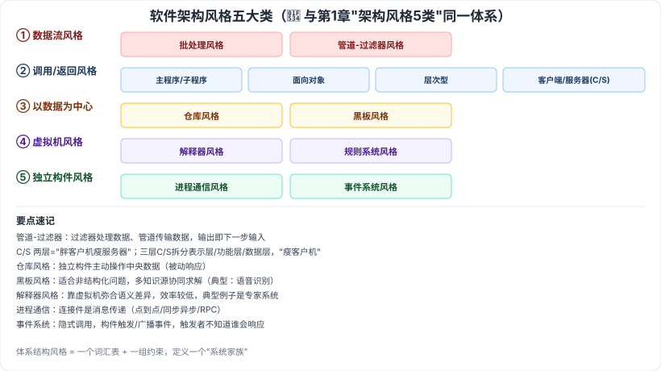

# 7.3 软件架构风格

> 来源：网络取材（主线索 lcp0578/book-note 仓库，见 CLAUDE.md「网络取材来源」）· 对应《系统架构设计师教程（第二版）》第 7 章 · 第 3 节
>
> ⚠️ **本节分级未经本次会话检索验证**（WebSearch 额度耗尽）。软件架构风格五大类与第 1 章 1.1 提到的"架构风格 5 类：数据流、调用返回、独立组件、虚拟机、仓库"是**同一套分类体系**（参见 [[1.1-系统架构概述]]，该处已确认 🔴），本节是其完整展开，按同等重要性定 🔴；内容严格取自网络取材主线索原文。
>
> ⚠️ 原始材料编号有误：源文件中"调用/返回体系结构风格"与"以数据为中心的体系结构风格"都标注为 7.3.4（重复编号，疑似原仓库笔误），本总结已按逻辑顺序重新编号为 7.3.3 / 7.3.4，供参考。

---

## 7.3.1 软件架构风格概述

🟡 软件体系结构风格是描述某一特定应用领域中系统组织方式的**惯用模式**。体系结构风格定义一个**系统家族**，即一个体系结构定义一个**词汇表**和**一组约束**。

---

## 7.3.2 数据流体系结构风格 🔴

| 风格 | 要点 |
| --- | --- |
| 🔴 批处理风格 | 每个处理步骤是一个单独的程序，每一步必须在前一步结束后才能开始，数据必须完整、以整体方式传递 |
| 🔴 管道-过滤器风格 | 系统分解为几个序贯处理步骤（**过滤器**实现），步骤间通过**数据流（管道）**连接，一个步骤的输出是另一个步骤的输入；过滤器从管道读取输入、内部处理后产生输出并写入管道 |

---

## 7.3.3 调用/返回体系结构风格 🔴（原文编号 7.3.4，已订正）

| 风格 | 要点 |
| --- | --- |
| 🔴 主程序/子程序风格 | 单线程控制，问题划分为若干处理步骤，构件即主程序和子程序；子程序合称模块，**过程调用作为连接件**；调用关系具有层次性，子程序正确性取决于它调用的子程序的正确性 |
| 🔴 面向对象风格 | 建立在数据抽象和面向对象基础上，数据表示方法及相应操作封装在抽象数据类型或对象中；构件是对象（抽象数据类型的实例） |
| 🔴 层次型风格 | 层次系统组成层次结构，每层为上层提供服务、作为下层的客户；每层最多只影响两层，相邻层接口相同则允许不同实现方法，为软件重用提供支持 |
| 🔴 客户端/服务器风格 | 两层 C/S：数据库服务器 + 客户应用程序 + 网络（服务器管数据、客户机管交互，称"**胖客户机，瘦服务器**"）；三层 C/S：增加应用服务器，应用逻辑驻留应用服务器，客户机只有表示层（称"**瘦客户机**"），分**表示层、功能层、数据层**三层，逻辑上独立 |

---

## 7.3.4 以数据为中心的体系结构风格 🔴（原文编号 7.3.4，与上节重号，已订正）

| 风格 | 要点 |
| --- | --- |
| 🔴 仓库风格 | 两种构件：**中央数据结构**（说明当前数据状态）+ **一组独立构件**（对中央数据进行操作），仓库与独立构件间的相互作用在系统中变化很大 |
| 🔴 黑板风格 | 适用于解决复杂的**非结构化**问题，能在求解过程中综合运用多种不同知识源；可通过选取黑板/知识源/控制模块构件设计，或用预定制的黑板体系结构编程环境；传统应用于**信号处理领域**（语音识别、模式识别），另一应用是松耦合代理数据共享存取 |

---

## 7.3.5 虚拟机体系结构风格 🔴

| 风格 | 要点 |
| --- | --- |
| 🔴 解释器风格 | 软件中含一个虚拟机，可仿真硬件执行过程和关键应用；用来建立虚拟机以弥合程序语义与硬件语义的差异；**缺点是执行效率较低**；典型例子是**专家系统** |
| 🟡 规则系统风格 | 基于规则的系统包括：规则集、规则解释器、规则/数据选择器、工作内存 |

---

## 7.3.6 独立构件体系结构风格 🔴

| 风格 | 要点 |
| --- | --- |
| 🔴 进程通信风格 | 构件是独立的过程，连接件是**消息传递**；构件通常是命名过程，消息传递方式可以是点到点、异步/同步、远程过程调用等 |
| 🔴 事件系统风格 | 基于事件的**隐式调用**：构件不直接调用一个过程，而是触发或广播一个或多个事件；事件触发者并不知道哪些构件会被影响，因此不能假定构件处理顺序，甚至不知道哪些过程会被调用；许多隐式调用系统也包含显式调用作为补充 |

---

## 记忆钩子

- 五大类风格按"数据怎么流动/组件怎么协作"分类记：**数据流**（一步步传递，如流水线）、**调用返回**（谁调用谁，层层嵌套）、**以数据为中心**（大家围着一个中央数据转）、**虚拟机**（模拟一层新的"机器"）、**独立构件**（各干各的，靠消息/事件联系）。
- C/S 两层 vs 三层记"胖瘦"：两层是"**胖客户机瘦服务器**"（客户机干活多），三层是"**瘦客户机**"（客户机只剩表示层，逻辑都在应用服务器）。
- 黑板风格 vs 仓库风格都"以数据为中心"，区别在于：**仓库**是被动的（构件主动来操作数据），**黑板**是主动触发的（数据变化会触发相关知识源介入，适合非结构化问题）。
- 解释器风格的核心代价是"多一层翻译就多一层开销"——典型例子专家系统，用虚拟机弥合语义差异，但执行效率较低。

## 关键词

`软件架构风格` `批处理风格` `管道-过滤器` `主程序子程序` `面向对象风格` `层次型风格` `客户端服务器` `胖客户机瘦服务器` `仓库风格` `黑板风格` `解释器风格` `规则系统` `进程通信风格` `事件系统风格` `隐式调用`
