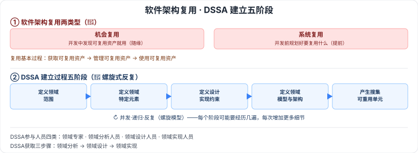

# 7.4 软件架构复用 · 7.5 特定领域软件体系结构（DSSA）

> 来源：网络取材（主线索 lcp0578/book-note 仓库，见 CLAUDE.md「网络取材来源」）· 对应《系统架构设计师教程（第二版）》第 7 章 · 第 4–5 节（本章最后两节）
>
> ⚠️ **本节分级未经本次会话检索验证**（WebSearch 额度耗尽）。DSSA 是软考常见概念题，按通用软考常识定级；内容严格取自网络取材主线索原文。

---

## 7.4 软件架构复用

### 7.4.1 定义及分类 🔴

软件架构复用分两类：

| 类型 | 定义 |
| --- | --- |
| 🔴 机会复用 | 开发过程中，只要发现有可复用的资产，就对其进行复用 |
| 🔴 系统复用 | 开发之前就进行规划，以决定哪些需要复用 |

### 7.4.2 复用的原因

🟡 减少开发工作、减少开发时间、降低开发成本、提高生产力；提高产品质量、更好的互操作性；使产品维护更简单。

### 7.4.3 复用的对象及形式

🟢 可复用资产范围广，包括：需求、架构设计、元素、建模与分析、测试、项目规划、过程/方法和工具、人员、样本系统、缺陷消除。

### 7.4.4 复用的基本过程

🟡 三步骤：**获取可复用的软件资产 → 管理可复用资产 → 使用可复用资产**。

---

## 7.5 特定领域软件体系结构（DSSA）

### 7.5.1 DSSA 的定义 🔴

🔴 **DSSA（Domain Specific Software Architecture）**：在一个特定应用领域中为一组应用提供组织结构参考的标准软件体系结构。主要目的是在一组相关应用中**共享软件体系结构**。

### 7.5.2 DSSA 的基本获取

🟡 三步骤：**领域分析 → 领域设计 → 领域实现**。

### 7.5.3 参与 DSSA 的人员

🟡 四类角色：**领域专家、领域分析人员、领域设计人员、领域实现人员**。

### 7.5.4 DSSA 的建立过程 🔴

⚠️ 建立过程分**五个阶段**，每阶段可进一步划分为步骤/子阶段，每阶段含一组待回答问题、一组输入、一组输出和验证标准。该过程是**并发的、递归的、反复的**，可以说是**螺旋模型**——完成本过程可能需要对每个阶段经历几遍，每次增加更多细节。

五个阶段：

1. 🔴 定义领域范围
2. 🔴 定义领域特定的元素
3. 🔴 定义领域特定的设计和实现需求约束
4. 🔴 定义领域模型和体系结构
5. 🔴 产生、搜集可重用的产品单元

⚠️ 原始材料还提到"DSSA 的一个三层次系统模型"（仅图片引用，无文字说明），内容缺失，暂不展开，建议翻实体书补全。

---

## 记忆钩子

- 机会复用 vs 系统复用记"随缘 vs 规划"：机会复用是"遇到了就用"，系统复用是"开发前就想好要用"。
- DSSA 参与人员四类按"懂领域→懂分析→懂设计→懂实现"排列，正好对应获取三步骤"领域分析→领域设计→领域实现"前二者，实现人员是第三步的执行者。
- DSSA 建立过程是螺旋模型的应用——"五个阶段"不是走一遍就完，而是像螺旋一样反复经历、每次加细节，这一点和第2章"螺旋模型"的核心思想（风险分析+迭代）是共通的。

## 关键词

`软件架构复用` `机会复用` `系统复用` `DSSA` `特定领域软件体系结构` `领域分析` `领域设计` `领域实现` `领域专家` `螺旋模型`
