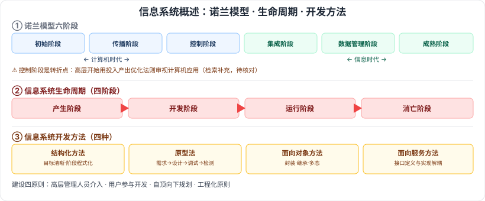

# 3.1 信息系统概述

> 来源：网络取材（主线索 lcp0578/book-note 仓库 + 检索资料交叉印证，见 CLAUDE.md「网络取材来源」）· 对应《系统架构设计师教程（第二版）》第 3 章 · 第 1 节

## 一句话概括

信息系统 = 人机一体化系统，五大功能（输入/存储/处理/输出/控制）；诺兰模型把信息系统建设分六阶段（前三属"计算机时代"、后三属"信息时代"）；生命周期四阶段（产生→开发→运行→消亡）；建设讲四原则，开发有四种方法（结构化/原型法/面向对象/面向服务）。⚠️ 本节多处知识点检索到的是相关软考科目（系统规划与管理师/系统集成项目管理工程师）的真题证据，非直接确认系统架构设计师科目真题，故整体按 🟡 保守处理。

---

## 3.1.1 信息系统的定义

🟡 **信息系统**：由计算硬件、网络和通信设备、计算机软件、信息资源、信息用户和规章制度组成的、以处理信息流为目的的**人机一体化系统**。

### 五个基本功能

| 功能 | 说明 |
| --- | --- |
| 🟡 输入 | 取决于系统所要达到的目的及系统能力和信息环境的许可 |
| 🟢 存储 | 存储各种信息资料和数据的能力 |
| 🟡 处理 | 数据处理工具，基于**数据仓库技术的联机分析处理（OLAP）**和**数据挖掘（DM）**技术 |
| 🟢 输出 | 各种功能最终都是为了实现最佳输出 |
| 🟢 控制 | 对各种信息处理设备进行控制和管理，对信息加工/处理/传输/输出等环节通过程序控制 |

---

## 3.1.2 信息系统的发展（诺兰模型）

🟡 诺兰（Nolan）将计算机信息系统的发展道路划分为 **6 个阶段**：初始阶段 → 传播阶段 → 控制阶段 → 集成阶段 → 数据管理阶段 → 成熟阶段。

⚠️ 检索补充：**前三阶段属"计算机时代"，后三阶段属"信息时代"**，转折点在控制阶段与集成阶段之间（信息资源规划的最佳时机）；控制阶段的关键特征是"企业高层管理人员开始用投入产出优化法则审视计算机应用"。教材原文是否有此表述待核对。

---

## 3.1.3 信息系统的分类

🟢 业务（数据）处理系统、管理信息系统、决策支持系统、专家系统、办公自动化系统、综合性信息系统（这六类正是本章 3.2–3.7 各节的展开对象）。

- 决策支持系统（DSS）：能帮助决策者利用数据和模型去解决**半结构化**决策问题和**非结构化**决策问题的交互系统
- 专家系统：智能计算机程序系统，内含某领域专家水平的知识与经验，能利用专家的知识和解决问题的方法处理该领域问题
- 办公自动化系统：人机结合的综合性办公事务管理系统

---

## 3.1.4 信息系统的生命周期

🟡 四阶段：**产生阶段 → 开发阶段 → 运行阶段 → 消亡阶段**。

---

## 3.1.5 信息系统建设原则

🟡 四条：**高层管理人员介入原则、用户参与开发原则、自顶向下规划原则、工程化原则**。

---

## 3.1.6 信息系统开发方法

| 方法 | 要点 |
| --- | --- |
| 🟡 结构化方法 | 结构化生命周期法四特点：**开发目标清晰化、工作阶段程式化、开发文档规范化、设计方法结构化** |
| 🟡 原型法 | 快速原型法开发过程：系统需求分析 → 系统初步设计 → 系统调试 → 系统检测；⚠️ 检索补充：常分**抛弃型**与**演化型**两类，教材是否展开待核对 |
| 🟢 面向对象方法 | 利用面向对象的信息建模概念（实体、关系、属性），运用封装、继承、多态等机制构造模拟现实系统的方法 |
| 🟢 面向服务的方法 | 跨构件功能调用以接口形式暴露，接口定义与实现解耦，催生服务和面向服务的开发方法 |

---

## 记忆钩子

- 诺兰模型六阶段按"计算机时代 3 + 信息时代 3"记：**初始→传播→控制**（还在折腾计算机本身）｜**集成→数据管理→成熟**（开始把信息当资源管）。
- 信息系统生命周期就是"从生到死"：**产生→开发→运行→消亡**，和一般项目生命周期思路一致。

## 关键词

`信息系统` `人机一体化系统` `OLAP` `数据挖掘` `诺兰模型` `信息系统生命周期` `结构化方法` `原型法` `面向对象方法` `面向服务方法`
