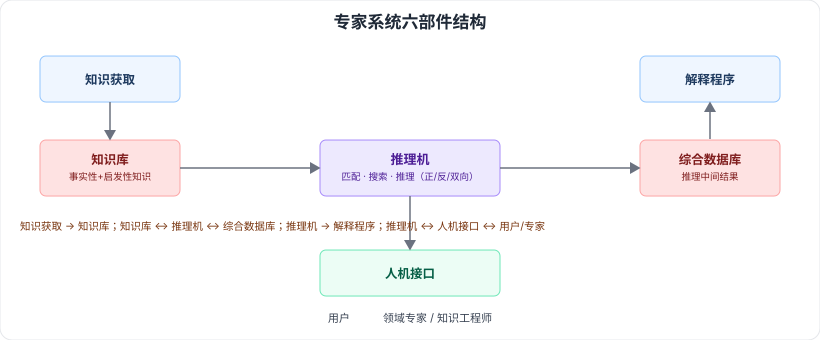

# 3.5 专家系统（ES）· 3.6 办公自动化系统（OAS）

> 来源：网络取材（主线索 lcp0578/book-note 仓库 + 检索资料交叉印证，见 CLAUDE.md「网络取材来源」）· 对应《系统架构设计师教程（第二版）》第 3 章 · 第 5–6 节
>
> ⚠️ 检索未找到这两节历年真题的具体年份/题号证据；多份软考备考资料普遍将专家系统六部件、OAS 三大功能列为标准考点讲解内容，说明在考纲范围内但确切考察频率未知，按保守原则不升 🔴。

---

## 3.5 专家系统（ES）

### 3.5.1 概念

🟡 专家系统是一个智能计算机程序系统，内部含有某领域专家水平的大量知识与经验，能够利用人类专家的知识和解决问题的方法来处理该领域的问题。

### 3.5.2 特点

⚠️ 原始材料本节空白，以下为检索补充（多来源一致，供参考）：

| 特点 | 说明 |
| --- | --- |
| 启发性 | 既运用逻辑知识，也运用启发性/直觉性经验知识 |
| 透明性 | 用户不了解内部结构也能交互，系统可解释自己的推理思路 |
| 灵活性 | 知识库与推理机分离，知识可持续扩充 |
| 交互性 | 支持人机对话 |
| 不确定性推理 | 处理的数据/知识多不精确、模糊，需设置匹配阈值 |

### 3.5.3 组成（六部件）🟡

| 部件 | 作用 |
| --- | --- |
| 知识库 | 存放领域专家提供的事实性知识 + 启发性经验知识，是问题求解的知识来源 |
| 综合数据库 | 又称动态知识库，存放推理过程中的初始状态、中间结果等工作数据 |
| 推理机 | 又称控制结构/规则解释器，依据知识库对综合数据库信息做匹配、搜索、推理；⚠️ 检索补充：分正向/反向/双向三种推理方式，待核对 |
| 知识获取 | 把新知识加入知识库的过程，含知识编辑求精、知识自学习两方面功能 |
| 解释程序 | 向用户说明推理如何得出结论，提升系统透明度和可信度 |
| 人机接口 | 分两部分：系统与用户的接口、系统与领域专家/知识工程师的接口 |

---

## 3.6 办公自动化系统（OAS）

### 3.6.1 概念

🟢 一个人机结合的综合性的办公事务管理系统。

### 3.6.2 功能

🟡 三大功能：**事务处理、信息管理、辅助决策**。

⚠️ 检索补充：事务处理分单机/多机处理系统；信息管理是对信息流的收集/加工/传递/存取/反馈等的控制管理。

### 3.6.3 组成

⚠️ 原始材料本节空白，检索到两种口径（均有资料支持，具体教材采用哪种待核对）：

- **按硬件/软件维度**：计算设备、办公设备、数据通信及网络设备、软件系统
- **按 OA 类型对应功能**：事务型（单机/多机事务办公）、管理型（分布式、信息共享的经理型办公）、决策型（基于管理型积累数据建立决策模型辅助方案生成）

---

## 记忆钩子

- 专家系统六部件按"数据 vs 逻辑"分两组记：**存东西的**（知识库、综合数据库）+ **用东西的**（推理机、解释程序）+ **管进出的**（知识获取管"进"、人机接口管"出/交互"）。
- OAS 三功能是"处理→管理→决策"递进：先把日常**事务**处理掉，再把**信息**管起来，最后**辅助决策**。

## 关键词

`专家系统` `ES` `知识库` `综合数据库` `推理机` `知识获取` `解释程序` `人机接口` `OAS` `办公自动化系统` `事务处理` `信息管理` `辅助决策`
