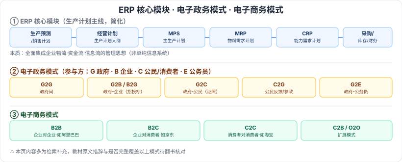

# 3.7 企业资源规划（ERP）· 3.8 典型信息系统架构模型

> 来源：网络取材（主线索 lcp0578/book-note 仓库 + 检索资料交叉印证，见 CLAUDE.md「网络取材来源」）· 对应《系统架构设计师教程（第二版）》第 3 章 · 第 7–8 节（本章最后两节）
>
> ⚠️ 这两节网络取材主线索材料**几乎完全空白**（只有小节标题），本节内容以检索补充为主，教材原文的具体措辞和展开程度均待核对。

---

## 3.7 企业资源规划（ERP）

### 3.7.1 概念

🟡 ERP 建立在信息技术基础上，运用现代企业管理思想，全面集成企业的**物流、资金流、信息流**三大资源信息，为企业决策、计划、控制提供综合系统的管理平台。⚠️ 本质是一种**管理思想**，而非单纯的信息系统，教材是否有此表述待核对。

### 3.7.2 结构（约 11 个模块，检索补充）

按供应链思想将企业划分为多个协同子系统/模块：

🟡 生产预测、销售管理（计划）、经营计划（生产计划大纲）、**主生产计划（MPS）**、**物料需求计划（MRP）**、**能力需求计划（CRP）**、车间作业计划（PAC）、采购与库存管理、质量与设备管理、财务管理、ERP 扩展应用模块。

⚠️ 检索到线索显示 MPS/MRP/CRP 等模块定义曾出现在真题中（以定义匹配题形式），但未能确认具体年份/题号，判断为"可能重点"而非确证 🔴，仍按保守原则定 🟡。

### 3.7.3 功能

⚠️ **存疑**：未检索到教材原文级别的独立"功能"清单，多数资料仅罗列结构模块、未单独展开功能描述。本节暂不勉强填充，建议翻实体书核对。

---

## 3.8 典型信息系统架构模型

### 3.8.1 政府信息化与电子政务

🟡 **电子政务**：利用信息技术（尤其互联网）提高政府工作透明度、效率与服务质量，改善政府与公民、企业的互动。

⚠️ 检索补充主要模式（多来源交叉一致，供参考）：

| 模式 | 说明 |
| --- | --- |
| G2G | 政府间（Government to Government） |
| G2B / B2G | 政府与企业，如电子招投标 |
| G2C | 政府对公民，如电子证照申领 |
| C2G | 公民对政府（反馈/参政） |
| G2E | 政府对公务员 |

### 3.8.2 企业信息化与电子商务

🟡 **电子商务**：以信息网络技术为手段、以商品交换为中心的商务活动。

⚠️ 检索补充主要模式：

| 模式 | 说明 |
| --- | --- |
| B2B | 企业对企业，如阿里巴巴 |
| B2C | 企业对消费者，如京东、苏宁 |
| C2C | 消费者对消费者，如淘宝 |
| C2B / O2O | 扩展模式 |

---

## 记忆钩子

- 电子政务/电子商务的模式命名法则一致：字母表示参与方，**G**=政府、**B**=企业、**C**=消费者/公民、**E**=公务员，"2"读作"to"——记住参与方缩写，模式名自动拼得出来。
- ERP 三大模块主线：**先算多少（MPS 主生产计划）→ 再算要买什么（MRP 物料需求）→ 最后算产能够不够（CRP 能力需求）**，是一条从"要做什么"到"做不做得完"的推导链。

## 关键词

`ERP` `企业资源规划` `物流` `资金流` `信息流` `MPS` `MRP` `CRP` `电子政务` `G2G` `G2B` `G2C` `电子商务` `B2B` `B2C` `C2C`
