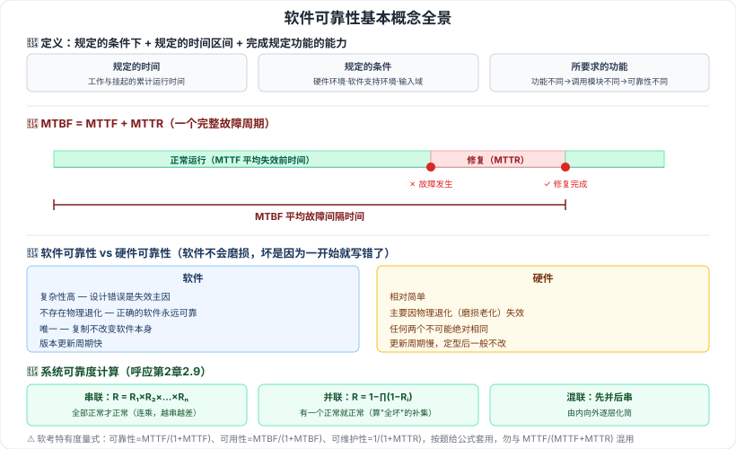

# 9.1 软件可靠性基本概念

> 来源：网络取材（主线索 lcp0578/book-note 仓库 chapter9.md，见 CLAUDE.md「网络取材来源」）· 对应《系统架构设计师教程（第二版）》第 9 章 · 第 1 节
>
> ⚠️ 原始材料本节**只有三行**（可靠性定义、MTBF 定义、可靠性测试目的三条）+ 一张图片引用（ReliabilityTest.png）。以下"定义三要素""软硬件可靠性四区别""定量指标体系""时间三分类"均为检索补充，两个独立来源（[博客园·欢笑一声](https://www.cnblogs.com/wuhuixuri/articles/18362009)、[CSDN·xingzuo_1840](https://blog.csdn.net/xingzuo_1840/article/details/136070318)）措辞高度一致、互相印证，可信度较高，但非教材原文逐字转录。

---

## 9.1.1 软件可靠性定义 🔴

**软件可靠性 = 软件产品在规定的条件下和规定的时间区间完成规定功能的能力。**（原文）

另一等价表述（检索补充）：在规定的条件下、规定的时间内，**软件不引起系统失效的概率**。

定义中的三个"规定"（检索补充）：

| 要素 | 含义 |
| --- | --- |
| 规定的时间 | 运行时间（工作与挂起的累计时间） |
| 规定的条件 | 硬件环境、软件支持环境、确定的**输入域** |
| 所要求的功能 | 功能不同则调用的子模块不同，可靠性也不同 |

### 软件可靠性 vs 硬件可靠性（检索补充）🔴

| 对比角度 | 软件 | 硬件 |
| --- | --- | --- |
| 复杂性 | 内部逻辑高度复杂，**设计错误是失效主因** | 相对简单 |
| 物理退化 | **不存在物理退化**，正确的软件任何时刻都可靠 | 主要因物理退化而失效 |
| 唯一性 | **唯一**，复制不改变软件本身 | 任何两个不可能绝对相同 |
| 版本更新 | 更新周期快 | 更新周期慢，定型后一般不改 |

> 记忆抓手：软件不会"用坏"，只会"本来就错"——所以软件可靠性的敌人是**设计缺陷**，硬件可靠性的敌人是**磨损老化**。

---

## 9.1.2 软件可靠性的定量描述指标 🔴

（除 MTBF 外均为检索补充，原文未给出）

| 指标 | 含义 | 关键性质 |
| --- | --- | --- |
| 失效概率 F(t) | 从运行开始到时刻 t 出现失效的概率 | F(0)=0，F(+∞)=1 |
| 可靠度 R(t) | 规定时间内不发生失效的概率 | **R(t) = 1 − F(t)**；R(0)=1，R(+∞)=0 |
| 失效强度 f(t) | 单位时间出现失效的概率 | — |
| **MTTF** | 平均失效前时间：从 t=0 到故障发生时，系统持续运行时间的期望值 | 越大越可靠 |
| **MTTR** | 平均恢复前时间：从出现故障到修复成功之间的时间 | 越小越好修 |
| **MTBF** | 平均故障间隔时间 | 🔴 **MTBF = MTTF + MTTR** |

⚠️ 原文对 MTBF 的定义写作"**失效或维护中所需的平均时间，包括故障时间以及检测和维护设备的时间**"——这个表述读起来更接近 MTTR 的含义，与"MTBF = MTTF + MTTR"的关系式在直觉上不太吻合。检索到的另一来源使用了**完全相同的措辞**，说明这不是主线索仓库的笔误，而应是教材原文（或其翻译）本身如此，但两处表述的张力建议翻实体书核对。

⚠️ 原文写作"MTBF（Mean Time Between Failures，**评估**故障间隔时间）"，疑为"**平均**故障间隔时间"之误（标准术语与检索来源均为"平均"），已在正文按"平均故障间隔时间"记录。

### 三种时间（检索补充）🟡

自然时间（日历时间）、运行时间、**执行时间（CPU 时间）**——其中**执行时间最准确**。

---

## 9.1.3 可靠性 / 可用性的度量式（补充，非本节教材原文）

⚠️ 以下公式在**软考真题（综合知识）中反复出现**，但检索到的第 9 章教材笔记中未见，来源为多篇软考备考资料的一致转述（[CSDN·yunhua_lee](https://blog.csdn.net/yunhua_lee/article/details/121674703)、[阿里云开发者社区](https://developer.aliyun.com/article/1482128)），作为应试补充列出：

- 🔴 **可靠性 = MTTF / (1 + MTTF)**
- 🔴 **可用性 = MTBF / (1 + MTBF)**
- 🟡 可维护性 = 1 / (1 + MTTR)

> ⚠️ 这组式子量纲上略显特殊（时间量与 1 相加），是软考特有的度量约定，**按题目给的公式套用即可，不必深究物理含义**。实际工程中更常见的可用性写法是 MTTF/(MTTF+MTTR)，两者不要混用——考试以前者为准。

### 系统可靠度计算（补充，呼应第 2 章 2.9）🔴

第 2 章 2.9「系统性能」处曾标注"真正高频的可靠性/可用性计算公式属第 9 章范畴"，在此补齐（参见 [[2.9-系统性能]]）：

| 结构 | 可靠度公式 | 记忆 |
| --- | --- | --- |
| 串联系统 | R = R₁ × R₂ × … × Rₙ | 全部正常才正常，**连乘**，越串越不可靠 |
| 并联系统 | R = 1 − (1−R₁)(1−R₂)…(1−Rₙ) | 有一个正常就正常，算**"全都坏"的补集** |
| 混联系统 | 先算各并联块的可靠度，再按串联连乘 | 由内向外逐层化简 |

> 真题线索（检索）：「三个相同子系统并联，子系统可靠性 0.9，则系统可靠性 = 1−0.1³ = **0.999**」是流传较广的经典例题，可作为自测题型。

---

## 9.1.4 可靠性测试的目的 🟡

（原文）可归纳为三个方面：

1. 发现软件系统在**需求、设计、编码、测试和实施**等方面的各种缺陷
2. 为软件的使用和维护**提供可靠性数据**
3. **确认软件是否达到可靠性的定量要求**

⚠️ 原文此处配有一张"可靠性测试"图片（ReliabilityTest.png）无文字说明，图中内容未知，建议翻实体书核对是否有额外信息。

---

---

## 记忆钩子

- **MTBF = MTTF + MTTR**：一个完整的"故障周期" = 正常跑的那段（MTTF）+ 修的那段（MTTR）。三个词都以 MT（Mean Time）开头，区别只看后两个字母：**TF = To Failure**（跑到坏）、**TR = To Repair**（修到好）、**BF = Between Failures**（两次坏之间）。
- 软件 vs 硬件可靠性四区别记"**复杂、不退化、唯一、更新快**"——核心一句话：软件不会磨损，坏是因为一开始就写错了。
- 串联 vs 并联：串联"**连乘**"（一环断全断），并联"**1 减全坏**"（全坏才坏）。

## 关键词

`软件可靠性` `失效概率F(t)` `可靠度R(t)` `失效强度` `MTTF` `MTTR` `MTBF` `执行时间` `可用性` `串联系统` `并联系统` `可靠性测试目的`
