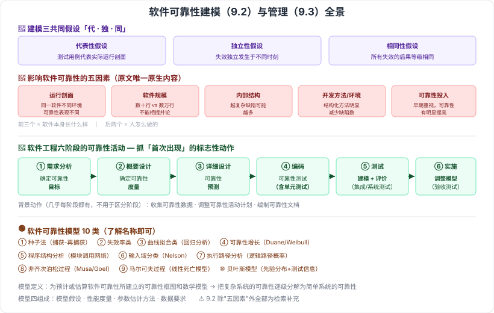

# 9.2–9.3 软件可靠性建模与管理

> 来源：网络取材（主线索 lcp0578/book-note 仓库 chapter9.md，见 CLAUDE.md「网络取材来源」）· 对应《系统架构设计师教程（第二版）》第 9 章 · 第 2–3 节
>
> ⚠️ 9.2 原始材料**只有"影响可靠性的主要因素"5 条**，而本节标题是"建模"——模型定义、组成、假设、分类等核心内容原文全部缺失，均为检索补充（来源：[博客园·欢笑一声](https://www.cnblogs.com/wuhuixuri/articles/18362009)，与另一来源对模型分类的转述一致）。9.3 原始材料完整详细，直接采用。

---

# 9.2 软件可靠性建模

## 9.2.1 软件可靠性模型的定义与组成（检索补充）🟡

**软件可靠性模型**：为预计或估算软件的可靠性所建立的**可靠性框图和数学模型**。目的是将复杂系统的可靠性**逐级分解为简单系统的可靠性**。

一个模型通常包含 4 部分：

1. 模型假设
2. 性能度量
3. 参数估计方法
4. 数据要求

## 9.2.2 软件可靠性模型的三个共同假设（检索补充）🔴

| 假设 | 含义 |
| --- | --- |
| **代表性假设** | 测试用例的选取**代表软件实际的运行剖面** |
| **独立性假设** | 软件失效**独立发生于不同时刻**（互不影响） |
| **相同性假设** | 所有软件失效的**后果（等级）相同** |

> 这三条是几乎所有可靠性模型共享的前提，也是模型在实际中容易失准的根源（现实中失效后果往往不相同）。

## 9.2.3 影响软件可靠性的主要因素 🔴（原文完整，本节唯一原生内容）

| 因素 | 要点 |
| --- | --- |
| **运行剖面（环境）** | 可靠性定义是**相对运行环境而言**的，同一软件在不同运行剖面下可靠性表现不同 |
| **软件规模** | 数十行代码的软件与几千、几万行的软件不能相提并论 |
| **软件内部结构** | 影响主要取决于**结构的复杂程度**，内部结构越复杂，可能包含的缺陷数越多 |
| **软件的开发方法和开发环境** | 与非结构化方法相比，**结构化方法可明显减少软件缺陷数** |
| **软件的可靠性投入** | 包括可靠性设计、管理、测试、评价方面投入的人力/资金/资源/时间；**早期重视可靠性并采取措施，可靠性有明显提高** |

## 9.2.4 软件可靠性模型分类（检索补充）🟢

共 10 类，了解名称即可，不必深究数学细节：

| # | 分类 | 一句话 |
| --- | --- | --- |
| 1 | 种子法模型 | 利用**捕获-再捕获**抽样估计错误数 |
| 2 | 失效率类模型 | 研究程序失效率（Jelinski-Moranda 等） |
| 3 | 曲线拟合类模型 | 用**回归分析**研究缺陷数、失效率 |
| 4 | 可靠性增长模型 | 预测检错过程中的可靠性改进（Duane、Weibull 等） |
| 5 | 程序结构分析模型 | 依模块调用关系形成分析网络 |
| 6 | 输入域分类模型 | 选取输入域样本点运行程序（Nelson 等） |
| 7 | 执行路径分析模型 | 计算各逻辑路径的执行概率 |
| 8 | 非齐次泊松过程模型 | 以单位时间失效次数为**泊松随机变量**（Musa、Goel 等） |
| 9 | 马尔可夫过程模型 | 基于马尔可夫链的线性死亡模型 |
| 10 | 贝叶斯模型 | 用试验前分布 + 当前测试信息评估可靠性 |

---

# 9.3 软件可靠性管理 🔴

**软件可靠性管理** = 以全面提高和保证软件可靠性为目标、以软件可靠性活动为主要对象的管理形式。

软件工程各阶段的主要可靠性活动（原文完整）：

| 阶段 | 主要可靠性活动 |
| --- | --- |
| **1. 需求分析** | ①确定软件的**可靠性目标** ②分析可能影响可靠性的因素 ③确定可靠性的**验收标准** ④制定可靠性**管理框架** ⑤制定可靠性文档编写规范 ⑥制定可靠性活动初步计划 ⑦确定可靠性**数据收集规范** |
| **2. 概要设计** | ①确定**可靠性度量** ②制定详细的可靠性**验收方案** ③可靠性设计 ④收集可靠性数据 ⑤调整可靠性活动计划 ⑥明确后续阶段活动详细计划 ⑦编制可靠性文档 |
| **3. 详细设计** | ①可靠性设计 ②**可靠性预测**（确定可靠性度量估计值） ③调整计划 ④收集数据 ⑤明确后续计划 ⑥编制文档 |
| **4. 编码** | ①**可靠性测试（含于单元测试）** ②排错 ③调整计划 ④收集数据 ⑤明确后续计划 ⑥编制文档 |
| **5. 测试** | ①**可靠性测试（含于集成测试、系统测试）** ②排错 ③**可靠性建模** ④**可靠性评价** ⑤调整计划 ⑥收集数据 ⑦明确后续计划 ⑧编制文档 |
| **6. 实施** | ①**可靠性测试（含于验收测试）** ②排错 ③收集数据 ④**调整可靠性模型** ⑤可靠性评价 ⑥编制文档 |

### 抓考点：各阶段的"标志性动作" 🔴

原文六阶段中，"收集数据/调整计划/编制文档"几乎每阶段都有（属背景动作），真正区分阶段的是这几个**首次出现**的动作：

| 动作 | 首次出现阶段 |
| --- | --- |
| 确定可靠性**目标** | 需求分析 |
| 确定可靠性**度量** | 概要设计 |
| 可靠性**预测** | 详细设计 |
| 可靠性**测试**（含于单元测试） | 编码 |
| 可靠性**建模 + 评价** | 测试 |
| 可靠性测试（含于**验收测试**）、**调整模型** | 实施 |

> ⚠️ 检索来源提到"可靠性管理目前仍停留在**定性水平**，如何用有限投入达到预期目标是长期课题"，原文未见此句，作为背景了解。

---

---

## 记忆钩子

- 建模三假设记"**代独同**"：测试用例有**代**表性、失效相互**独**立、后果等级相**同**——三条都是"为了数学上好算"而做的理想化假设，也正是模型在现实中失准的地方。
- 影响可靠性五因素记"**环境、规模、结构、方法、投入**"——前三个是"软件本身长什么样"，后两个是"人怎么做的"。
- 六阶段可靠性活动的递进主线：**定目标（需求）→ 定度量（概设）→ 做预测（详设）→ 开始测（编码）→ 建模+评价（测试）→ 验收+调模型（实施）**。

## 关键词

`软件可靠性模型` `代表性假设` `独立性假设` `相同性假设` `运行剖面` `软件规模` `内部结构` `可靠性投入` `种子法模型` `非齐次泊松过程模型` `可靠性管理` `可靠性目标` `可靠性度量` `可靠性预测`
