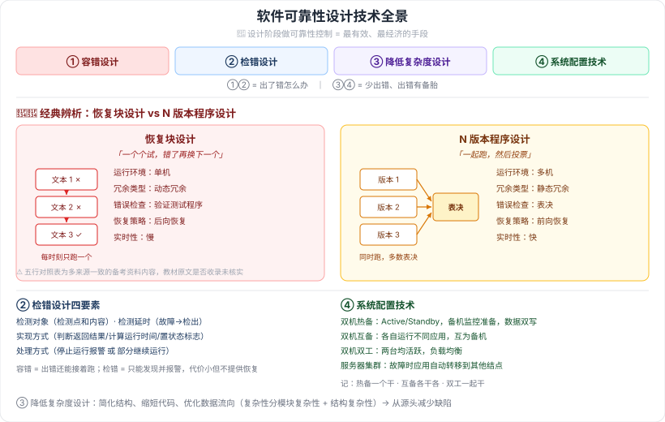

# 9.4 软件可靠性设计

> 来源：网络取材（主线索 lcp0578/book-note 仓库 chapter9.md，见 CLAUDE.md「网络取材来源」）· 对应《系统架构设计师教程（第二版）》第 9 章 · 第 4 节
>
> 原始材料给出了完整的技术清单骨架（容错设计三种 / 检错设计 / 降低复杂度设计 / 系统配置技术两种），但**各技术的具体做法未展开**，已按检索补充（[CSDN·u014745465](https://blog.csdn.net/u014745465/article/details/139892715)、[腾讯云·系统架构设计师容错设计技术](https://cloud.tencent.com/developer/news/1313805)）。**恢复块 vs N版本对比表**为多来源一致的经典考点，非原文内容。

> 🔴 **核心原则**：在**设计阶段**采取措施进行可靠性控制，是保障软件可靠性**最有效、最经济**的手段。

---

## 9.4.1 容错设计技术 🔴

### 1. 恢复块设计

选择一组操作作为**容错设计单元**，一个恢复块包含若干个**功能相同、设计差异**的程序块文本，**每一时刻只有一个文本处于运行状态**。一旦该文本出现故障，则用备份文本加以替换 → 构成**动态冗余**。

### 2. N 版本程序设计

设计出**多个模块或不同版本**，对于相同的初始条件和相同输入，其操作结果实行**多数表决**，防止其中某一模块/版本的故障提供错误的服务 → 构成**静态冗余**。

核心要素（检索补充）：
- 需求说明的**完全性与精确性**
- 各设计人员之间的**不相关性**（采用不同算法、编程语言、开发工具、测试方法）

### 3. 冗余设计

在软件系统中实现**不同路径、不同算法或不同实现方法**的模块或系统作为备份。虽增加费用，但**低于重新开发的成本**。

---

### 🔴🔴 恢复块 vs N 版本程序设计（经典辨析，多来源一致）

| 对比角度 | 恢复块设计 | N 版本程序设计 |
| --- | --- | --- |
| 硬件运行环境 | **单机** | **多机** |
| 故障屏蔽类型 | **动态冗余** | **静态冗余** |
| 错误检查方法 | **验证测试程序** | **表决** |
| 恢复策略 | **后向恢复** | **前向恢复** |
| 实时性 | **慢** | **快** |

> ⚠️ 此表在多篇软考备考资料中以完全相同的五行形式出现，是流传极广的考点对照表，但**教材原文是否收录此表未能核实**，建议翻实体书确认。内容本身可信度高（多来源一致），作为应试记忆无碍。

**记忆抓手**：恢复块是"**一个个试**"（错了再换下一个 → 单机、慢、要回退 = 后向恢复）；N 版本是"**一起跑再投票**"（多机同时算 → 快、不用回退 = 前向恢复）。

---

## 9.4.2 检错设计技术 🟡

（原文一句）一般采用检错技术，在软件出现故障后能**及时发现并报警**，提醒维护人员进行处理。

四个核心要素（检索补充）：

| 要素 | 含义 |
| --- | --- |
| 检测对象 | 检测点和检测内容 |
| 检测延时 | 从故障发生到被检出的时间 |
| 实现方式 | 判断返回结果、计算运行时间、置状态标志 |
| 处理方式 | 停止运行并报警，或部分继续运行 |

> 与容错设计的区别：**容错是"出错还能接着跑"，检错只是"出错能被发现并报警"**——检错代价小得多，但不提供恢复能力。

---

## 9.4.3 降低复杂度设计 🟡

（原文）在保证实现软件功能的基础上，**简化软件结构、缩短程序代码长度、优化软件数据流向、降低软件复杂度**，从而提高软件可靠性。

软件复杂性分两类（检索补充）：**模块复杂性** + **结构复杂性**。

> 呼应第 9.2.3 节"内部结构越复杂，所包含的软件缺陷数就可能越多"——降低复杂度是从源头减少缺陷。

---

## 9.4.4 系统配置技术 🟡

| 技术 | 要点 |
| --- | --- |
| **双机热备**（原文列出） | Active/Standby 方式：主机工作、**备机监控准备**，数据同时写入两台；主机故障时激活备机 |
| 双机互备（检索补充） | 两台机器**各自独立运行不同应用**，互为备机 |
| 双机双工（检索补充） | 集群形式，两台**均处于活跃状态**，实现**负载均衡** |
| **服务器集群**（原文列出） | 多台独立服务器组合成单一系统，某结点故障时应用**自动转移**到其他结点 |

⚠️ 原文只列了"双机热备技术"和"服务器集群技术"两项，"双机互备/双机双工"为检索补充，教材是否收录待核对。

---

---

## 记忆钩子

- 四大类设计技术分两个层次：**容错/检错**是"出了错怎么办"，**降低复杂度/系统配置**是"少出错、出错有备胎"。
- 恢复块 vs N 版本五个维度一句话串起来：「**恢复块单机跑一个，错了回退换下一个（动态冗余、验证测试、后向恢复、慢）；N 版本多机一起跑，投票选答案（静态冗余、表决、前向恢复、快）**」。
- 双机三种模式记"**热备一个干、互备各干各、双工一起干**"。

## 关键词

`可靠性设计` `容错设计` `恢复块设计` `N版本程序设计` `冗余设计` `动态冗余` `静态冗余` `后向恢复` `前向恢复` `表决` `检错设计` `降低复杂度设计` `双机热备` `双机互备` `双机双工` `服务器集群`
