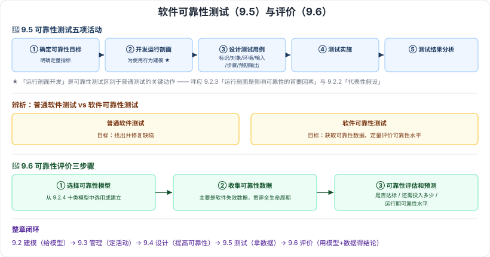

# 9.5–9.6 软件可靠性测试与评价

> 来源：网络取材（主线索 lcp0578/book-note 仓库 chapter9.md，见 CLAUDE.md「网络取材来源」）· 对应《系统架构设计师教程（第二版）》第 9 章 · 第 5–6 节
>
> ⚠️ 这两节是全章最薄的部分：9.5 原始材料**只有一句话**（列出组成活动名称），9.6 只有定义 + 三步骤名称。各活动/步骤的具体内容为检索补充（[CSDN·u014745465](https://blog.csdn.net/u014745465/article/details/139892715)），单一来源，可信度中等。

---

# 9.5 软件可靠性测试 🟡

## 定义

- （原文）软件可靠性测试由**可靠性目标的确定、运行剖面的开发、测试用例的设计、测试实施、测试结果的分析**等主要活动组成。
- （检索补充）**广义**的软件可靠性测试：为了最终评价软件系统的可靠性，运用**建模、统计、试验、分析和评价**等一系列手段对软件系统实施的一种测试。
- （检索补充）**狭义**的软件可靠性测试：为获取可靠性数据，针对重要质量特性，按预定测试用例，在**预期使用环境**中实施的测试。

## 五项主要活动 🔴

| # | 活动 | 要点（检索补充） |
| --- | --- | --- |
| 1 | 可靠性目标的确定 | 明确要达到的可靠性定量指标 |
| 2 | **运行剖面的开发** | 为软件的**使用行为建模**——本节最具本章特色的一步，呼应 9.2.3「运行剖面是影响可靠性的首要因素」 |
| 3 | 测试用例的设计 | 包含测试标识、被测对象、环境条件、输入、操作步骤、预期输出等 |
| 4 | 测试实施 | — |
| 5 | 测试结果的分析 | — |

> 需精确估计的指标（检索补充，⚠️ 单一来源）：当前可靠度、平均无失效时间、故障密度、达到目标的日期、成本要求。

**与普通软件测试的区别**：普通测试目标是"找出并修复缺陷"，可靠性测试目标是"**获取可靠性数据、定量评价可靠性水平**"——所以它必须建立在真实的**运行剖面**之上，否则测出来的数据不能代表实际使用中的可靠性（这正是 9.2.2「代表性假设」的现实要求）。

---

# 9.6 软件可靠性评价 🟡

## 定义（原文）

软件可靠性评价工作是指**选用或建立合适的可靠性数学模型**，运用**统计技术和其他手段**，对软件可靠性测试和系统运行期间收集的**软件失效数据**进行处理，并**评估和预测**软件可靠性的过程。

## 三个步骤 🔴

| # | 步骤 | 要点（检索补充） |
| --- | --- | --- |
| 1 | **选择可靠性模型** | 从 9.2.4 的十类模型中选用或建立合适的数学模型 |
| 2 | **收集可靠性数据** | 主要是**软件失效数据**，贯穿整个生命周期 |
| 3 | **可靠性评估和预测** | 判断是否达到可靠性目标、预测还需投入多少、评估运行期间的可靠性水平 |

---

---

## 记忆钩子

- 9.5 五项活动是一条完整链路：**定目标 → 建运行剖面 → 设计用例 → 实施 → 分析结果**；其中"**运行剖面开发**"是可靠性测试区别于普通测试的关键动作。
- 9.6 三步骤记"**选模型 → 收数据 → 评估预测**"——与 9.3 中"测试阶段"的可靠性活动（可靠性建模 + 可靠性评价）正好对应上，本节是那两个动作的展开。
- 整章闭环：**建模（9.2 给模型）→ 管理（9.3 定活动）→ 设计（9.4 提高可靠性）→ 测试（9.5 拿数据）→ 评价（9.6 用模型 + 数据得结论）**。

## 关键词

`软件可靠性测试` `运行剖面` `测试用例设计` `广义可靠性测试` `狭义可靠性测试` `软件可靠性评价` `选择可靠性模型` `收集可靠性数据` `可靠性评估和预测` `软件失效数据`
