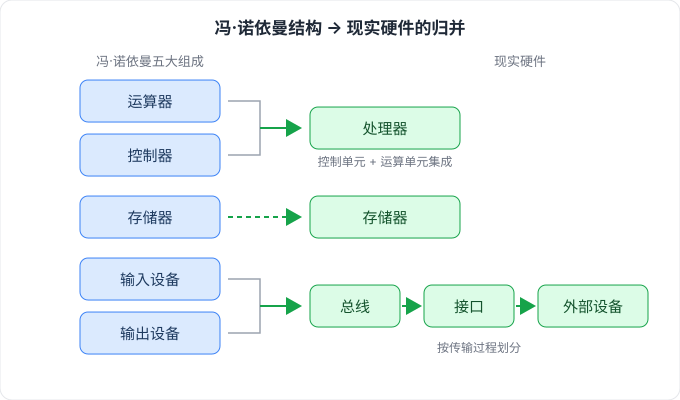
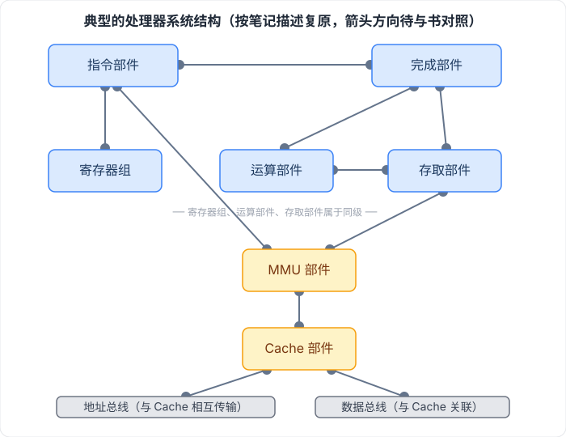
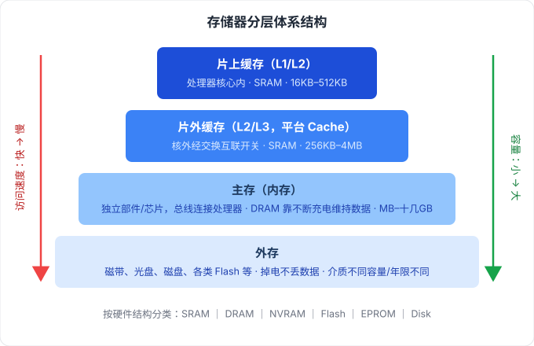
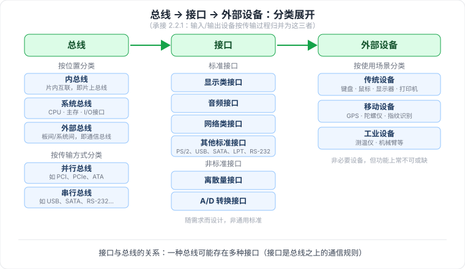

# 2.2 计算机硬件

> 来源：《系统架构设计师教程（第二版）》· 第 2 章 · 第 2 节

## 一句话概括

从冯·诺依曼五大部件出发落到现实硬件：运算 + 控制归并为**处理器**（指令集分 RISC/CISC），存储采用**分层体系**（片上缓存 → 片外缓存 → 主存 → 外存），输入输出按传输过程归并为**总线 → 接口 → 外部设备**。

---

## 2.2.1 计算机硬件组成

🟡 **冯·诺依曼结构五大组成**：运算器、控制器、存储器、输入设备、输出设备。

🟡 现实硬件对五大部件的归并：

| 冯·诺依曼部件 | 现实硬件 | 说明 |
| --- | --- | --- |
| 运算器 + 控制器 | **处理器** | 控制单元和运算单元集成为一体 |
| 存储器 | 存储器 | 不变 |
| 输入设备 + 输出设备 | **总线、接口、外部设备** | 集成为一体后按传输过程划分 |

---

## 2.2.2 处理器

🟡 **指令集两大类**（代表厂商/架构须记）：

| 指令集 | 全称 | 代表 |
| --- | --- | --- |
| CISC | 复杂指令集 | Intel、AMD 的 x86 CPU |
| RISC | 精简指令集 | ARM、Power |

🟡 **典型的处理器系统结构**——部件间关联关系（原稿描述）：

- 指令部件 ↔ 完成部件、MMU 部件、寄存器组
- 寄存器组、运算部件、存取部件三者**属于同级**；运算部件 ↔ 存取部件
- 运算部件、存取部件 ↔ 完成部件
- 存取部件 ↔ MMU 部件；Cache 部件 ↔ MMU 部件
- Cache 部件与**地址总线**相互传输，与**数据总线**关联

---

## 2.2.3 存储器

🟢 **按硬件结构分类**：SRAM、DRAM、NVRAM、Flash、EPROM、Disk 等。

🟡 **分层体系结构**（每层的结构类型 + 容量范围须记）：

| 层级 | 位置 | 硬件结构 | 容量 | 备注 |
| --- | --- | --- | --- | --- |
| 片上缓存 | 处理器核心中直接集成 | SRAM | 16KB–512KB | 按设计分一级 / 二级 |
| 片外缓存 | 处理器核外，经交换互联开关 | SRAM | 256KB–4MB | L2 / L3 Cache，或称平台 Cache |
| 主存（内存） | 独立部件 / 芯片，通过总线与处理器连接 | DRAM | MB–十几 GB | 依赖不断充电维护数据 |
| 外存 | 具体介质器件 | 磁带、光盘、磁盘、各类 Flash 等 | 容量大 | 速度慢；掉电不丢数据；介质不同容量和保存年限不同 |

---

## 2.2.4 总线

🟡 **定义**：计算机部件间遵循某一特定协议实现数据交换的形式，即以特定格式、按规定的控制逻辑实现部件间的数据传输。

🟡 **按位置分类**（三级，须记）：

| 总线 | 定义 |
| --- | --- |
| 内总线 | 用于各类芯片内部互联，也称片上总线 / 片内总线 |
| 系统总线 | 计算机中 CPU、主存、I/O 接口之间的总线 |
| 外部总线 | 计算机板与外部设备之间、或计算机系统之间互联的总线，又称通信总线 |

🟢 **按传输方式分类**：
- 并行总线：如 PCI、PCIe、ATA(IDE)
- 串行总线：如 USB、SATA、CAN、RS-232、RS-485、RapidIO、以太网

---

## 2.2.5 接口

🟡 **定义**：同一计算机不同功能层之间的通信规则。

🟢 **分类**：
- 标准接口：显示类（如 HDMI、DVI）、音频接口、网络类接口、其他标准接口（PS/2、USB、SATA、LPT、RS-232）
- 非标准接口（随需求设计）：离散量接口、A/D 转换接口

🟡 **与总线的关系**：一种总线可能存在多种接口（接口是总线之上的通信规则）。

---

## 2.2.6 外部设备

🟡 **定义**：也称外围设备，是计算机的非必要设备，但功能上常不可或缺；现代计算机外部设备种类日益丰富，包括所有输入输出设备以及部分存储设备。

🟢 **按使用场景分类**：
- 传统设备：键盘、鼠标、显示器、扫描仪、摄像头、麦克风、打印机、光驱、网卡
- 移动设备：加速计、GPS、陀螺仪、感光设备、指纹识别设备
- 工业设备：测温仪、测速仪、机械臂、液压装置等

---

## 我的理解

- 冯·诺依曼是「理论拼图」，现实硬件是「合并同类项」：算 + 控 → 处理器，进 + 出 → 总线/接口/外设。
- 存储分层的规律一图看穿：越靠近处理器越快、越小（SRAM），越远越慢、越大（DRAM → 磁盘/Flash）。
- 总线的三级划分也是「由内到外」：内总线（片内）→ 系统总线（板内）→ 外部总线（板间/系统间），和存储分层「离处理器越远、覆盖范围越大」是同一种思路。

## 待核对 · 存疑

- ⚠️ 处理器系统结构图是按笔记文字描述复原的，各部件间连线的**方向（箭头指向）与整体布局**可能与书上原图有出入，建议翻书比对后告知修正。

## 关键词

`冯·诺依曼结构` `处理器` `CISC` `RISC` `指令部件` `MMU` `Cache` `分层存储` `SRAM` `DRAM` `总线` `内总线` `系统总线` `外部总线` `接口` `外部设备`
