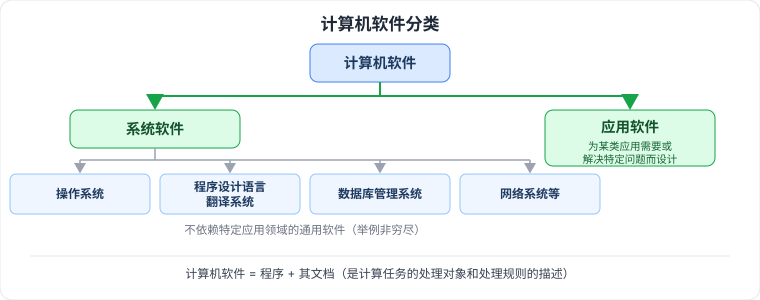
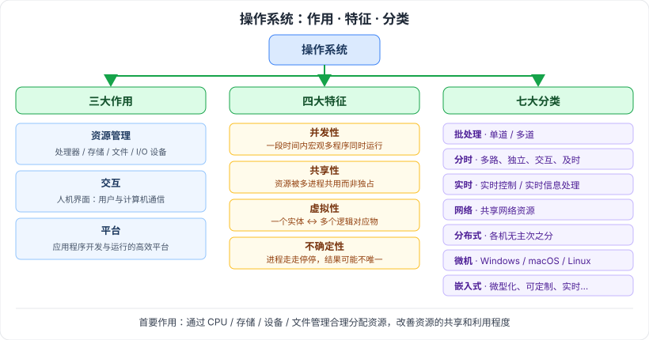
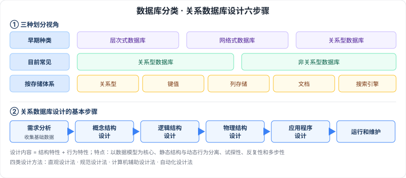
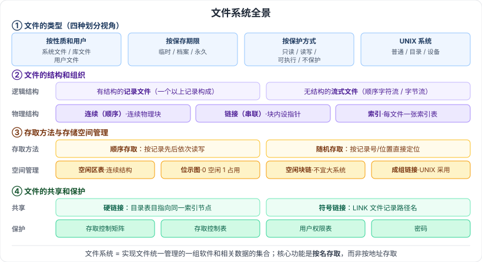

# 2.3 计算机软件

> 来源：《系统架构设计师教程（第二版）》· 第 2 章 · 第 3 节

## 一句话概括

计算机软件 = 程序 + 其文档，按"是否依赖特定应用领域"分为**系统软件**与**应用软件**；系统软件中最核心的三块是**操作系统**（管资源、给交互、当平台）、**数据库**（把数据组织起来并管好）与**文件系统**（把外存上的信息按名管起来）。

---

## 2.3.1 计算机软件概述

- 🟡 **计算机软件**：计算机系统中的程序及其文档，是计算任务的处理对象和处理规则的描述。
- 🟡 **系统软件**：为整个计算机系统配置的、不依赖特定应用领域的通用软件。
- 🟡 **应用软件**：为某类应用需要或解决某个特定问题而设计的软件。

1. 🟡 区分系统软件与应用软件的核心标准：是否依赖特定应用领域（通用 vs 定制）。
2. 🟢 系统软件按功能可分为：操作系统、程序设计语言翻译系统、数据库管理系统、网络系统等（举例非穷尽）。

---

## 2.3.2 操作系统

🟡 **首要作用**：通过 **CPU 管理、存储管理、设备管理和文件管理**对各种资源进行合理分配，改善资源的**共享和利用程度**。

🟡 **组成**：操作系统 = **操作系统内核** + 其他许多附加的配套软件。
内核 = 提供**进程管理、存储管理、文件管理、设备管理**等功能的那些软件模块。

### 三大作用

| 作用 | 内容 |
| --- | --- |
| 🟡 资源管理 | 处理器管理、存储管理、文件管理、I/O 设备管理 |
| 🟡 交互 | 人机界面：实现用户与计算机之间的通信 |
| 🟡 平台 | 为应用程序的开发和运行提供高效率的平台 |

### 四大特征 🔴

| 特征 | 含义 |
| --- | --- |
| 🔴 并发性 | 一段时间内**宏观上**多个程序同时运行；单 CPU 下每一时刻只有一个程序在执行，多 CPU 下可分配到不同 CPU 执行 |
| 🔴 共享性 | 资源可被多个并发执行的进程**共同使用**，而非被一个进程独占 |
| 🔴 虚拟性 | 一种管理技术：把物理上的**一个实体变成逻辑上的多个**对应物，或把物理上的**多个实体变成逻辑上的一个**对应物 |
| 🔴 不确定性 | 资源有限，进程执行不是一贯到底，以不确定的方式运行 → **程序执行结果可能不唯一** |

### 七大分类 🔴

| 分类 | 要点 |
| --- | --- |
| 🔴 批处理 | 分**单道批处理**和**多道批处理** |
| 🔴 分时 | 特点：**多路性、独立性、交互性、及时性** |
| 🔴 实时 | 对外来信息能以足够快的速度处理，并在被控对象允许的时间范围内快速反应；分**实时控制系统**和**实时信息处理系统** |
| 🔴 网络 | 使联网计算机能方便而有效地共享网络资源、为网络用户提供各种服务的**软件和有关协议的集合** |
| 🔴 分布式 | 由多个分散的计算机连接而成的计算机系统，系统中计算机**无主、次之分**，任意两台可通过通信交换信息 |
| 🔴 微型计算机（微机） | 常用有 Windows、macOS、Linux |
| 🔴 嵌入式 | 运行在嵌入式智能设备环境中，统一协调、处理、指挥和控制各种部件装置；特点：**微型化、可定制、实时性、可靠性、易移植性** |

---

## 2.3.3 数据库

### 数据库分类（三种划分视角）

| 视角 | 种类 |
| --- | --- |
| 🟡 早期 | 层次式数据库、网络式数据库、关系型数据库 |
| 🟡 目前常见 | 关系型数据库、非关系型数据库 |
| 🟡 按存储体系 | 关系型、键值、列存储、文档、搜索引擎数据库等 |

- 🟡 **关系型数据库**：把复杂的数据结构归结为**简单的二元关系**，数据全都建立在一个或多个**关系表**上；大型系统中通常有多个表，表之间有各种关系。
- 🟢 **键值数据库**：非关系型，用简单的键值方法存储数据，**键作为唯一标识符**。
- 🟢 **列存储数据库**：与传统关系型数据库的区别就在于**表中数据的存储形式**不同。
- 🟢 **文档数据库**：存放并获取文档（XML、JSON、BSON 等格式）；与键值的区别在于**这里的"值"存的是文件**。
- 🟢 **搜索引擎数据库**：应用在搜索引擎领域的数据存储形式。

### 关系数据库

- 🟡 **数据模型**：数据特征的抽象，是数据库组织方式的模型化表示，是**数据库系统的核心与基础**；三要素 = **数据结构、数据操作、完整性约束条件**。
- 🟢 **主码**：能唯一确定某个实体，如学号能唯一确定某个学生。

**设计的特点与方法**

- 🟢 数据库设计包括**结构特性**和**行为特性**两方面内容。
- 🟢 特点：**从数据结构（即数据模型）开始并以数据模型为核心展开**（主要特点）；静态结构设计与动态行为设计分离；试探性；反复性和多步性。
- 🟡 设计方法分四类：**直观设计法、规范设计法、计算机辅助设计法、自动化设计法**。
- 🟢 常用方法：基于 3NF、基于 ER 模型、基于视图概念、面向对象的关系数据库设计方法、计算机辅助数据库设计方法、敏捷数据库设计方法等。

**设计的基本步骤（六步）🔴**

| 步骤 | 任务 |
| --- | --- |
| 🔴 需求分析 | 对现实世界要处理的对象详细调查，收集支持系统目标的**基础数据及其处理方法** |
| 🔴 概念结构设计 | 在需求分析基础上对用户信息**分类、聚集、概括**，建立信息模型，转换为数据的逻辑结构 |
| 🔴 逻辑结构设计 | **确定数据模型**、将 ER 图转换为指定的数据模型、确定完整性约束、确定用户视图 |
| 🔴 物理结构设计 | 利用 DBMS 提供的方法与技术，以较优的存储结构和存取路径、合理的数据存放位置与存储分配，设计出高效可实现的物理结构 |
| 🔴 应用程序设计 | 方法有**结构化设计方法**和**面向对象设计方法**两种 |
| 🔴 运行和维护 | —— |

### 分布式数据库

- 🟡 **提出背景/定义**：针对**地理上分散、管理上又需要不同程度集中管理**的需求而提出的一种数据库管理信息系统。
- 🟡 **完全分布式数据库系统**须满足四条：**分布性、逻辑相关性、场地透明性、场地自治性**。
- 🟡 **五大特点**：集中控制性、数据独立性、**数据冗余可控性**、场地自治性、存取的有效性。
- 🟡 **体系结构 4 层模式**：**全局外层 → 全局概念层 → 局部概念层 → 局部内层**；既适用于同构型，也适用于异构型分布式数据库系统。
- 🟢 **应用领域**：分布式计算、Internet 应用、**数据仓库**、数据复制、全球联网查询等；Sybase 公司的 **Replication Server** 是典型的分布式数据库系统。

### 常用的数据库管理系统

| DBMS | 要点 |
| --- | --- |
| 🟢 Oracle | 大型、中型和微型计算机的**关系**数据库管理系统 |
| 🟢 IBM DB2 | IBM 的一种**分布式**数据库解决方案 |
| 🟢 Sybase | —— |
| 🟢 SQL Server | 典型的**关系型**数据库管理系统 |

### 大型数据库管理系统的特点（七条）

1. 🟢 基于**网络环境**的数据库管理系统，可用于 C/S 结构、也可用于 B/S 结构的数据库应用系统
2. 🟢 支持大规模的应用
3. 🟢 提供**自动锁**功能，使并发用户可安全高效地访问数据
4. 🟢 可保证系统的高度**安全性**
5. 🟢 提供方便灵活的**数据备份和恢复**方法以及设备**镜像**功能
6. 🟢 提供多种维护**数据完整性**的手段
7. 🟢 提供方便易用的**分布式处理**功能

---

## 2.3.4 文件系统

### 文件与文件系统

- 🟡 **文件**：一种**抽象机制**，隐藏了硬件和实现细节，提供将信息保存在外存上、便于以后读取的手段；用户不必了解信息的存储方法、位置以及存储设备的实际操作方式便可存取信息。
- 🟡 **文件系统**：操作系统中实现文件统一管理的**一组软件和相关数据的集合**，是专门负责管理和存取文件信息的软件机构；功能包括**按名存取**，而不是按地址存取。

### 文件的类型

| 划分视角 | 类型 |
| --- | --- |
| 🟡 按性质和用户 | 系统文件、库文件、用户文件 |
| 🟡 按信息保存期限 | 临时文件、档案文件、永久文件 |
| 🟡 按保护方式 | 只读文件、读写文件、可执行文件、不保护文件 |
| 🟡 UNIX 系统的划分 | 普通文件、目录文件、设备文件 |

🟢 常用的文件系统类型：**FAT、VFAT、NTFS、Ext2、HPFS** 等。

### 文件的结构和组织

🟡 **逻辑结构**两大类：

- **有结构的记录文件**：由一个以上的记录构成的文件。
- **无结构的流式文件**：由一串顺序字符流构成，文件体为字节流；通常采用**顺序访问**方式，每次可读写指定的任意数据长度。

🔴 **物理结构**三种：

| 物理结构 | 别名 | 存放方式 |
| --- | --- | --- |
| 🔴 连续结构 | 顺序结构 | 逻辑上连续的文件信息依次存放在**连续编号**的物理块上 |
| 🔴 链接结构 | 串联结构 | 存放在**不连续**的物理块上，每个物理块设一个**指针**指向下一个物理块 |
| 🔴 索引结构 | —— | 存放在不连续的物理块中，系统为每个文件建立一张**索引表** |

- ⚠️ 索引表跨多个物理块时：文件过大、一个索引块装不下全部物理块号，采用**多级索引**——第一级索引块中存放下一级索引块的块号，逐级展开。（此条为检索补充，教材原文措辞待翻书核对）

### 文件存取的方法和存储空间的管理

🟡 **存取方法**两种：**顺序存取**（按记录先后依次读写）、**随机存取**（也称直接存取，按记录号/位置直接定位）。

🔴 **存储空间管理**四种方法：

| 方法 | 要点 |
| --- | --- |
| 🔴 空闲区表 | 外存上一个**连续的未分配区域**称为空闲区；适用于**连续文件结构** |
| 🔴 位示图 | 每个二进制位对应一个物理块，**0 表示空闲、1 表示占用**；用（字号，位号）换算块号 |
| 🔴 空闲块链 | 所有空闲块链成一条链，分配时从链头摘取、回收时挂回；无需额外表格，但查找与合并慢，**不适合大型文件系统** |
| 🔴 成组链接法 | **UNIX 采用**：空闲块分组，每组的首块（或末块）记录**下一组的块号和块数**；兼顾空闲表法与空闲链表法，适合大型文件系统 |

### 文件的共享和保护

🟡 **共享**两种链接：

| 链接 | 说明 |
| --- | --- |
| 🟡 硬链接 | 文件**目录表目指向同一个索引节点**的链接，也称**基于索引节点的链接** |
| 🟡 符号链接 | 也称软链接：新建一个 **LINK 类型文件**，内容是被共享文件的**路径名**，系统按路径逐层查找；原文件删除后链接失效 |

🟡 **保护**四种方法：

| 方法 | 说明 |
| --- | --- |
| 🟡 存取控制矩阵 | 行 = 用户、列 = 文件，交叉点记权限；文件多时矩阵庞大且稀疏 |
| 🟡 存取控制表 | 按**文件**（列）拆分矩阵，随文件记录有权限的用户及其权限 |
| 🟡 用户权限表 | 按**用户**（行）拆分矩阵，记录该用户对各文件的权限 |
| 🟡 密码 | 存取文件需提供口令；省空间但保密性较差 |

---

## 记忆钩子

- 操作系统四特征背口诀：**并、共、虚、不定** —— 前三个是"能力"，最后一个是前三个带来的"代价"（结果不唯一）。
- 数据库设计六步是一条单向流水线：**需求 → 概念 → 逻辑 → 物理 → 程序 → 运维**，前四步一路从"人话"翻译到"机器话"。
- 分布式数据库的"集中控制性 + 场地自治性"要成对记：**集中管全局、自治管本地**。
- 文件物理结构三种，就是数据结构里的"数组 / 链表 / 索引"搬到磁盘上：**连续=数组、链接=链表、索引=索引表**。
- 空间管理四法按"记什么"分：记**区间**（空闲区表）、记**位**（位示图）、记**链**（空闲块链）、记**组**（成组链接法，UNIX）。
- 文件保护三兄弟是同一张矩阵的三种存法：**整张存**=存取控制矩阵、**按列存**=存取控制表、**按行存**=用户权限表。

## 关键词

`操作系统` `内核` `并发性` `共享性` `虚拟性` `不确定性` `批处理` `分时` `实时` `网络操作系统` `分布式操作系统` `嵌入式操作系统` `关系型数据库` `键值数据库` `列存储` `文档数据库` `数据模型三要素` `主码` `数据库设计六步骤` `分布式数据库` `场地自治性` `数据冗余可控性` `4 层模式` `文件系统` `按名存取` `记录文件` `流式文件` `连续结构` `链接结构` `索引结构` `位示图` `成组链接法` `硬链接` `符号链接` `存取控制表` `用户权限表`
