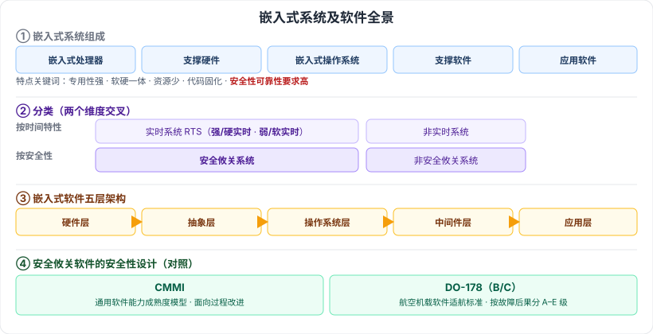

# 2.4 嵌入式系统及软件

> 来源：网络取材（主线索 lcp0578/book-note 仓库 + 检索资料交叉印证，2026-08-07 起，见 CLAUDE.md「网络取材来源」）· 对应《系统架构设计师教程（第二版）》第 2 章 · 第 4 节

## 一句话概括

嵌入式系统 = 软硬一体的专用计算机系统，资源少、实时性强、安全可靠性要求高；按**时间特性**分实时（强/弱）与非实时，按**安全性**分安全攸关与非安全攸关；嵌入式软件是五层架构（硬件层→抽象层→操作系统层→中间件层→应用层）；安全攸关软件的安全性设计需要专门标准（如 DO-178），区别于通用的软件过程改进模型 CMMI。

---

## 2.4.1 嵌入式系统的组成及特点

🟡 **定义**：以应用为中心、以计算机技术为基础，将可配置与可裁剪的软硬件集成于一体的专用计算机系统，需要满足应用对功能、可靠性、成本、体积和功耗等方面的严格要求。

### 组成（五部分）

🟢 嵌入式处理器、相关支撑硬件、嵌入式操作系统、支撑软件、应用软件。

### 特点（八条）

| 特点 | 说明 |
| --- | --- |
| 🟡 专用性强 | 面向特定应用场景 |
| 🟢 技术融合 | 软硬件深度结合 |
| 🟢 软硬一体、软件为主 | —— |
| 🟢 资源少于通用计算机 | —— |
| 🟡 代码固化 | 程序代码固化在非易失存储器中 |
| 🟢 需专门开发工具和环境 | —— |
| 🟡 体积小、价格低、性能价格比高、实时性强 | 系统配置要求相对较低 |
| 🟡 安全性、可靠性要求高 | 嵌入式系统区别于通用计算机的常见考点，常与"安全攸关系统"呼应 |

---

## 2.4.2 嵌入式系统的分类

⚠️ **结构说明**：网络取材原始材料只平铺列出"实时系统(RTS)、安全攸关系统"两项，检索资料显示这实际是**两个独立的分类维度**交叉产生的结果，非同一维度下的并列项，故下表按两个维度重新组织（结构调整，非教材逐字原文，建议核对）：

| 维度 | 类别 |
| --- | --- |
| 🟡 按时间特性 | 实时系统 Real-Time System, RTS（细分：⚠️ 强/硬实时、弱/软实时——检索补充）、非实时系统 |
| 🟡 按安全性 | 安全攸关系统 Safety-Critical System、非安全攸关系统 |

---

## 2.4.3 嵌入式软件的组成及特点

### 组成（五层架构）🟡

硬件层 → 抽象层 → 操作系统层 → 中间件层（Middleware）→ 应用层

### 特点（六条）

🟢 可裁剪性、可配置性、强实时性、安全性、可靠性、高确定性。

---

## 2.4.4 安全攸关软件的安全性设计

⚠️ **存疑**：网络取材原始材料本节仅有"CMMI""DO-178"两个词，无展开，教材原文具体措辞未能核实。以下为检索资料整理的对照关系，供参考，**建议翻实体书核对**：

| 标准 | 定位 |
| --- | --- |
| 🟡 CMMI | 通用软件能力成熟度模型，面向**过程改进**（教材第 5 章会专门展开），本节推测作为"通用模型"的对照参照 |
| 🟡 DO-178（B/C） | 航空机载软件适航审定标准，按故障后果分 A–E 级，代表**安全攸关领域专用标准** |

⚠️ 未检索到本节是否还提及 IEC 61508、ISO 26262 等其他安全攸关标准，存疑，待核对。

---

## 记忆钩子

- 嵌入式系统两大分类维度别搞混：**时间特性**（实时/非实时）管"快不快"，**安全性**（安全攸关/非安全攸关）管"出错要不要命"。
- CMMI 和 DO-178 是"通用 vs 专用"的对照：CMMI 管**怎么把软件做好**（过程），DO-178 管**特定领域软件够不够安全**（认证）。

## 关键词

`嵌入式系统` `嵌入式处理器` `实时系统` `安全攸关系统` `强实时` `弱实时` `嵌入式软件五层架构` `中间件层` `CMMI` `DO-178`
