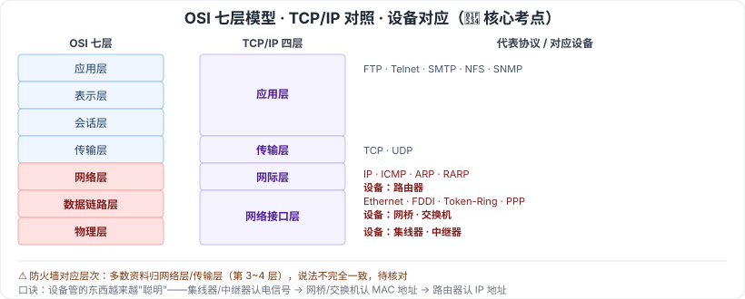

# 2.5 计算机网络

> 来源：网络取材（主线索 lcp0578/book-note 仓库 + 检索资料交叉印证，见 CLAUDE.md「网络取材来源」）· 对应《系统架构设计师教程（第二版）》第 2 章 · 第 5 节

## 一句话概括

计算机网络这节的核心考点是 **OSI 七层模型 ↔ 网络设备的对应关系**（集线器/中继器=物理层，网桥/交换机=数据链路层，路由器=网络层），这是软考各级别反复出现的经典必考题；性能指标、5G 关键技术、网络工程三阶段是背景知识，了解即可。

---

## 2.5.1 网络的基本概念

网络攸关指标分两类：

| 类别 | 具体指标 |
| --- | --- |
| 🟢 性能指标 | 速率、带宽、吞吐量、时延、往返时间、利用率 |
| 🟢 非性能指标 | 费用、质量、标准化、可靠性、可扩展性和可升级性、易管理和维护性 |

⚠️ 检索到性能指标的具体计算公式（如时延=发送时延+传播时延+处理时延+排队时延），但未找到该公式在系统架构设计师真题中被直接考察的证据（更多见于软考中级"网络工程师/软件设计师"）。判断为**了解层面**，本次不展开计算公式，仅记概念。

---

## 2.5.2 通信技术

- 🟢 信道、信号变换、复用技术和多址技术（未展开）
- 🟢 **5G 通信网络关键技术**：基于 OFDM 优化的波形和多址接入、可扩展的 OFDM 间隔参数配置、OFDM 加窗提高多路传输效率、灵活框架设计、大规模 MIMO、毫米波、频谱共享、先进的信道编码设计

---

## 2.5.3 网络技术

🟢 网络按**覆盖区域和通信介质**分类：局域网 LAN、无线局域网 WLAN、城域网 MAN、广域网 WAN、移动通信网。

---

## 2.5.4 组网技术 🔴

### 网络设备与 OSI 层次对应（核心考点）

⚠️ 原始材料只分别列出"网络设备"和"OSI 七层"两份清单，未说明对应关系；以下对应关系为检索补充并交叉印证（多篇独立来源一致），属于软考经典必考点：

| OSI 层次 | 对应设备 |
| --- | --- |
| 🔴 物理层 | 集线器、中继器 |
| 🔴 数据链路层 | 网桥、（二层）交换机 |
| 🔴 网络层 | 路由器 |
| 🟡 网络层/传输层 | 防火墙（不同资料说法不完全一致，⚠️ 待核对） |

### OSI/RM 七层

🟡 物理层 → 数据链路层 → 网络层 → 传输层 → 会话层 → 表示层 → 应用层

### OSI 与 TCP/IP 模型对比

🟡 TCP/IP 是四层（网络接口层、网际层、传输层、应用层），与 OSI 七层的对应关系：

| OSI 七层 | TCP/IP 四层 | 代表协议 |
| --- | --- | --- |
| 应用层 / 表示层 / 会话层 | 应用层 | FTP、Telnet、SMTP、NFS、SNMP |
| 传输层 | 传输层 | TCP、UDP |
| 网络层 | 网际层 | IP、ICMP、ARP、RARP |
| 数据链路层 / 物理层 | 网络接口层 | Ethernet(IEEE 802.3)、FDDI、Token-Ring、ARCnet、PPP/SLIP |

---

## 2.5.5 网络工程

🟡 三阶段：**网络规划 → 网络设计 → 网络实施**

⚠️ 原始材料仅有三个阶段名称，未展开；以下为检索补充，供参考（教材原文展开程度待核对）：

| 阶段 | 主要内容（检索补充） |
| --- | --- |
| 🟡 网络规划 | 需求分析（功能/通信/性能/可靠/安全/运维管理）、可行性研究、现有网络分析 |
| 🟡 网络设计 | 逻辑设计（逻辑网络图、IP 方案、安全方案）+ 物理设计（布线方案、设备清单）；常按接入层/汇聚层/核心层分层 |
| 🟡 网络实施 | 工程实施计划 → 设备验收 → 安装 → 系统测试 → 试运行 → 用户培训 → 系统转换 |

---

## 记忆钩子

- 设备对应 OSI 层次按"管的东西越来越聪明"往上记：**集线器/中继器**只认电信号（物理层）→ **网桥/交换机**认 MAC 地址（数据链路层）→ **路由器**认 IP 地址（网络层）。
- OSI 七层到 TCP/IP 四层是"就近合并"：上三层（应用/表示/会话）合并成应用层，下两层（数据链路/物理）合并成网络接口层，中间两层（网络、传输）不变。

## 关键词

`OSI七层` `TCP/IP四层` `集线器` `中继器` `网桥` `交换机` `路由器` `防火墙` `局域网` `广域网` `城域网` `5G` `网络规划` `网络设计` `网络实施`
