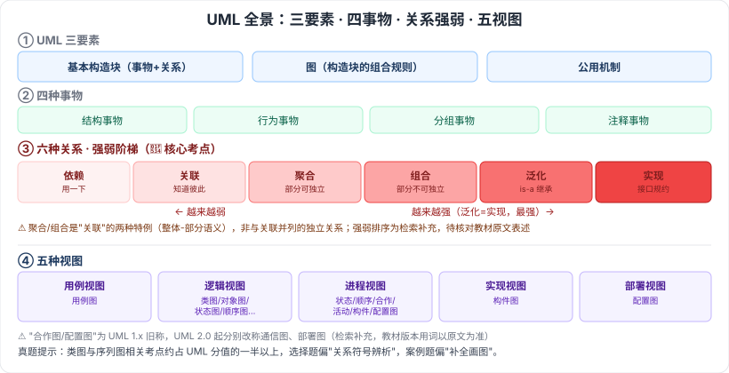

# 2.6 计算机语言

> 来源：网络取材（主线索 lcp0578/book-note 仓库 + 检索资料交叉印证，见 CLAUDE.md「网络取材来源」）· 对应《系统架构设计师教程（第二版）》第 2 章 · 第 6 节

## 一句话概括

计算机语言按"离机器远近"分四代：机器语言（二进制）→ 汇编语言（符号化）→ 高级语言（可移植）→ 建模语言（UML，不直接执行、用于设计表达）；本节重点在 **UML**——三要素、四种关系（含聚合/组合的强弱辨析）、五种视图，是软考类图/序列图相关考题的基础，真题证据充分。

---

## 2.6.1 计算机语言的组成

🟢 计算机语言主要由一套**指令**组成，指令一般包括**表达式、流程控制、集合**三大部分内容。

---

## 2.6.2 计算机语言的分类

| 类型 | 要点 |
| --- | --- |
| 🟡 机器语言 | 二进制代码，由**操作码**和**操作数**两部分组成 |
| 🟡 汇编语言 | 机器语言的符号化描述，仍是**面向机器**的程序设计语言 |
| 🟡 高级语言 | 与计算机架构、指令集**无关**，具有良好的**可移植性** |
| 🔴 建模语言（UML） | 定义良好、易于表达、功能强大且普遍适用的建模语言；不限于面向对象分析设计，支持需求分析开始的软件开发全过程；成为"标准"的原因之一是**与程序设计语言无关**、是符号集语言而非方法学 |
| 🟢 形式化语言 | ⚠️ 检索补充：基于数学/逻辑的规格说明语言，分三类——**基于模型**（Z、VDM、B）、**代数方法**（ACT ONE、OBJ、Larch）、**进程代数**（CSP、CCS、LOTOS）；原始材料本节未展开，教材实际深度待核对 |

### UML 三要素 🟡

基本构造块（**事物**、**关系**） + **图**（支配基本构造块如何放置在一起的规则） + **运用于整个语言的公用机制**

### UML 四种事物 🟡

结构事物、行为事物、分组事物、注释事物

### UML 关系：四种高层分类 + 强弱辨析 🔴

原始材料给出的"依赖、关联、泛化、实现"四种是教程对关系的**高层分类**；⚠️ 检索补充：**聚合、组合**不是并列的第五、六种，而是"**关联**"关系下的两种特例（整体-部分语义的强关联）。备考需按下表整体记忆强弱顺序：

| 关系 | 语义 | 强弱 |
| --- | --- | --- |
| 🔴 依赖 | 一个元素的变化会影响另一个元素（用到但不拥有） | 最弱 |
| 🔴 关联 | 元素间的结构化连接（对象间"知道"彼此） | 弱 |
| 🔴 聚合 | 关联的特例：整体-部分，**部分可脱离整体独立存在** | 中 |
| 🔴 组合 | 关联的特例：整体-部分，**部分不能脱离整体独立存在**（整体销毁、部分也销毁） | 强 |
| 🔴 泛化 | 一般-特殊关系（继承） | 最强（与实现同级） |
| 🔴 实现 | 元素实现另一元素（接口的规约） | 最强（与泛化同级） |

⚠️ 强弱顺序表述"组合 > 聚合 > 关联 > 依赖，泛化与实现同级最强"为检索补充整理，教材原文是否有此明确排序待核对。

### UML 五种视图 🟡

| 视图 | 描述内容 | 主要图 |
| --- | --- | --- |
| 用例视图 | 系统功能需求，外部用户能观察到的功能模型 | 用例图 |
| 逻辑视图 | 系统内部功能实现；静态结构 + 动态协作 | 类图、对象图、状态图、顺序图、合作图、活动图 |
| 进程视图 | 系统并发性、线程间通信与同步 | 状态图、顺序图、合作图、活动图、构件图、配置图 |
| 实现视图 | 代码构件组织、实现模块及依赖关系 | 构件图 |
| 部署视图 | 软硬件物理体系结构及连接、程序/对象部署位置 | 配置图 |

⚠️ 「合作图」「配置图」是 UML 1.x 旧称，UML 2.0 起分别改称**通信图**、**部署图**——检索补充，供理解新旧名称对应，教材版本用词以原文为准。

---

## 记忆钩子

- UML 关系强弱一句话："**用一下**（依赖）< **认识你**（关联）< **你是我一部分但你能独立活**（聚合）< **你是我一部分、我死你也死**（组合）< **我就是你**（泛化/实现，最强）"。
- 四代语言按"人话到机器话"的翻译程度递减记：机器语言（纯机器话）→ 汇编（机器话的符号版）→ 高级语言（接近人话）→ UML（画图表达设计，不执行）。

## 关键词

`机器语言` `汇编语言` `高级语言` `UML` `UML三要素` `事物` `关系` `依赖` `关联` `聚合` `组合` `泛化` `实现` `用例视图` `逻辑视图` `进程视图` `实现视图` `部署视图` `形式化语言` `Z语言` `VDM`
