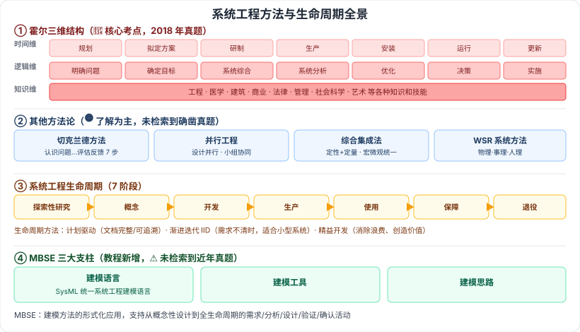

# 2.8 系统工程

> 来源：网络取材（主线索 lcp0578/book-note 仓库 + 检索资料交叉印证，见 CLAUDE.md「网络取材来源」）· 对应《系统架构设计师教程（第二版）》第 2 章 · 第 8 节

## 一句话概括

系统工程 = 用系统化方法把"提要求→设计→评价→修改要求"反复循环、找最佳方案；本节列了多种方法论（霍尔三维结构、切克兰德、并行工程、综合集成法、WSR）和一套通用生命周期（7 阶段），外加近年新增的 MBSE。检索确认本节整体在真题中权重不高，仅**霍尔三维结构**有确凿真题证据。

---

## 2.8.1 系统工程概述

🟡 采用系统工程方法的主要步骤：**对系统提出要求 → 根据要求设计系统、评价设计方案 → 修改要求、再设计**，如此反复循环，最终综合成技术合理、经济合算、研制周期短且能协调运转的工程系统。

---

## 2.8.2 系统工程方法

🟡 系统工程方法是一种现代的科学决策方法，也是一门基本的决策技术。特点：**整体性、综合性、协调性、科学性、实践性**。

### 霍尔的三维结构 🔴

集中体现系统工程方法的系统化、综合化、最优化、程序化和标准化等特点，是系统工程方法论的重要基础内容（⚠️ 2018 年综合知识真题考过一次，考三维定义及"研制阶段做研制方案与生产计划"，属确凿必背点）。

| 维度 | 内容 |
| --- | --- |
| 🔴 时间维 | 规划 → 拟定方案 → 研制 → 生产 → 安装 → 运行 → 更新 |
| 🔴 逻辑维 | 明确问题 → 确定目标 → 系统综合 → 系统分析 → 优化 → 决策 → 实施 |
| 🔴 知识维 | 工程、医学、建筑、商业、法律、管理、社会科学、艺术等各种知识和技能 |

### 切克兰德方法 🟡

将工作过程分为 7 个步骤：认识问题 → 根底定义 → 建立概念模型 → 比较及探寻 → 选择 → 设计与实施 → 评估与反馈。

### 并行工程方法 🟡

强调三点：
1. 产品设计开发期间将概念设计、结构设计、工艺设计、最终需求等结合起来，以最快速度、要求的质量完成
2. 各项工作由相关项目小组完成，成员自行安排工作、随时/定期反馈信息、协调解决问题
3. 依据信息系统工具反馈与协调整个项目，利用现代 CIM 技术辅助项目进程并行化

### 综合集成法 🟡

主要特点：
- 定性研究与定量研究有机结合，贯穿全过程
- 科学理论与经验知识结合，综合集成解决问题
- 应用系统思想把多种学科结合起来综合研究
- 依复杂巨系统的层次结构，把宏观研究与微观研究统一起来
- 必须有大型计算机系统支持（不仅管理信息系统、决策支持系统功能，还要有综合集成功能）

### WSR 系统方法 🟡

WSR 是**物理（Wuli）- 事理（Shili）- 人理（Renli）**方法论的简称。

---

## 2.8.3 系统工程的生命周期

### 系统工程流程的 7 个一般生命周期阶段 🟡

| 阶段 | 目的 |
| --- | --- |
| 探索性研究阶段 | 识别利益攸关者的需求，探索创意和技术 |
| 概念阶段 | 细化利益攸关者的需求，探索可行概念，提出有望实现的解决方案 |
| 开发阶段 | 细化系统需求，创建解决方案的描述，构建系统，验证并确认系统 |
| 生产阶段 | 生产系统并进行检验和验证 |
| 使用阶段 | 运行系统以满足用户需求 |
| 保障阶段 | 提供持续的系统能力 |
| 退役阶段 | 存储、归档或退出系统 |

### 生命周期方法 🟡

| 方法 | 要点 |
| --- | --- |
| 计划驱动方法 | 始终遵守规定流程的系统化方法，特别关注**文档完整性、需求可追溯性、每种表示的事后验证** |
| 渐进迭代开发（IID） | 适用于需求不清晰/不确定或需引入新技术时；基于最初假设开发候选系统并评估，不满足则演进重复，直到满足要求或组织决定终止；适用于**较小、不太复杂**的系统，重点在灵活性 |
| 精益开发 | 动态、知识驱动、以客户为中心的过程，通过消除浪费创造价值；精益系统工程 = 精益原则/实践/工具应用到系统工程，提升利益攸关者价值交付 |

---

## 2.8.4 基于模型的系统工程（MBSE）

🟡 **定义**：MBSE（Model-Based Systems Engineering）是建模方法的形式化应用，以支持系统需求、分析、设计、验证和确认等活动，从概念性设计阶段开始、持续贯穿到设计开发以及后续所有生命周期阶段。

### MBSE 三大支柱 🟡

| 支柱 | 要点 |
| --- | --- |
| 建模语言 | **SysML** 的目的是统一系统工程中使用的建模语言 |
| 建模工具 | ⚠️ 原始材料未展开 |
| 建模思路 | ⚠️ 原始材料未展开 |

⚠️ MBSE 是教程第二版新增内容，检索未找到近年（2022–2025）真题直接考察的证据，暂按"了解/次重点"处理，非高频但需知道基本概念。

---

## 记忆钩子

- 霍尔三维结构记口诀：**时间维=项目七阶段**（规划到更新，像项目管理）、**逻辑维=解题七步骤**（明确问题到实施，像解决问题的思路）、**知识维=用到的各种学科**。
- WSR 三个字直接对应拼音首字母：**物**理、**事**理、**人**理——从"物"到"事"到"人"，越来越软。
- MBSE 三支柱按"用什么画、用什么工具、怎么想"来记：建模**语言**（SysML）+ 建模**工具** + 建模**思路**。

## 关键词

`系统工程` `霍尔三维结构` `时间维` `逻辑维` `知识维` `切克兰德方法` `并行工程` `综合集成法` `WSR` `系统工程生命周期` `计划驱动方法` `渐进迭代开发` `IID` `精益开发` `MBSE` `SysML`
