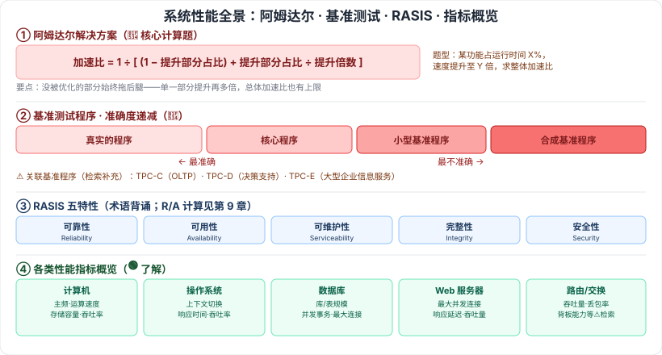

# 2.9 系统性能

> 来源：网络取材（主线索 lcp0578/book-note 仓库 + 检索资料交叉印证，见 CLAUDE.md「网络取材来源」）· 对应《系统架构设计师教程（第二版）》第 2 章 · 第 9 节（本章最后一节）

## 一句话概括

系统性能 = 系统提供给用户的所有性能指标的集合，涵盖硬件/软件性能、部件/综合性能指标；本节最重要的两个计算题考点是**阿姆达尔解决方案**（加速比计算）和**可靠性/可用性相关计算**（RASIS 的子集），基准测试程序的四种类型及准确度顺序也是常考记忆点。

---

## 2.9.1 性能指标

🟡 **系统性能定义**：一个系统提供给用户的所有性能指标的集合，既包括硬件性能（如处理器主频、存储器容量、通信带宽）和软件性能（如上下文切换、延迟、执行时间），也包括部件性能指标和综合性能指标。

### 计算机的性能指标

🟢 时钟频率（主频）、运算速度、运算精度、内存的存储容量、存储器的存取周期、数据处理速率 PDR、吞吐率、各种响应时间、各种利用率、平均故障响应时间、兼容性、可扩充性、性能价格比

#### RASIS 特性 🟡

| 特性 | 英文 |
| --- | --- |
| 可靠性 | Reliability |
| 可用性 | Availability |
| 可维护性 | Serviceability |
| 完整性 | Integrity |
| 安全性 | Security |

⚠️ 检索确认：RASIS 五项术语定义本身多作为选择题背诵点；但真正**高频稳定出计算题**的是其中的**可靠性/可用性子集**（如 MTBF/MTTR、串并联系统可用度计算），这类计算公式属于第 9 章"软件可靠性基础知识"的范畴，本节（2.9）原始材料未给出具体公式，此处不展开、不杜撰，需要计算方法时请参考第 9 章笔记。

### 网络设备性能指标 ⚠️

原始材料仅有标题、无具体内容，以下为检索补充（供参考，教材原文是否与此一致待核对）：

| 对象 | 性能指标（检索补充） |
| --- | --- |
| 路由器 | 设备吞吐量、端口吞吐量、全双工线速转发能力、背靠背帧数、路由表能力、背板能力、丢包率、时延、时延抖动、VPN 支持能力等 |
| 交换机 | 背板吞吐量、缓冲区大小、最大 MAC 地址表大小、VLAN 数量、QoS、端口镜像、负载均衡等 |
| 网络 | 分设备级、网络级、应用级、用户级性能指标，以及吞吐量 |

### 操作系统的性能指标 🟢

系统上下文切换、系统响应时间、系统的吞吐率（量）、系统资源利用率、可靠性、可移植性

### 数据库管理系统的性能指标 🟢

数据库的大小、数据库中表的数量、单个表的大小、表中允许的记录（行）数量、单个记录（行）的大小、表中所允许的索引数量、数据库所允许的索引数量、最大并发事务处理能力、负载均衡能力、最大连接数

### Web 服务器的性能指标 🟢

最大并发连接数、响应延迟、吞吐量

---

## 2.9.2 性能计算

🟢 性能指标计算的主要方法：**定义法、公式法、程序检测法、仪器检测法**。⚠️ 检索未找到本考试对这四种方法的真题引用，判断为低频/了解层面。

---

## 2.9.3 性能设计

- 🟢 性能调整（原始材料未展开）
- 🔴 **阿姆达尔解决方案**：多篇独立来源一致确认这是本节**核心计算题型**（虽未检索到具体年份真题编号，但确认是教材固定考点、历年反复以此模式出计算题）。⚠️ 题目模式（检索补充）：某功能处理时间占系统运行时间 X%，若该功能处理速度提升至原来 Y 倍，求整个系统的加速比；一般公式为：

  **加速比 = 1 / [(1 − 提升部分占比) + 提升部分占比 / 提升倍数]**

  ⚠️ 此公式为检索补充的阿姆达尔定律通用表述，教材原文措辞和例题待核对。

---

## 2.9.4 性能评估

### 基准测试程序 🔴

四种类型，评测准确度依次递减：

**真实的程序 > 核心程序 > 小型基准程序 > 合成基准程序**

⚠️ 检索补充：常关联的具体基准测试程序名称——TPC-C（OLTP 联机事务处理基准）、TPC-D（决策支持基准）、TPC-E（大型企业信息服务基准），教材原文是否提及待核对。

### Web 服务器的性能评估 🟢

压力测试（原始材料未展开）。

---

## 记忆钩子

- 基准测试准确度递减口诀：**越真实越准**——真实程序（最准，就是实际跑）> 核心程序（跑最耗时的那部分代码）> 小型基准程序（跑小片段）> 合成基准程序（人工拼凑，最不准）。
- 阿姆达尔公式记忆：**没提升的部分拖后腿**——公式分母里"没被优化的那一部分占比"始终占主导，所以哪怕某部分提升无限倍，总体加速比也有上限。
- RASIS 五特性首字母就是名字本身：**R**eliability **A**vailability **S**erviceability **I**ntegrity **S**ecurity——但备考重点在 R/A 的计算，不是背全五个字母。

## 关键词

`系统性能` `RASIS` `可靠性` `可用性` `路由器性能指标` `交换机性能指标` `阿姆达尔解决方案` `加速比` `基准测试程序` `TPC-C` `TPC-D` `TPC-E` `压力测试`
