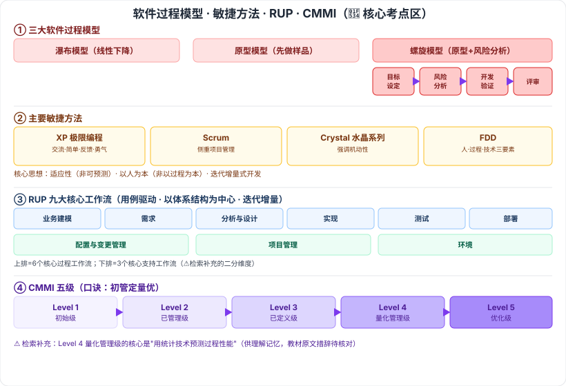

# 5.1 软件工程

> 来源：网络取材（主线索 lcp0578/book-note 仓库 + 检索资料交叉印证，见 CLAUDE.md「网络取材来源」）· 对应《系统架构设计师教程（第二版）》第 5 章 · 第 1 节

## 一句话概括

本节是软考最经典的核心考点区之一：**三大过程模型**（瀑布/原型/螺旋）、**敏捷方法**（XP/Scrum/水晶/FDD）、**RUP 九大工作流与三特点**、**CMMI 五级**，检索确认全部是历年反复出现的高频必考内容，全节高密度 🔴。

---

## 5.1.1 软件工程定义

⚠️ 原始材料本节空白，以下为检索补充（IEEE Std 610.12-1990 通用定义，供参考，教材原文措辞待核对）：

🟡 软件工程 = 将**系统化的、规范的、可量化的方法**应用于软件的开发、运行及维护（1993 年更新版本改为"应用于软件的**过程**"）。

---

## 5.1.2 软件过程模型 🔴

| 模型 | 要点 |
| --- | --- |
| 🔴 瀑布模型 | 最早使用的软件过程模型之一；一系列活动从一个阶段到另一阶段逐次下降，工作流程形式上像瀑布 |
| 🔴 原型化模型（快速原型） | 两阶段：①**原型开发阶段**——根据用户定义快速开发一个原型；②**目标软件开发阶段**——征求用户对原型的意见、修改完善、确认需求达成一致后进一步开发实际系统 |
| 🔴 螺旋模型 | 在快速原型基础上扩展而成，核心是**加入风险分析**；每个阶段由 4 部分组成（见下） |

### 螺旋模型四象限 🔴（选择题常考"哪个模型强调风险分析"）

1. 🔴 **目标设定**：需求分析，定义确定该阶段专门目标，指定对过程和产品的约束，制定详细管理计划
2. 🔴 **风险分析**：对可选方案进行风险识别和详细分析，制定解决办法，采取有效措施避免风险
3. 🔴 **开发和有效性验证**：风险评估后为系统选择开发模型，进行原型开发
4. 🔴 **评审**：评审项目以确定是否进入螺旋线下一次回路，若继续则制订下一阶段计划

---

## 5.1.3 敏捷模型 🔴

### 核心思想（三点）

🟡 适应性而非可预测性；以人为本而非以过程为本；迭代增量式的开发过程。

### 主要敏捷方法 🔴

| 方法 | 要点 |
| --- | --- |
| 🔴 极限编程（XP） | 敏捷方法中最引人瞩目、轻量级但严谨的方法；四大价值观：**交流（沟通）、简单（朴素）、反馈、勇气**——⚠️ 检索补充英文对应 Communication/Simplicity/Feedback/Courage |
| 🟡 水晶系列方法（Crystal） | 提倡"机动性"，含具有共性的核心元素（角色/过程模式/工作产品/实践）；是一组经证明对不同类型项目有效的敏捷过程，团队可按项目和环境选择合适的 Crystal 家族成员 |
| 🔴 Scrum | **侧重项目管理**；迭代式增量软件开发过程；一系列实践和预定义角色的过程骨架 |
| 🟡 特征驱动开发（FDD） | 迭代开发模型；认为有效软件开发需要三要素：**人、过程、技术** |

---

## 5.1.4 统一过程模型（RUP）🔴

### 9 个核心工作流

⚠️ 检索补充：这 9 个工作流实际分为 **6 个核心过程工作流 + 3 个核心支持工作流**，教材是否有此二分待核对。

| 工作流 | 要点 |
| --- | --- |
| 🔴 业务建模 | 理解待开发系统所在机构及商业运作，确保参与人员对机构有共同认识，评估系统对机构的影响 |
| 🔴 需求 | 定义系统功能及用户界面，使客户知道系统功能、开发人员理解需求，为项目预算及计划提供基础 |
| 🔴 分析与设计 | 把需求分析结果转换为分析与设计模型 |
| 🔴 实现 | 把设计模型转换为实现结果，对代码做单元测试，集成为可执行系统 |
| 🔴 测试 | 检查子系统间交互集成，验证需求是否被正确实现，归档缺陷、提出改进建议 |
| 🔴 部署 | 打包、分发、安装软件，升级旧系统，培训用户及销售人员，提供技术支持 |
| 🔴 配置与变更管理 | 跟踪并维护系统开发过程中所有制品的完整性和一致性 |
| 🔴 项目管理 | 为软件开发项目提供计划、人员分配、执行、监控指导，为风险管理提供框架 |
| 🔴 环境 | 为开发机构提供软件开发环境，即过程管理和工具支持 |

### RUP 三大特点 🔴

**用例驱动、以体系结构为中心、迭代和增量**。

⚠️ 检索补充：RUP 还有 **4 个生命周期阶段**（初始→细化→构建→交付），与 9 大工作流是不同维度（阶段 × 工作流的二维模型），原始材料未提及，教材是否展开待核对。

---

## 5.1.5 软件能力成熟度模型（CMMI）🔴

口诀"初管定量优"：

| 级别 | 名称 |
| --- | --- |
| 🔴 Level 1 | 初始级 |
| 🔴 Level 2 | 已管理级 |
| 🔴 Level 3 | 已定义级 |
| 🔴 Level 4 | 量化管理级 |
| 🔴 Level 5 | 优化级 |

⚠️ 检索补充例题线索：CMMI 第 4 级（量化管理级）核心是"用统计技术预测过程性能"，供理解记忆，教材原文措辞待核对。

---

## 记忆钩子

- 三大模型演进线：**瀑布**（线性，改不了）→ **原型**（先做样品再改）→ **螺旋**（原型 + 风险分析，最稳妥但最复杂）。
- 螺旋模型四象限口诀：**目标 → 风险 → 开发 → 评审**，每转一圈都要先"想清楚要什么、评估有什么风险"再动手。
- XP 四价值观首字母：**交（流）简（单）反（馈）勇（气）**，对应英文 CSFC（Communication/Simplicity/Feedback/Courage）。
- CMMI 五级口诀：**初管定量优**——从"乱来"到"有人管"到"有标准"到"能量化"到"会优化"，一级比一级更"讲道理"。
- RUP 三特点记："**用例**"回答做什么、"**体系结构**"回答怎么搭、"**迭代增量**"回答怎么推进。

## 关键词

`软件过程模型` `瀑布模型` `原型模型` `螺旋模型` `风险分析` `敏捷方法` `XP极限编程` `Scrum` `Crystal水晶` `FDD` `RUP` `统一过程模型` `用例驱动` `迭代增量` `CMMI` `初始级` `已管理级` `已定义级` `量化管理级` `优化级`
