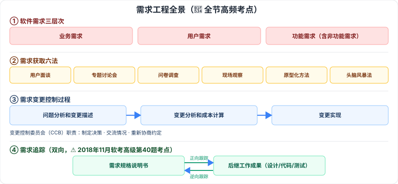

# 5.2 需求工程

> 来源：网络取材（主线索 lcp0578/book-note 仓库 + 检索资料交叉印证，见 CLAUDE.md「网络取材来源」）· 对应《系统架构设计师教程（第二版）》第 5 章 · 第 2 节

## 一句话概括

检索确认本节四大知识点（需求三层次、需求获取六法、需求变更三步骤+CCB、需求追踪正向/逆向）**全部为历年真题反复出现的高频考点**，其中需求追踪找到确切真题实例（2018 年 11 月软考高级第 40 题）。

---

## 需求工程总览

🔴 **软件需求三层次**：业务需求、用户需求、功能需求（也包括非功能需求）。⚠️ 检索确认案例分析题常给出场景要求判断某条陈述属于哪一层次。

🟡 需求工程活动分四阶段：

| 阶段 | 内容 |
| --- | --- |
| 需求获取 | 通过与用户交流、观察现有系统、任务分析，开发/捕获/修订用户需求 |
| 需求分析 | 为系统建立概念模型，作为需求的抽象描述，尽可能多捕获现实世界语义 |
| 形成需求规格（需求文档化） | 按标准生成需求模型文档；用户原始需求书是用户与开发者的协约（常作合同附件）；软件需求规约是后续开发指南 |
| 需求管理 | 需求文档的追踪管理、变更控制、版本控制等 |

---

## 5.2.1 需求获取 🔴

### 基本步骤（六步）

🟡 开发高层业务模型 → 定义项目范围和高层需求 → 识别用户角色和用户代表 → 获取具体的需求 → 确定目标系统的业务工作流 → 需求整理与总结。

### 需求获取方法（六种）🔴

**用户面谈、需求专题讨论会、问卷调查、现场观察、原型化方法、头脑风暴法**。

⚠️ 检索确认这六种方法的**场景辨析**是选择题高频考点，尤以"原型化法 vs 头脑风暴法"的适用场景区分最常被考查。

---

## 5.2.2 需求变更 🔴

### 控制要求（四项）

🟡 仔细评估已建议的变更；挑选合适人选对变更做出判定；变更应及时通知所有相关人员；项目要按一定程序采纳需求变更，对变更过程和状态进行控制。

### 变更控制过程（三步骤）🔴

**问题分析和变更描述 → 变更分析和成本计算 → 变更实现**。

### 变更控制委员会（CCB）职责 🔴

制定决策、交流情况、重新协商约定。

---

## 5.2.3 需求追踪 🔴

🟡 **定义**：编制每个需求同系统元素（其他需求、体系结构、其他设计部件、源代码模块、测试、帮助文件和文档等）之间联系的文档，在整个项目工作之间形成**水平可追踪性**。

🟡 **目的**：建立与维护"需求-设计-编程-测试"之间的一致性，确保工作成果符合用户需求；提供由需求到产品实现整个过程范围的明确查阅能力。

### 两种追踪方式 🔴（⚠️ 确认有真题实例：2018 年 11 月软考高级第 40 题考查此辨析）

| 方式 | 检查方向 |
| --- | --- |
| 🔴 正向跟踪 | 检查《产品需求规格说明书》中的每个需求是否都能在**后继工作成果**中找到对应点 |
| 🔴 逆向跟踪 | 检查设计文档、代码、测试用例等**工作成果**是否都能在《产品需求规格说明书》中找到出处 |

⚠️ 检索补充：正向跟踪 + 逆向跟踪合称"**双向跟踪**"，教材是否有此提法待核对。

---

## 记忆钩子

- 需求追踪正向/逆向记方向：**正向 = 从需求文档"往后"查有没有落实**（需求→成果）；**逆向 = 从工作成果"往回"查有没有出处**（成果→需求），两个方向刚好相反。
- 需求获取六法按"跟谁聊"分组：**一对一**（用户面谈）、**一对多**（专题讨论会、问卷调查、头脑风暴）、**不聊只看**（现场观察）、**先做出来看反应**（原型化方法）。
- 变更控制三步骤是"先看问题、再算成本、最后落地"：**问题分析和变更描述 → 变更分析和成本计算 → 变更实现**。

## 关键词

`软件需求三层次` `业务需求` `用户需求` `功能需求` `需求获取` `头脑风暴法` `原型化方法` `需求变更` `变更控制委员会` `CCB` `需求追踪` `正向跟踪` `逆向跟踪` `水平可追踪性`
