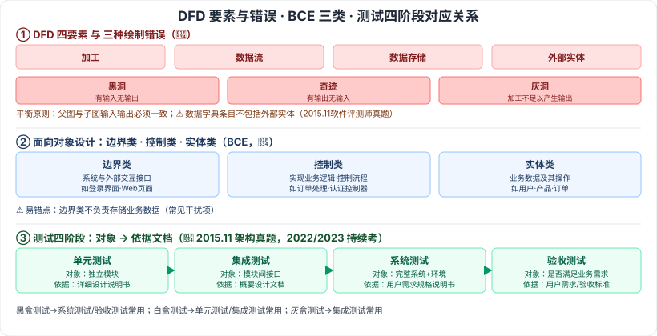

# 5.3 系统分析与设计 · 5.4 软件测试

> 来源：网络取材（主线索 lcp0578/book-note 仓库 + 检索资料交叉印证，见 CLAUDE.md「网络取材来源」）· 对应《系统架构设计师教程（第二版）》第 5 章 · 第 3–4 节

## 一句话概括

检索确认结构化分析工具（DFD/数据字典）、面向对象的边界类-控制类-实体类（BCE 模式）、黑白灰盒测试与四阶段测试对象-依据文档对应关系，均为历年真题反复出现的高频考点，部分找到确切真题出处（2015 年 11 月软件评测师/系统架构设计师真题）。

---

## 5.3 系统分析与设计

### 5.3.1 结构化方法（SASD）

🟡 **结构化分析**：给出一组帮助系统分析人员产生功能规约的原理与技术，一般用图形表达用户需求，主要手段：**数据流图（DFD）、数据字典、结构化语言、判定表、判定树**。

⚠️ 检索补充（DFD 是高频考点，教材原文是否有此展开待核对）：

| DFD 要点 | 内容 |
| --- | --- |
| 🔴 DFD 四要素 | 加工、数据流、数据存储、外部实体 |
| 🔴 平衡原则 | 父图与子图的输入输出必须一致，分层绘制遵循**自顶向下、逐步求精** |
| 🔴 三种绘制错误 | **黑洞**（有输入无输出）、**奇迹**（有输出无输入）、**灰洞**（加工不足以产生输出） |
| 🔴 数据字典条目范围 | ⚠️ 检索确认真题考点（源自 2015 年 11 月软件评测师上午题）：数据字典条目**不包括外部实体** |

🟡 **结构化设计**：面向数据流的设计方法，以数据流图和数据字典等文档为基础，是自顶向下、逐步求精和模块化的过程。

🟡 **结构化编程**：自顶向下、逐步求精，各模块通过"**顺序、选择、循环**"控制结构连接，**只有一个入口和一个出口**。

🟢 **数据库设计（概念结构设计）**：对用户要求描述的现实世界，通过对实体事物的分类、聚集和概括，建立抽象的概念数据模型，反映各部门信息结构、信息流动、信息间制约关系及存储/查询/加工要求。

### 5.3.2 面向对象方法

⚠️ 原始材料"面向对象分析""面向对象编程""数据持久化与数据库"三块空白，暂不填充。

🔴 **面向对象设计——类的三种类型（BCE 模式）**：⚠️ 检索确认这是常考知识点，以下定义为检索补充：

| 类型 | 定义 | 举例 |
| --- | --- | --- |
| 🔴 边界类（Boundary Class） | 实现系统与外部世界（用户界面、外部系统）之间交互的接口 | 登录界面、Web 页面 |
| 🔴 控制类（Control Class） | 负责实现系统业务逻辑，处理数据流、控制应用程序流程 | 订单处理流程、用户认证控制器 |
| 🔴 实体类（Entity Class） | 表示系统业务数据及其相关操作，对应现实世界业务实体，通常具有持久性 | 用户、产品、订单 |

⚠️ 常见易错点（检索补充）：**边界类不负责存储业务数据**——这是真题常见干扰项。

---

## 5.4 软件测试

### 5.4.1 测试方法

🔴 三个分类维度：

| 维度 | 分类 |
| --- | --- |
| 按执行状态 | **静态测试（ST）**：不执行代码，通过评审/走查检查代码或文档；**动态测试（DT）**：执行代码以发现运行时错误 |
| 按对内部结构了解程度 | **黑盒测试**：不关心内部结构，只关注输入输出与功能，常用于系统测试/验收测试；**白盒测试**：关注内部逻辑结构，常用于单元测试/集成测试；**灰盒测试**：介于两者之间，常用于集成测试 |
| 按执行方式 | 人工测试（MT）、自动化测试（AT） |

### 5.4.2 测试阶段 🔴

⚠️ 检索确认此表为高频考点（源自 2015 年 11 月系统架构设计师真题，同类题型 2022、2023 年持续出现）：

| 阶段 | 测试对象 | 依据文档 |
| --- | --- | --- |
| 🔴 单元测试 | 独立模块 | 详细设计说明书 |
| 🔴 集成测试 | 模块间接口 | 概要设计文档 |
| 🔴 系统测试 | 完整系统与运行环境 | 用户需求规格说明书 |
| 🔴 验收测试 | 系统是否满足用户业务需求 | 用户需求/验收标准（用户主导参与） |
| 🟢 性能测试 | —— | 原始材料未展开 |
| 🟢 其他测试 | —— | 原始材料未展开 |

---

## 记忆钩子

- DFD 三种绘制错误按"有没有出口/入口"记：**黑洞**=只进不出、**奇迹**=凭空生出、**灰洞**=进的不够出的多。
- BCE 三类按"谁跟外界打交道"分层：**边界类**面对用户/外系统（前台）、**控制类**管流程调度（中台）、**实体类**存数据（后台）——三层架构的面向对象版本。
- 测试四阶段"对象-文档"对应表按"设计文档倒着测回去"记：**单元测详细设计、集成测概要设计、系统测需求规格、验收测用户满不满意**。
- 黑白灰盒按"能不能看见里面"记：**黑盒看不见**（只看输入输出）、**白盒全看见**（看内部逻辑）、**灰盒看一半**。

## 关键词

`结构化分析` `数据流图` `DFD` `数据字典` `判定表` `判定树` `黑洞` `奇迹` `灰洞` `结构化设计` `结构化编程` `边界类` `控制类` `实体类` `BCE模式` `黑盒测试` `白盒测试` `灰盒测试` `单元测试` `集成测试` `系统测试` `验收测试`
