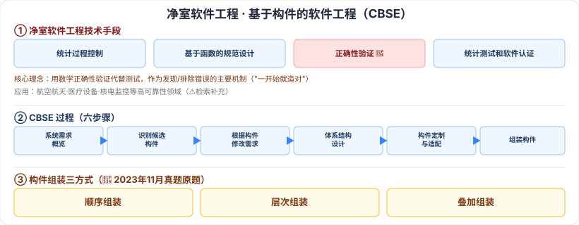

# 5.5 净室软件工程 · 5.6 基于构件的软件工程（CBSE）

> 来源：网络取材（主线索 lcp0578/book-note 仓库 + 检索资料交叉印证，见 CLAUDE.md「网络取材来源」）· 对应《系统架构设计师教程（第二版）》第 5 章 · 第 5–6 节

## 一句话概括

净室软件工程的核心是"**一开始就造对**"——用数学正确性验证取代测试调试，检索确认这是"王牌考点"、2025 年真题频繁出现；CBSE 强调用可复用构件构造系统，**构件组装三方式**（顺序/层次/叠加）有确切真题实证（2023 年 11 月系统架构设计师真题）。这两节都不算低频冷门。

---

## 5.5 净室软件工程

### 5.5.1 理论基础

🟡 净室软件工程是一种在软件开发过程中**强调建立正确性**的方法（区别于传统方法的"造出来再修"）。理论基础：**函数理论、抽样理论**（原始材料未展开）。

⚠️ 检索补充核心区别（供理解，教材原文措辞待核对）：传统方法是"分析→设计→编码→测试→调试"的流程，净室方法强调**用数学正确性验证代替测试**，作为发现/排除错误的主要机制。

### 5.5.2 技术手段

| 手段 | 备注 |
| --- | --- |
| 🟡 统计过程控制下的增量式开发 | —— |
| 🟡 基于函数的规范与设计 | —— |
| 🔴 正确性验证 | ⚠️ 检索确认这是"王牌考点"，多篇资料称 2025 年系统架构设计师真题中频繁出现选择题（考查"核心技术手段"辨析） |
| 🟡 统计测试和软件认证 | —— |

### 5.5.3 应用与缺点

⚠️ **存疑**：原始材料本节空白，检索补充（证据较弱，非直接真题依据）：应用于航空航天、医疗设备、核电监控等**高可靠性领域**；缺点资料未明确列出，推测与"对团队形式化/数学能力要求高、开发周期长"有关，教材原文待核对。

---

## 5.6 基于构件的软件工程（CBSE）

🟡 **定义**：基于分布对象技术，强调通过可复用构件设计与构造软件系统的软件复用途径。

### 5.6.1 构件和构件模型

🟡 构件应具备五个特征：**可组装性、可部署性、文档化、独立性、标准化**（与第 2 章 2.3.7 软件构件五大特征完全一致，参见 [[2.3-计算机软件概述]]）。

### 5.6.2 CBSE 过程（六步骤）

🟡 系统需求概览 → 识别候选构件 → 根据发现的构件修改需求 → 体系结构设计 → 构件定制与适配 → 组装构件，创建系统。

### 5.6.3 构件组装 🔴

⚠️ 检索确认这是**高频且有真题实证**的考点：2023 年 11 月系统架构设计师真题直接考"构件常见的组装方式包括（　）"，正确答案即以下三种：

| 组装方式 | —— |
| --- | --- |
| 🔴 顺序组装 | —— |
| 🔴 层次组装 | —— |
| 🔴 叠加组装 | —— |

⚠️ 原始材料只有三个名称，未展开各自含义，教材原文措辞待核对。

---

## 记忆钩子

- 净室软件工程一句话理解：**不靠"测出来的错"把关，靠"数学证明对不对"把关**——这是它和传统软件工程最本质的区别。
- CBSE 过程六步骤是一条"从需求到组装"的流水线：**需求概览 → 找构件 → 改需求 → 搭架构 → 改构件 → 组装成系统**，中间两次"改"分别对应"构件反过来影响需求"和"构件本身需要适配"。

## 关键词

`净室软件工程` `正确性验证` `函数理论` `抽样理论` `统计过程控制` `CBSE` `基于构件的软件工程` `构件五大特征` `顺序组装` `层次组装` `叠加组装`
