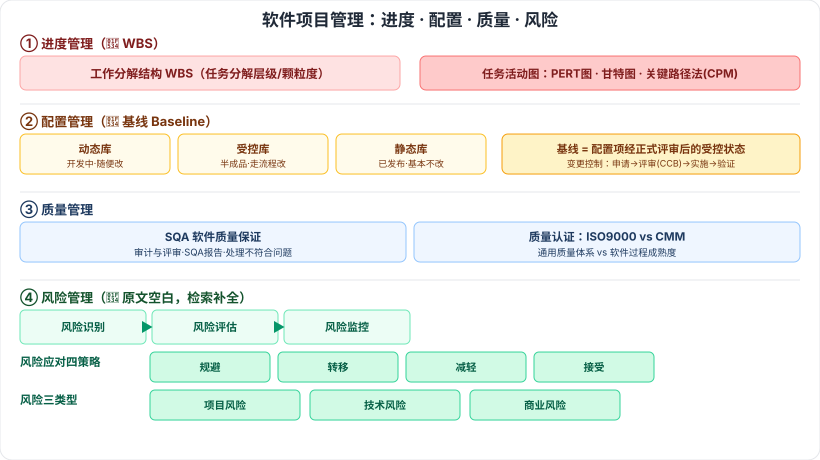

# 5.7 软件项目管理

> 来源：网络取材（主线索 lcp0578/book-note 仓库 + 检索资料交叉印证，见 CLAUDE.md「网络取材来源」）· 对应《系统架构设计师教程（第二版）》第 5 章 · 第 7 节（本章最后一节）

## 一句话概括

本节五个子节（概述/进度/配置/质量/风险管理）检索确认均为软考经典考点：**WBS 工作分解结构**、**配置管理"基线"定义**、**质量管理 ISO9000 与 CMM 辨析**、**风险管理**（原文全空白但确认是固定考点，需重点补全）。

---

## 5.7.1 项目管理概述

🟡 软件项目管理是为了使软件项目能够按照预定的**成本、进度、质量**顺利完成，而对**人员、产品、过程和项目**进行分析和管理的活动。

---

## 5.7.2 软件进度管理 🔴

进度管理包括：活动定义、活动排序、活动资源估计、活动历时估计、指定进度计划、进度控制。

🔴 **工作分解结构（WBS）**：⚠️ 检索确认历年高频考点，常考"任务分解层级、颗粒度、分解原则"等选择题。

🟡 **任务活动图**：原始材料未展开；⚠️ 检索补充：常与 **PERT 图、甘特图、关键路径法（CPM，求工期/关键路径）**结合考察，是经典必考题型，教材原文是否展开这些工具待核对。

---

## 5.7.3 软件配置管理 🔴

| 子项 | 要点 |
| --- | --- |
| 🟡 版本控制 | ⚠️ 检索补充：配置项（CI）标识、版本号规则、配置库三层结构（**动态库/受控库/静态库**） |
| 🟡 变更控制 | ⚠️ 检索补充：变更申请 → 评审（**CCB 变更控制委员会**）→ 实施 → 验证 的闭环流程 |
| 🔴 基线（Baseline） | ⚠️ **检索确认为真题最高频考点，已核实原文定义**：基线是指一个（或一组）配置项在项目生命周期的不同时间点上通过正式评审而进入正式受控的一种状态 |

⚠️ 检索提示原始材料本节遗漏了几个经典考点，建议翻实体书核对是否有以下内容：**配置项分类**（基线配置项/非基线配置项）、**配置管理计划**、**配置审计**。

---

## 5.7.4 软件质量管理

| 子项 | 要点 |
| --- | --- |
| 🟡 软件质量保证（SQA） | 含 SQA 审计与评审、SQA 报告、处理不符合问题 |
| 🟡 软件质量认证 | **ISO 9000**（通用质量体系认证）、**CMM**（软件过程成熟度模型）；⚠️ 检索补充：两者常作辨析对比题——ISO 9000 面向通用质量管理体系，CMM 专注软件过程成熟度 |

---

## 5.7.5 软件风险管理 🔴

⚠️ **存疑，重点补全**：网络取材主线索原文本节**完全空白**，但检索确认这是历年真题的**固定考点**，不能留空，以下为检索补充内容（供参考，教材原文措辞待核对）：

| 环节 | 内容（检索补充） |
| --- | --- |
| 🔴 风险识别 | 识别项目中可能存在的各类风险 |
| 🔴 风险评估 | 概率 × 影响，评估风险的可能性和后果严重程度 |
| 🔴 风险监控 | 持续跟踪已识别风险的状态变化 |
| 🔴 风险应对（四策略） | **规避、转移、减轻、接受** |
| 🔴 风险类型（三分类） | **项目风险、技术风险、商业风险** |

---

## 记忆钩子

- 配置管理三库按"离生产环境远近"记：**动态库**（开发中，随便改）→ **受控库**（半成品，需要走流程改）→ **静态库**（已发布，基本不改）。
- 基线的本质是"**正式评审通过后的快照**"——一旦成为基线，后续修改都要走变更控制流程，不能随便动。
- 风险应对四策略按"怎么处理风险"分：**躲开它**（规避）、**转给别人担**（转移）、**减小它的影响**（减轻）、**认了不管**（接受）。
- 风险三分类按"风险来自哪"记：**项目风险**（进度/资源/人员）、**技术风险**（技术方案本身）、**商业风险**（市场/客户/预算）。

## 关键词

`软件项目管理` `WBS` `工作分解结构` `PERT图` `甘特图` `关键路径法` `配置管理` `基线` `Baseline` `配置项` `CCB` `SQA` `软件质量保证` `ISO9000` `CMM` `软件风险管理` `风险识别` `风险评估` `风险应对`
