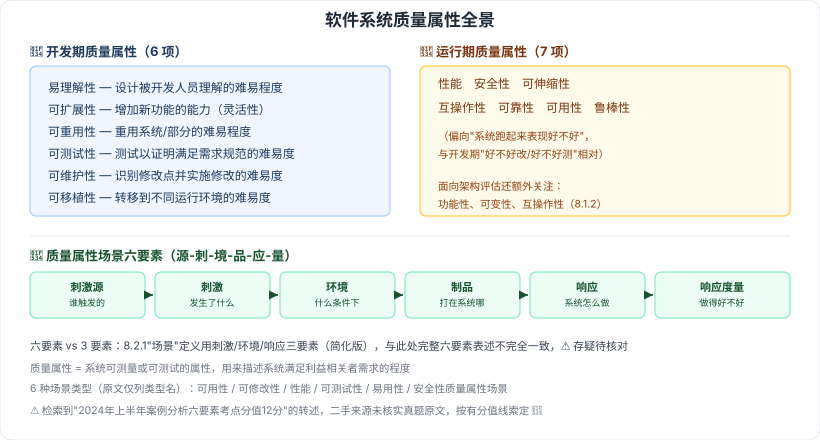

# 8.1 软件系统质量属性

> 来源：网络取材（主线索 lcp0578/book-note 仓库 chapter8.md，见 CLAUDE.md「网络取材来源」）· 对应《系统架构设计师教程（第二版）》第 8 章 · 第 1 节
>
> 本章起恢复本会话检索验证（前会话第 6–7 章因 WebSearch 额度耗尽未验证，本章起额度已重置，分级均经检索交叉核实）。

---

## 8.1.1 质量属性概念

🟡 软件的质量属性是一个系统**可测量或可测试的属性**，用来描述系统满足利益相关者需求的程度。

基于软件系统生命周期，质量属性分两类：

| 分类 | 具体属性 |
| --- | --- |
| 🔴 开发期质量属性（6 项） | 易理解性、可扩展性、可重用性、可测试性、可维护性、可移植性 |
| 🔴 运行期质量属性（7 项） | 性能、安全性、可伸缩性、互操作性、可靠性、可用性、鲁棒性 |

> 检索交叉印证：开发期 6 项、运行期 7 项的条目与顺序，与多个独立 CSDN 笔记转述一致（[博客园·Ritchie](https://www.cnblogs.com/wang-zeyu/p/18753285)、[CSDN·g984160547](https://blog.csdn.net/g984160547/article/details/140439195)）；未找到确切真题年份/题号，但多篇真题解析明确提示"质量属性题目不能出错，是较好拿分的一道题"（[博客园·yangykaifa](https://www.cnblogs.com/yangykaifa/p/19328433)）。

---

## 8.1.2 面向架构评估的质量属性

🟡 架构评估方法普遍关注的质量属性：

- 性能
- 可靠性（含**容错**、**健壮性**）
- 可用性
- 安全性
- 可修改性（含**可维护性**、**可扩展性**、**结构重组**、**可移植性**）
- 功能性
- 可变性
- 互操作性

> 注意与 8.1.1 的分类区分：8.1.1 是按"开发期/运行期"两分，本节是评估方法视角下的关注清单，两套分类**有重叠但不是同一套体系**（如"可修改性"在本节被拆解为四个子项，8.1.1 中"可维护性/可扩展性/可移植性"是并列的独立开发期属性）。

---

## 8.1.3 质量属性场景描述

原文列出的 6 种场景类型（仅有类型名，无具体示例展开）：

🟡 可用性质量属性场景、可修改性质量属性场景、性能质量属性场景、可测试性质量属性场景、易用性质量属性场景、安全性质量属性场景

### 质量属性场景六要素（检索补充）

🔴 原文本节仅列场景类型名称，未展开"场景"本身的组成结构；检索补充标准定义——一个质量属性场景由 **6 个部分**组成：

| 要素 | 含义 |
| --- | --- |
| 刺激源（Source） | 产生该刺激的实体（人、计算机系统或其他触发器） |
| 刺激（Stimulus） | 刺激到达系统时需要考虑和关注的情况 |
| 环境（Environment） | 刺激发生时所处的条件（如系统可能正处于过载状态） |
| 制品（Artifact） | 系统中受刺激的部分（可能是整个系统，也可能是一部分） |
| 响应（Response） | 刺激到达后系统采取的行动 |
| 响应度量（Response Measure） | 当响应发生时，用某种方式对其进行度量，用于测试是否满足需求 |

另需区分：**一般场景**（独立于具体系统、适用于任何系统的通用场景）vs **具体场景**（针对正在评估的特定系统的场景）。

> 来源：多篇 CSDN 笔记交叉印证一致（[CSDN·qq_41413652](https://blog.csdn.net/qq_41413652/article/details/151582241)、[CSDN·huaqianzkh](https://blog.csdn.net/huaqianzkh/article/details/134157300)）；**真题证据**：检索到"2024 年上半年系统架构设计师案例分析真题中，质量属性场景描述六要素是考查重点，分值 12 分"的转述（未能定位到官方真题原文核实具体题号，来源为二手真题解析博客），按有具体分值线索处理为 🔴，但真题原文本身未直接核实，⚠️ 标注。

---

---

## 记忆钩子

- 开发期 vs 运行期，记口诀"**开发看六性**（理解/扩展/重用/测试/维护/移植，全是"性"字结尾），**运行看七样**（性能/安全/伸缩/互操作/可靠/可用/鲁棒，偏向"跑起来好不好"）"。
- 质量属性场景六要素记"**源-刺-境-品-应-量**"：谁触发（源）、触发了什么（刺激）、什么条件下（环境）、打在哪（制品）、系统怎么应对（响应）、应对得好不好怎么量化（响应度量）。

## 关键词

`质量属性` `开发期质量属性` `运行期质量属性` `质量属性场景` `刺激源` `刺激` `环境` `制品` `响应` `响应度量` `一般场景` `具体场景`
