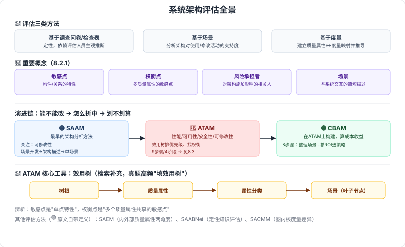

# 8.2 系统架构评估

> 来源：网络取材（主线索 lcp0578/book-note 仓库 chapter8.md，见 CLAUDE.md「网络取材来源」）· 对应《系统架构设计师教程（第二版）》第 8 章 · 第 2 节
>
> 原文 8.2.2 对 SAAM / ATAM 仅列出"评估维度框架"的分类名（如"特定目标、评估技术、质量属性…"），没有展开每个方法在各维度下的具体内容，且 SAAM/ATAM 的输入与评估过程均只有图片引用（SAAM.png / ATAM.png），无文字。以下标 (检索补充) 的内容均为本节检索交叉印证后补充，原文未直接给出。

---

## 系统架构评估的三类方法 🔴

| 方法 | 特点 |
| --- | --- |
| 基于调查问卷或检查表 | 定性，依赖评估人员的主观推断 |
| 基于场景 | 通过分析架构对使用/修改活动的支持程度，判断质量需求满足度 |
| 基于度量 | 建立质量属性与度量的映射，从架构文档中提取度量信息进行推导 |

---

## 8.2.1 系统架构评估中的重要概念 🔴

| 概念 | 定义 |
| --- | --- |
| 敏感点 | 一个或多个构件（及其相互关系）的特性 |
| 权衡点 | 影响多个质量属性的特性，即多个质量属性的敏感点 |
| 风险承担者（利益相关人） | 对架构施加影响、以实现各自目标的相关人员 |
| 场景 | 从风险承担者角度对系统交互的简短描述 |

⚠️ 检索补充定义提到"场景由**刺激、环境、响应**三方面组成"（简化版三要素），与 [[8.1-软件系统质量属性]] 中"质量属性场景"的完整**六要素**（刺激源/刺激/环境/制品/响应/响应度量）不完全一致——推测是不同来源对同一概念的粗细两种表述，未找到教材原文能确认是否为同一定义的两种颗粒度，存疑待核对。

**辨析记忆**：敏感点是"单点特性"，权衡点是"敏感点的交集"（一个特性同时影响多个质量属性，就升级为权衡点）。

---

## 8.2.2 系统架构评估方法

### 1. SAAM 方法（软件架构分析方法）🟡

一种非功能质量属性的架构分析方法，是**最早形成文档并得到广泛使用**的软件架构分析方法。（原文）

- 主要目标（检索补充）：验证软件架构的基本假设和原理，评估架构是否适合特定系统需求，或比较不同架构。
- 主要关注**可修改性**，也可用于评估可移植性、可伸缩性等其他质量属性（检索补充）。
- 输入（检索补充，原文仅图片）：**问题描述、需求说明、架构描述**。
- 评估过程五步骤（检索补充，原文仅图片）：

  **场景开发 → 架构描述 → 单个场景评估 → 场景交互 → 总体评估**

### 2. ATAM 方法（架构权衡分析法）🔴

架构权衡分析法是在 SAAM 的基础上发展起来的，主要针对**性能、实用性、安全性和可修改性**，在系统开发之前，对这些质量属性进行评价和折中。（原文）

- 聚焦 4 类质量属性（检索确认，与原文一致）：**性能、可用性、安全性、可修改性**。
- 核心工具——**效用树（Utility Tree）**（检索补充，原文未提及）：树状结构，**树根 → 质量属性 → 属性分类 → 质量属性场景（叶子节点）**，用于对质量属性分类并排定优先级。
- 具体评估步骤见 [[8.3-ATAM方法架构评估实践]]。

> 真题证据（检索）：效用树是历年案例分析的高频考点，2021/2022 年案例分析考点解析（[博客园·黑帅-quan](https://www.cnblogs.com/wzqnxd/p/17783794.html)）、2024/2025 下半年模考卷（[希赛网](https://www.educity.cn/rk/5350222.html)）均出现"补全效用树/为效用树选场景描述"的题型，可信度高。

### 3. CBAM 方法（成本效益分析法）🟡

成本效益分析法是在 ATAM 上构建，用来对架构设计决策的成本和收益进行建模，是优化此类决策的一种手段。（原文）

8 个步骤（检索补充，原文仅提及方法定义未展开步骤）：

**整理场景 → 场景求精 → 确定场景优先级 → 分配效用 → 明确架构策略涉及的质量属性及响应级别 → 用内插法计算质量属性响应级别的效用 → 计算各架构策略的总收益 → 按受成本限制影响的 ROI 选择架构策略**

### 4. 其他评估方法 🟢（原文自带定义，未做检索补充）

| 方法 | 说明 |
| --- | --- |
| SAEM | 将软件架构看作最终产品及设计过程中的中间产品，从外部质量属性和内部质量属性两个角度阐述评估模型 |
| SAABNet | 一种用来表达和使用定性知识以辅助架构定性评估的方法 |
| SACMM | 一种软件架构修改的度量方法，基于图内核定义差异度量准则计算两个软件架构之间的距离 |

---

---

## 记忆钩子

- SAAM → ATAM → CBAM 是一条演进链："**先看能不能改（SAAM 关注可修改性）→ 再看多个质量属性怎么折中（ATAM 权衡）→ 最后算这么改划不划算（CBAM 算钱）**"。
- SAAM 五步骤记"**开场评交总**"：场景**开**发、架构描述、**单场景**评估、**场景交互**、**总**体评估。
- 效用树四层记"**根—属—类—景**"：树根（系统质量）→ 质量属性 → 属性分类 → 场景（叶子节点，最具体）。

## 关键词

`架构评估三类方法` `敏感点` `权衡点` `风险承担者` `场景` `SAAM` `ATAM` `CBAM` `效用树` `SAEM` `SAABNet` `SACMM`
