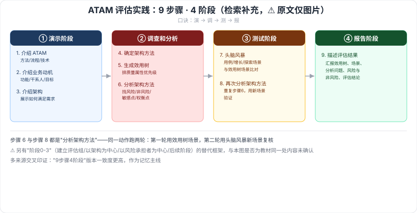

# 8.3 ATAM 方法架构评估实践

> 来源：网络取材（主线索 lcp0578/book-note 仓库 chapter8.md，见 CLAUDE.md「网络取材来源」）· 对应《系统架构设计师教程（第二版）》第 8 章 · 第 3 节
>
> ⚠️ 原文本节**只有一句标题性说明 + 一张流程图片引用（ATAM.png）**，没有任何文字展开。以下内容全部为检索补充，用于填补图片信息，非教材原文转录，措辞可能与教材不完全一致，建议翻实体书核对原图。

---

## ATAM 评估实践：9 个步骤，分 4 个阶段 🔴

多篇独立检索来源（[CSDN·qq_42935045](https://blog.csdn.net/qq_42935045/article/details/153782971)、[企业架构设计方法与实践](https://tonydeng.github.io/EA-practices/governance/assessment/atam.html)、[CSDN·weixin_43960657](https://blog.csdn.net/weixin_43960657/article/details/143593980) 等）一致给出以下结构，来源相互印证、可信度较高：

| 阶段 | 步骤 | 内容 |
| --- | --- | --- |
| **① 演示阶段** | 1. 介绍 ATAM | 评估负责人向参与者解释 ATAM 方法、评估流程、将使用的技术 |
| | 2. 介绍业务动机 | 从业务视角介绍系统功能、主要利益相关方、业务目标和其他约束 |
| | 3. 介绍架构 | 架构团队展示被评估的体系结构，说明架构如何工作、如何满足关键需求 |
| **② 调查和分析阶段** | 4. 确定架构方法 | 识别能理解系统关键需求的关键架构方法 |
| | 5. 生成质量属性效用树 | 确定最重要的质量属性并排定优先级，构造效用树 |
| | 6. 分析架构方法 | 调查架构方法、提出分析问题、分析问题的答案，找出**风险、非风险、敏感点、权衡点** |
| **③ 测试阶段** | 7. 头脑风暴和确定场景优先级 | 风险承担者头脑风暴列出场景（用例场景、增长场景、探索场景），与效用树中的优先场景比对 |
| | 8. 分析架构方法（第二轮） | 重复步骤 6 的分析动作，验证新场景下的架构表现 |
| **④ 报告阶段** | 9. 描述评估结果 | 汇报效用树、生成的场景、分析问题、已识别的风险与非风险、评估结论 |

⚠️ 检索中还发现另一种"阶段划分"表述——**阶段 0（建立评估小组）→ 阶段 1（以架构为中心，获取并分析架构信息）→ 阶段 2（以风险承担者为中心，获取意见并验证阶段 1 结果）→ 阶段 3（后续阶段，形成最终报告）**（[百度百科·atam](https://baike.baidu.com/item/atam/1652710)、[博客园·mongotea](https://www.cnblogs.com/mongotea/p/11986011.html) 等）。这一版本更强调"评估组织/参与方"视角，与上表"9 步骤 4 阶段"（更强调"方法内部活动"视角）**是否是教材原文所指的同一套内容尚未确认**，未找到能明确对应到本教材版本的原文，两者均标 ⚠️，以上表"9 步骤 4 阶段"作为主线（多来源一致度更高），供优先记忆。

---

---

## 记忆钩子

- 4 阶段记"**演调测报**"：**演**示（说清楚要评估什么）→ **调**查分析（挖出风险点）→ **测**试（拿场景去验证）→ **报**告（交作业）。
- 步骤 6 和步骤 8 都是"分析架构方法"，唯一区别是**跑两轮**——第一轮用效用树里的场景分析，第二轮用头脑风暴新场景再验证一次，本质是同一动作的"复核"。

## 关键词

`ATAM评估实践` `演示阶段` `调查和分析阶段` `测试阶段` `报告阶段` `效用树` `风险` `非风险` `敏感点` `权衡点`
