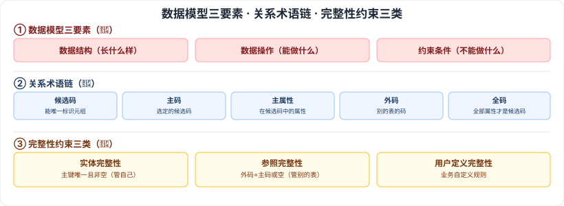

# 6.1 数据库基本概念 · 6.2.1 关系数据库基本概念

> 来源：网络取材（主线索 lcp0578/book-note 仓库，见 CLAUDE.md「网络取材来源」）· 对应《系统架构设计师教程（第二版）》第 6 章 · 第 1 节、第 2.1 节
>
> ⚠️ **本节分级未经本次会话检索验证**：本次会话 WebSearch 额度已耗尽，无法逐条检索真题证据交叉核实。以下分级按通用软考常识判断（这些是数据库领域公认的经典基础概念，在软考各科目中普遍重要），而非本次检索到的具体真题年份/题号；内容严格取自网络取材主线索原文，未做检索补充。

---

## 6.1 数据库基本概念

### 6.1.1 数据库技术的发展

🟢 三阶段：**人工管理阶段 → 文件系统阶段 → 数据库系统阶段**。

### 6.1.2 数据模型三要素

🔴 **数据结构、数据操作、数据的约束条件**。

### 6.1.3 数据库管理系统（DBMS）

🟡 DBMS 实现了对共享数据的有效组织、管理和存取。

**DBMS 功能**：数据定义（通过 DDL 描述外模式/模式/内模式、完整性、安全保密定义，存于数据字典）、数据库操作、数据库运行管理、数据组织存储和管理、数据库的建立和维护。

**DBMS 特点**：数据结构化且统一管理；有较高的数据独立性；数据控制功能（对数据的**安全性、完整性、并发和恢复**的控制）。

### 6.1.4 数据库三级模式

⚠️ **存疑，内容缺失**：网络取材主线索原文本节只有一张图片引用（"DBMS3.png"数据库系统体系结构图），没有任何文字说明，本次未检索补充（额度耗尽），暂时留空。**这是数据库领域的经典必背内容，强烈建议翻实体书直接补全**（外模式/概念模式/内模式三级模式及二级映像的具体定义）。

---

## 6.2.1 关系数据库基本概念

### 关系的基本术语 🔴

| 术语 | 定义 |
| --- | --- |
| 属性 | 描述事物的若干特征 |
| 域 | 每个属性的取值范围对应的值的集合 |
| 目 / 度 | 一个关系中属性的个数 |
| 候选码 | 关系中某一属性或属性组的值能唯一标识一个元组 |
| 主码（主键） | 一个关系有多个候选码时，选定其中一个作为主码 |
| 主属性 / 非主属性 | 包含在任何候选码中的属性称为主属性，不包含的称为非主属性 |
| 外码 | 关系模式 R 中不是本关系的码、但是其他关系的码的属性（集） |
| 全码 | 关系模式的所有属性组构成候选码 |
| 笛卡尔积 | —— |

### 关系数据库模式

🟡 关系模式形式化表示：**R(U, D, dom, F)**——R 为关系名，U 是属性名集合，D 是属性的域，dom 是属性向域的映像集合，F 为属性间数据的依赖关系集合；简记为 R(U) 或 R(A₁,A₂,...,Aₙ)。

### 关系的完整性约束 🔴

| 约束 | 定义 |
| --- | --- |
| 实体完整性 | 每个数据表必须有主键，作为主键的所有字段必须唯一且非空 |
| 参照完整性（引用完整性） | 若 F 是基本关系 R 的外码，与基本关系 S 的主码 Ks 相对应，则 R 中每个元组在 F 上的值要么取空值，要么等于 S 中某元组的主码值 |
| 用户定义完整性 | 针对具体关系数据库的约束条件，反映具体应用所涉及数据必须满足的语义要求，由应用环境决定 |

---

## 记忆钩子

- 数据模型三要素记"结构-操作-约束"，对应"长什么样-能做什么-不能做什么"。
- 候选码/主码/主属性/外码/全码是一条链：**候选码**是"能唯一标识的候选人"，选一个当**主码**；被主码/候选码覆盖的属性是**主属性**；别的表的码放到本表里叫**外码**；如果全部属性合起来才能当候选码，就是**全码**。
- 三类完整性约束记"管自己、管别人、管特殊需求"：实体完整性管本表主键，参照完整性管跟别的表的外键关系，用户定义完整性管业务自定义规则。

## 关键词

`数据模型三要素` `DBMS` `数据字典` `数据独立性` `数据库三级模式` `候选码` `主码` `外码` `全码` `主属性` `实体完整性` `参照完整性` `用户定义完整性`
