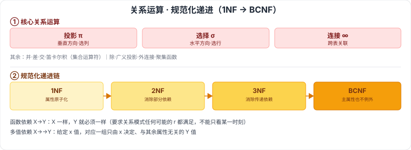

# 6.2.2 关系运算 · 6.2.3 关系数据库设计基本理论

> 来源：网络取材（主线索 lcp0578/book-note 仓库，见 CLAUDE.md「网络取材来源」）· 对应《系统架构设计师教程（第二版）》第 6 章 · 第 2.2–2.3 节
>
> ⚠️ **本节分级未经本次会话检索验证**（WebSearch 额度耗尽，见 6.1-6.2.1 说明）。函数依赖、规范化（1NF-BCNF）是数据库理论中公认的核心经典内容，按通用软考常识定 🔴；内容严格取自网络取材主线索原文。

---

## 6.2.2 关系运算

🟡 关系代数运算符分四类：**集合运算符、专门的关系运算符、算术比较符、逻辑运算符**。

### 具体运算

| 运算 | 符号 | 说明 |
| --- | --- | --- |
| 🟡 并（Union） | —— | 集合运算 |
| 🟡 差（Difference） | —— | 集合运算 |
| 🟡 广义笛卡尔积（Extended Cartesian Product） | × | —— |
| 🔴 投影（Projection） | π | 从关系的**垂直方向**进行运算（选列） |
| 🔴 选择（Selection） | σ | 从关系的**水平方向**进行运算（选行） |
| 🟡 交（Intersection） | —— | 集合运算 |
| 🔴 连接（Join） | ∞ | —— |
| 🟡 除（Division） | —— | —— |
| 🟢 广义投影（Generalized Projection） | —— | —— |
| 🟢 外连接（Outer Join） | —— | —— |
| 🟢 聚集函数 | —— | —— |

---

## 6.2.3 关系数据库设计基本理论

### 函数依赖 🔴

设 R(U) 是属性集 U 上的关系模式，X、Y 是 U 的子集。若对 R(U) 的任何一个可能的关系 r，r 中不可能存在两个元组在 X 上的属性值相等而在 Y 上的属性值不等，则称 **X 函数决定 Y** 或 **Y 函数依赖于 X**，记作 X→Y。

⚠️ 注意：函数依赖的定义要求关系模式 R 的**任何可能的 r 都满足**上述条件，因此不能仅考察 R 在某一时刻的关系 r 就断定某函数依赖成立。

### 多值依赖 🟡

若关系模式 R(U) 中，X、Y、Z 是 U 的子集，且 Z=U-X-Y。当且仅当对 R(U) 的任何一个关系 r，给定一对 (x,z) 值，有一组 Y 的值只由 x 值决定而与 z 值无关，则称"**Y 多值依赖于 X**"或"**X 多值决定 Y**"成立，记为 X→→Y。

### 规范化（1NF–BCNF）🔴

| 范式 | 定义 | 通俗理解 |
| --- | --- | --- |
| 🔴 1NF | 关系模式 R 的每一个分量都是不可再分的数据项 | 属性原子化 |
| 🔴 2NF | R∈1NF，且每一个非主属性完全依赖于码 | 1NF 消除非主属性对码的**部分**函数依赖 |
| 🔴 3NF | R(U,F) 中不存在码 X、属性组 Y 及非主属性 Z（Z∉Y）使得 X→Y（Y↛X）、Y→Z 成立 | 2NF 消除非主属性对码的**传递**函数依赖 |
| 🔴 BCNF | R∈1NF，若 X→Y 且 Y∉X 时 X 必含有码 | 3NF 消除主属性对码的部分函数依赖和传递函数依赖 |

---

## 记忆钩子

- 投影 π 记"竖着切"（选列），选择 σ 记"横着切"（选行）——一个管垂直方向、一个管水平方向。
- 规范化 1NF→2NF→3NF→BCNF 是一条"消除依赖"的升级链：**1NF 保证原子性**（先把数据切干净）→ **2NF 消除部分依赖**（非主属性得完全靠码）→ **3NF 消除传递依赖**（非主属性不能靠别的非主属性）→ **BCNF 更严格**（连主属性对码的依赖也要理清）。
- 函数依赖 X→Y 的核心是"X 一样，Y 就必须一样"——反过来举反例（X 相同但 Y 不同）就能证伪。

## 关键词

`关系代数` `投影` `选择` `连接` `并` `差` `笛卡尔积` `函数依赖` `多值依赖` `规范化` `1NF` `2NF` `3NF` `BCNF` `部分函数依赖` `传递函数依赖`
