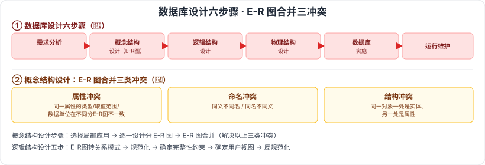

# 6.3 数据库设计

> 来源：网络取材（主线索 lcp0578/book-note 仓库，见 CLAUDE.md「网络取材来源」）· 对应《系统架构设计师教程（第二版）》第 6 章 · 第 3 节
>
> ⚠️ **本节分级未经本次会话检索验证**（WebSearch 额度耗尽）。数据库设计六步骤是数据库领域公认的核心经典内容（与第 2 章 2.3.3 提到的"数据库设计六步骤"是同一套框架，参见 [[2.3-计算机软件概述]]），按通用软考常识定 🔴；内容严格取自网络取材主线索原文。

---

## 6.3.1 数据库设计的基本步骤 🔴

六个阶段（与第 2 章 2.3.3 的框架一致，本节展开更细）：

| 阶段 | 内容 |
| --- | --- |
| 🔴 用户需求分析 | 数据库设计人员采用辅助功能对应用对象的功能、性能、限制等要求进行科学分析 |
| 🔴 概念结构设计 | 信息分析和定义（视图模型化、视图分析和汇总），对应用对象抽象概括，形成独立于计算机系统的企业信息模型；较理想的描述工具是 **E-R 图** |
| 🔴 逻辑结构设计 | 将抽象概念模型转换为选用 DBMS 产品支持的数据模型，是物理结构设计的基础；含模式初始设计、子模式设计、应用程序设计、模式评价、模式求精 |
| 🔴 物理结构设计 | 逻辑模型在计算机中的具体实现方案 |
| 🔴 数据库实施阶段 | 根据逻辑设计和物理设计结果建立数据库，编制调试应用程序，组织数据入库，进行试运行 |
| 🔴 数据库运行和维护阶段 | 应用系统试运行后即可投入运行，但需不断评价、调整与修改 |

---

## 6.3.2 数据需求分析

🟡 综合各用户的应用需求，对现实世界要处理的对象（组织/部门/企业等）进行详细调查，了解现行系统概况、确定新系统功能，收集支持系统目标的基础数据及处理方法。

---

## 6.3.3 概念结构设计 🔴

🟡 目标：产生反映系统信息要求的数据库概念结构，即**概念模式**。步骤：**选择局部应用 → 逐一设计分 E-R 图 → E-R 图合并**。

### E-R 图合并的三类冲突 🔴

| 冲突类型 | 说明 |
| --- | --- |
| 🔴 属性冲突 | 同一属性存在于不同分 E-R 图中，因涉及人员/出发点不同，对属性的类型、取值范围、数据单位等可能不一致，需在设计阶段统一 |
| 🔴 命名冲突 | 相同意义的属性在不同分 E-R 图上命名不同；或名称相同的属性在不同分 E-R 图中代表不同意义 |
| 🔴 结构冲突 | 同一实体在不同分 E-R 图中有不同属性；同一对象在某分 E-R 图中被抽象为实体，在另一分 E-R 图中被抽象为属性 |

---

## 6.3.4 逻辑结构设计

🟡 在概念结构设计基础上进行数据模型设计，可以是**层次模型、网状模型、关系模型**。

主要工作步骤：**E-R 图转换为关系模式 → 关系模式规范化 → 确定完整性约束 → 确定用户视图 → 反规范化**。

---

## 6.3.5 物理设计

🟡 主要工作步骤：**确定数据分布、确定数据的存储结构、确定数据的访问方式**。

---

## 6.3.6 数据库实施

🟡 根据逻辑和物理设计结果，在计算机上建立实际数据结构、数据加载（装入）、试运行和评价，称为数据库的实施（实现）。步骤：**建立实际的数据库结构 → 数据加载 → 数据库试运行和评价**。

---

## 6.3.7 数据库运行维护

🟡 主要内容：**对数据库性能的监测和改善、数据库的备份及故障恢复、数据库重组和重构**。

---

## 记忆钩子

- 数据库设计六步骤和第2章数据库设计六步骤是**同一套框架**：需求分析 → 概念结构 → 逻辑结构 → 物理结构 → 实施 → 运维，一条从"人话"到"机器话"再到"能跑起来"的流水线。
- E-R 图合并三种冲突记"同名不同义、同义不同名、同一事物身份不同"：**属性冲突**=同一属性的定义打架、**命名冲突**=名字对不上、**结构冲突**=同一个东西一会是实体一会是属性。

## 关键词

`数据库设计六步骤` `需求分析` `概念结构设计` `E-R图` `属性冲突` `命名冲突` `结构冲突` `逻辑结构设计` `反规范化` `物理设计` `数据库实施` `数据库运行维护`
