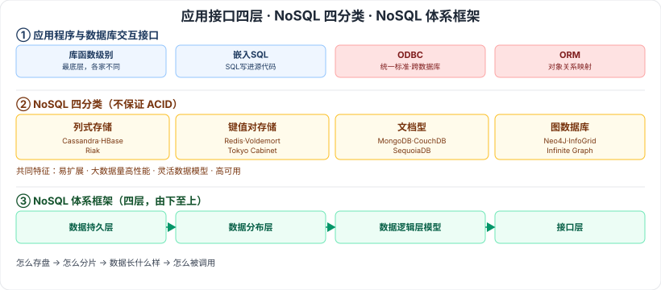

# 6.4 应用程序与数据库的交互 · 6.5 NoSQL 数据库

> 来源：网络取材（主线索 lcp0578/book-note 仓库，见 CLAUDE.md「网络取材来源」）· 对应《系统架构设计师教程（第二版）》第 6 章 · 第 4–5 节（本章最后两节）
>
> ⚠️ **本节分级未经本次会话检索验证**（WebSearch 额度耗尽）。ODBC、ORM 是应用开发中的常识性概念，NoSQL 分类是较新但常见的考点，按通用软考常识定级；内容严格取自网络取材主线索原文。

---

## 6.4 应用程序与数据库的交互

四种访问接口，按"层级由低到高"排列：

| 接口 | 说明 |
| --- | --- |
| 🟡 库函数级别访问接口 | 数据库提供的最底层的高级程序语言访问数据接口 |
| 🟡 嵌入 SQL 访问接口 | 将 SQL 语句直接写入某些高级程序语言的源代码中 |
| 🔴 通用数据接口标准（ODBC） | **开放数据库连接（Open DataBase Connectivity）**，为解决异构数据库间数据共享而产生；为异构数据库访问提供统一接口，允许应用程序以 SQL 为数据存取标准存取不同 DBMS 管理的数据，使应用程序直接操作数据而不随数据库改变而改变 |
| 🔴 ORM 访问接口 | **对象关系映射（Object Relational Mapping）**，一种程序设计技术，用于实现面向对象编程语言里不同类型系统数据之间的转换 |

---

## 6.5 NoSQL 数据库

🟡 NoSQL 仅仅是一个概念，泛指**非关系型数据库**，区别于关系数据库，它们**不保证关系数据的 ACID 特性**。

### 6.5.1 分类与特点

🔴 四大分类（原始材料举例的代表产品）：

| 分类 | 代表产品 |
| --- | --- |
| 🔴 列式存储数据库 | Cassandra、HBase、Riak |
| 🔴 键值对存储数据库 | Tokyo Cabinet/Tyrant、Redis、Voldemort、Oracle BDB |
| 🔴 文档型数据库 | CouchDB、MongoDB、SequoiaDB |
| 🔴 图数据库 | Neo4J、InfoGrid、Infinite Graph |

🟡 共同特征：**易扩展、大数据量高性能、灵活的数据模型、高可用**。

### 6.5.2 体系框架

🟡 NoSQL 整体框架分四层，由下至上：

**数据持久层（Data Persistence）→ 数据分布层（Data Distribution Model）→ 数据逻辑层模型（Data Logical Model）→ 接口层（Interface）**

---

## 记忆钩子

- 应用接口四层按"离数据库越来越远、越来越标准化"记：**库函数**（最底层，各家不同）→ **嵌入SQL**（写进代码里）→ **ODBC**（统一标准，跨数据库）→ **ORM**（面向对象，最贴近开发者）。
- NoSQL 四分类按"存的是什么形状"记：**列式**=一列一列存（大数据分析）、**键值对**=最简单的字典（缓存）、**文档型**=存一整份JSON（灵活结构）、**图**=存节点和关系（社交网络）。
- NoSQL 体系框架四层是"从底层存储到顶层接口"：**持久层**（怎么存盘）→ **分布层**（怎么分片）→ **逻辑层**（数据长什么样）→ **接口层**（怎么被调用）。

## 关键词

`ODBC` `开放数据库连接` `ORM` `对象关系映射` `NoSQL` `非关系型数据库` `ACID` `列式存储` `键值对存储` `文档型数据库` `图数据库` `Redis` `MongoDB` `Neo4J`
