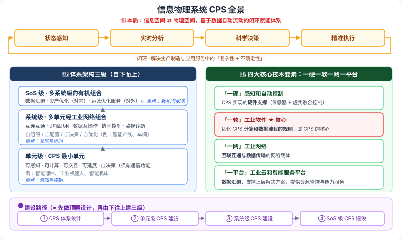

# 11.1 信息物理系统技术概述

> 来源：网络取材（主线索 lcp0578/book-note 仓库 chapter11.md，见 CLAUDE.md「网络取材来源」）· 对应《系统架构设计师教程（第二版）》第 11 章 · 第 1 节
>
> 📌 原始材料本节**只有**：CPS 定义、CPS 本质、体系架构三级的**名称**、四大核心技术要素（含各自一句话作用）。其余（三级的具体功能、技术体系、建设路径、应用场景）均为 (检索补充)，来源：[CSDN·z2014z](https://blog.csdn.net/z2014z/article/details/142614702)、[CSDN·weixin_43960657](https://blog.csdn.net/weixin_43960657/article/details/144458385)，两来源相互独立且措辞高度一致。

---

## 一句话概括

CPS 就是**给物理世界配一个数字分身，并让数据在两者之间自动闭环流动**——感知物理世界 → 在信息空间分析决策 → 再精准回控物理世界。

---

## 一、CPS 是什么 🔴（原文）

**信息物理系统（Cyber-Physical Systems, CPS）**

- CPS 是**多领域、跨学科**不同技术**融合发展**的结果。
- **定义**：通过集成先进的**感知、计算、通信、控制**等信息技术和自动控制技术，构建了**物理空间与信息空间**中**人、机、物、环境、信息**等要素**相互映射、适时交互、高效协同**的复杂系统，实现系统内资源配置和运行的**按需响应、快速迭代、动态优化**。

> 🟢 (检索补充) CPS 源于对**控制系统、嵌入式系统的扩展与延伸**——与第 2 章 2.4 嵌入式系统一脉相承。

### 本质 🔴（原文，本节最核心一句）

> CPS 的本质就是构建一套**信息空间与物理空间之间基于数据自动流动**的
> **状态感知 → 实时分析 → 科学决策 → 精准执行** 的**闭环赋能体系**，
> 解决生产制造、应用服务过程中的**复杂性和不确定性**问题，提高资源配置效率，实现资源优化。

**记忆钩子**：四个动作八个字——**感知 · 分析 · 决策 · 执行**，且必须是**闭环**、必须是**数据自动流动**。
「解决什么问题」也要记：**复杂性 + 不确定性**。

---

## 二、CPS 体系架构：三个层级 🔴（层级名称为原文，各级功能为检索补充）

| 层级 | 定位 | 核心能力 | 举例 |
| --- | --- | --- | --- |
| **单元级** | CPS 的**最小单元**（不可分割） | **可感知、可计算、可交互、可延展、自决策**；必须具备**通信功能** | 智能部件、工业机器人、智能机床 |
| **系统级** | 多个**单元级**通过**工业网络**组合 | **互连互通、即插即用、数据互操作、协同控制、监视与诊断**；具备**自组织、自配置、自决策、自优化** | 智能生产线、智能车间 |
| **SoS 级** (System of Systems) | 多个**系统级** CPS 的**有机组合** | **数据汇聚**、**资产优化**（对内）与**运营优化服务**（对外）；含数据存储、融合、分布式计算、大数据分析、数据服务 | 工厂级 / 企业级 CPS |

> **一句话串起来**：**单元级是"一个能自己想事的零件"，系统级是"一群零件被网连起来协同干活"，SoS 级是"多条产线的数据汇到平台上做优化和服务"。**
>
> 递进逻辑：**单元级重"感知与控制" → 系统级重"互联与协同" → SoS 级重"数据与服务"**。

⚠️ 单元级五功能「可感知、可计算、可交互、可延展、自决策」原文未列出，为两来源一致的检索补充；系统级"四自"（自组织/自配置/自决策/自优化）仅见于其中一个来源，可信度中等。

---

## 三、四大核心技术要素：「一硬 · 一软 · 一网 · 一平台」🔴（原文，本节最像考点的一处）

| 要素 | 指什么 | 定位（原文措辞） |
| --- | --- | --- |
| **"一硬"** | **感知和自动控制** | CPS 实现的**硬件支撑** |
| **"一软"** | **工业软件** | **固化**了 CPS 计算和数据流程的**规则**，是 CPS 的**核心** |
| **"一网"** | **工业网络** | **互联互通和数据传输**的**网络载体** |
| **"一平台"** | **工业云和智能服务平台** | CPS **数据汇聚**和**支撑上层解决方案**的技术，对外提供**资源管控和能力服务** |

**易错点**：**"一软"（工业软件）才是核心**，不是"一硬"、也不是"一平台"。硬件只是**支撑**，平台是**汇聚**。

> **记忆口诀**：**硬件撑、软件核、网络传、平台聚。**

### （检索补充，🟢 了解）各要素的展开

- **一硬 · 智能感知**：主要靠**传感器技术**。
- **一硬 · 虚实融合控制**：多层「感知—分析—决策—执行」循环，分四个层次——**嵌入控制**（控物理实体）、**虚体控制**（信息空间中对信息虚体的控制计算）、**集控控制**（通过 CPS 总线做虚体集成与控制）、**目标控制**（比对产品数据判断是否达成目标）。⚠️ 单一来源，可信度中等。
- **一软 · 工业软件定义**：专用于工业领域，为提高工业企业研发、制造、生产、服务与管理水平以及工业产品使用价值的软件。
- **一平台**：用**边缘计算、雾计算、大数据分析**加工数据（与本章 11.4 边缘计算呼应）。

---

## 四、CPS 技术体系三层 🟢（全部为检索补充，了解即可）

| 层 | 定位 | 内容 |
| --- | --- | --- |
| **总体技术** | 顶层设计 | 系统架构、异构系统集成、安全技术、试验验证技术 |
| **支撑技术** | 应用基础 | 智能感知、嵌入式软件、数据库、人机交互、中间件、SDN、物联网、大数据 |
| **核心技术** | 基础技术 | 虚实融合控制、智能装备、MBD、**数字孪生**、现场总线、工业以太网、CAX / MES / ERP / PLM / CRM / SCM |

> 注意「核心技术」里出现了**数字孪生**（本章 11.5）、「支撑技术」里出现了**物联网 / 大数据**（11.6）——第 11 章各节不是并列的六个孤岛，**CPS 是把它们串起来的那根线**。

---

## 五、CPS 建设路径：四阶段 🟡（检索补充，两来源一致）

**CPS 体系设计 → 单元级 CPS 建设 → 系统级 CPS 建设 → SoS 级 CPS 建设**

| 阶段 | 干什么 |
| --- | --- |
| CPS 体系设计 | 结合行业自身特点，设计应用模式、体系架构、安全体系、标准规范 |
| 单元级建设 | 安装感知与控制设备，实现工艺流程数字化，达成单元级资源优化 |
| 系统级建设 | 建设工业网络，实现多单元**互联互通、协同控制** |
| SoS 级建设 | 建设大数据与智能服务平台，提升数据处理与智能服务能力 |

> **建设路径 = 体系架构三级 + 前面加一个"先做顶层设计"**，不用单独死记。

---

## 六、CPS 典型应用场景 🟢（检索补充，了解即可）

| 场景 | 关键词 |
| --- | --- |
| **智能设计** | 在虚拟空间做仿真、迭代、改进（产品 / 工艺 / 产线 / 工厂设计） |
| **智能生产** | 设备管理、生产管理、柔性制造；打破信息孤岛 |
| **智能服务** | 健康管理、智能维护（预测性维护）、远程征兆性诊断、协同优化、共享服务 |
| **智能应用** | 无人装备、产业链互动、价值链共赢 |

---

---

## 记忆钩子

- **本质八字诀**：**感知 → 分析 → 决策 → 执行**，闭环 + 数据自动流动；解决**复杂性与不确定性**。
- **三级递进**：单元级（会想的零件）→ 系统级（连起来协同）→ SoS 级（汇数据做服务）。对应关键词：**感知控制 → 互联协同 → 数据服务**。
- **四要素口诀**：**硬件撑、软件核、网络传、平台聚**——记住"**工业软件是核心**"这个易错点。
- 建设路径 = **顶层设计 + 三级架构由下往上建**。

## 待核对 · 存疑

- ⚠️ 单元级五功能（可感知/可计算/可交互/可延展/自决策）、系统级"四自"、SoS 级功能清单，原文均**只有层级名称**，展开内容全部来自检索；其中"四自"仅单一来源。
- ⚠️ **虚实融合控制四层次**（嵌入控制/虚体控制/集控控制/目标控制）单一来源，措辞未与教材原文核对。
- ⚠️ CPS 技术体系三层（总体/支撑/核心）的具体技术清单，两来源一致但**是否为教材原文表述未核实**。
- ⚠️ 本节分级依据：检索到的多份软考笔记均把「四大核心技术要素」「三级体系架构」「建设路径」标为考试重点，但**未能定位到确切的真题年份/题号**，🔴 判定基于"原文唯一展开的两处内容 + 多份笔记一致标注重点"，证据强度弱于第 5、8 章。

## 关键词

`CPS` `信息物理系统` `状态感知` `实时分析` `科学决策` `精准执行` `闭环赋能体系` `单元级` `系统级` `SoS级` `一硬一软一网一平台` `工业软件` `工业网络` `工业云` `虚实融合控制` `建设路径`
