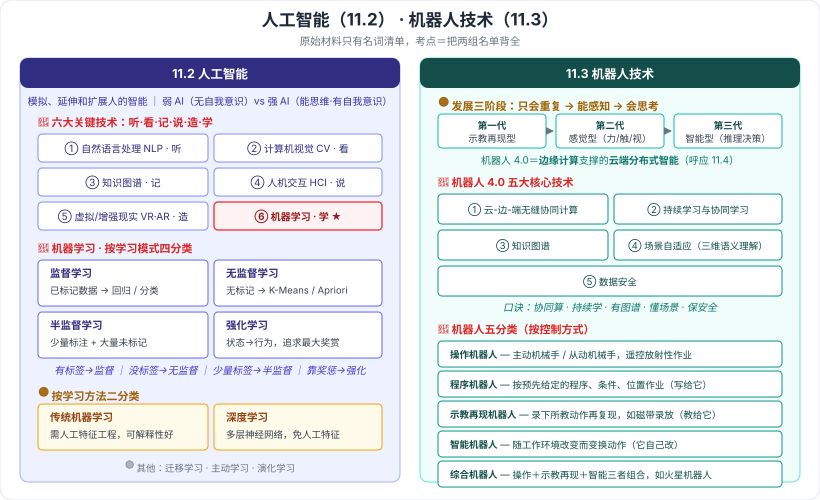

# 11.2 人工智能技术概述 · 11.3 机器人技术概述

> 来源：网络取材（主线索 lcp0578/book-note 仓库 chapter11.md，见 CLAUDE.md「网络取材来源」）· 对应《系统架构设计师教程（第二版）》第 11 章 · 第 2–3 节
>
> 📌 原始材料这两节**只有名词清单，零解释**：11.2 只列了 6 项关键技术名 + 机器学习 4 个分类名；11.3 只列了机器人 4.0 的 5 项核心技术名 + 5 个机器人分类名。**所有含义均为 (检索补充)**，来源：[CSDN·z2014z](https://blog.csdn.net/z2014z/article/details/142614737)、[CSDN·huaqianzkh（机器人系列）](https://blog.csdn.net/huaqianzkh/article/details/138198515)、[智东西·机器人4.0白皮书解读](https://zhidx.com/p/152003.html)。

---

## 一句话概括

- **11.2**：人工智能 = 让机器模拟、延伸、扩展人的智能；考点就是**六大关键技术名单**和**机器学习的四种学习模式**。
- **11.3**：机器人从"照着做"一路进化到"看懂环境自己做"；考点就是**机器人 4.0 的五项核心技术**和**按控制方式的五种分类**。

---

# 11.2 人工智能技术概述

## 一、人工智能的概念 🟡（检索补充）

**定义**：利用数字计算机或者数字计算机控制的机器，**模拟、延伸和扩展人的智能**，感知环境、获取知识并使用知识获得最佳结果的**理论、方法、技术及应用系统**。

| 分类 | 特征 |
| --- | --- |
| **弱人工智能** | **不能**真正实现推理和解决问题的智能机器，**不会有自主意识** |
| **强人工智能** | **真正能思维**的智能机器，具有**知觉和自我意识**；可分为**类人**与**非类人**两类 |

> 分界线只有一条：**有没有自我意识 / 能不能真正思维**。

⚠️ 原始材料未提及人工智能的定义与强弱分类，本段全部为检索补充。原文 11.2.2「人工智能的发展历程」在检索到的笔记中也被略过，**内容缺失**。

---

## 二、人工智能的六大关键技术 🔴（名称为原文，含义为检索补充）

| # | 技术 | 一句话含义 | 记忆抓手 |
| --- | --- | --- | --- |
| 1 | **自然语言处理** (NLP) | 让机器处理人类语言；含**机器翻译、语义理解、问答系统** | 「**听懂人话**」 |
| 2 | **计算机视觉** (Computer Vision) | 模仿人类视觉系统，**提取、处理、理解和分析图像** | 「**看懂图像**」 |
| 3 | **知识图谱** (Knowledge Graph) | 本质是**结构化的语义知识库**，由**节点和边**组成的**图数据结构**，以符号形式描述物理世界中的概念及其相互关系 | 「**记住关系**」 |
| 4 | **人机交互** (HCI) | 研究**人和计算机之间的信息交换** | 「**能对话**」 |
| 5 | **虚拟现实 / 增强现实** (VR/AR) | 以**计算机为核心**的新型**视听技术** | 「**造场景**」 |
| 6 | **机器学习** | 以**数据**为基础，通过研究样本数据**寻找规律**，并根据规律对未来数据进行**预测** | 「**会学习**」 |

> **口诀**：**听（NLP）· 看（CV）· 记（知识图谱）· 说（HCI）· 造（VR/AR）· 学（机器学习）**。
>
> 注意 **知识图谱** 在本章出现**两次**——11.2 是它本身，11.3 是机器人 4.0 的核心技术之一，同一个东西。

---

## 三、机器学习的分类 🔴

### 3.1 按学习模式分（原文四项，含义为检索补充）——本节最像考点的一处

| 类型 | 数据条件 | 典型算法 | 典型应用 |
| --- | --- | --- | --- |
| **监督学习** | 利用**已标记**的训练数据集建模，实现对新数据的标记或映射 | 回归、分类 | 自然语言处理、文本挖掘、手写体辨识 |
| **无监督学习** | 利用**无标记**数据，描述隐藏的**结构和规律** | Apriori、K-Means、随机森林、主成分分析 | 经济预测、异常检测、数据挖掘 |
| **半监督学习** | **少量标注样本 + 大量未标记样本**（介于二者之间） | 图论推理、拉普拉斯支持向量机 | 分类与回归 |
| **强化学习** | 学习**环境状态到行为的映射**，智能体选择行为以获得**环境最大奖赏** | Q-Learning、时间差学习 | 机器人控制、无人驾驶、工业控制 |

> **一句话辨析**：**有标签 = 监督，没标签 = 无监督，一点点标签 = 半监督，靠奖惩试出来 = 强化。**

### 3.2 按学习方法分 🟡（检索补充）

| 类型 | 关键差异 | 典型算法 |
| --- | --- | --- |
| **传统机器学习** | 需要**人工特征工程**，需要大量领域专业知识；**平衡有效性与可解释性** | 逻辑回归、支持向量机、K 近邻、决策树、贝叶斯方法 |
| **深度学习** | 基于**多层神经网络**、以**海量数据**为输入的**自学习**方法；**不需要人工特征提取**，但需大量数据与 GPU 算力 | CNN（卷积神经网络）、RNN（循环神经网络） |

### 3.3 其他机器学习算法 🟢（检索补充，了解名称即可）

- **迁移学习**：利用**另一领域**数据获得的关系来学习，优势是**减少所需数据量**。
- **主动学习**：算法主动**查询最有用的未标记样本**交专家标注；策略有**不确定性准则、差异性准则**。
- **演化学习**：基于演化算法的优化工具（粒子群优化、多目标演化算法）。

---

# 11.3 机器人技术概述

## 四、机器人的定义与发展阶段 🟡（全部为检索补充）

### 定义（两套经典说法）

- **森政弘 · 合田周平**：机器人具有 **7 个特征**——移动性、个体性、智能性、通用性、半机械半人性、自动性、奴隶性。
- **加藤一郎**：具备 **3 个条件**可称为机器人——① 有**脑、手、脚**三要素的个体；② 有**非接触传感器和接触传感器**（相当于五官）；③ 有**平衡觉和固有觉**的传感器。

> 🟢 词源：Robot 出自 1920 年捷克作家卡雷尔·卡佩克的剧本，捷克语意为「苦力 / 奴隶」。

### 发展三阶段 🟡

| 代际 | 名称 | 能力 |
| --- | --- | --- |
| **第一代** | **示教再现型**机器人 | 靠程序存储，**重复**已教过的工作 |
| **第二代** | **感觉型**机器人 | 具备**力觉、触觉、视觉**等**感知**能力 |
| **第三代** | **智能型**机器人 | 具有复杂**推理、决策和自主行为**能力 |

> **递进主线**：**只会重复 → 能感知 → 会思考**。
> **机器人 4.0**：利用**边缘计算**实现**云端分布式智能**，具备**感知、理解、决策和自主服务**能力（与 11.4 边缘计算直接呼应）。

⚠️ 原始材料完全没有机器人定义与发展阶段的内容，本段为检索补充；机器人 4.0 与"第三代 / 三阶段"的对应关系未在教材层面核实。

---

## 五、机器人 4.0 的五大核心技术 🔴（名称为原文，含义为检索补充）

| 技术 | 含义 |
| --- | --- |
| **云-边-端的无缝协同计算** | **云端**提供高性能计算与**通用知识存储**，**边缘侧**更有效地处理数据并为终端提供算力，**机器人终端**完成**实时**操作与处理；系统支持**动态任务迁移**，按业务需求把任务分配到云-边-端 |
| **持续学习与协同学习** | 支持**少数据**条件下的**自我提升**，在实际应用中不断积累经验与知识 |
| **知识图谱** | 结构化语义知识库，为机器人提供知识的存储与推理基础（同 11.2 的知识图谱） |
| **场景自适应** | 在对场景做**三维语义理解**的基础上，**主动观察**人与物的变化并**预测可能发生的事件**，产生与场景发展相关的**行动建议** |
| **数据安全** | 云-边-端环境下保护系统信息与用户隐私 |

> **口诀**：**协同算（云边端）· 持续学 · 有图谱 · 懂场景 · 保安全。**
>
> 现实约束（原文外补充）：受**网络带宽与延迟**制约，当前机器人以**机器人本身运算为主**、**云端处理非实时大计算量任务为辅**。

---

## 六、机器人的分类：按控制方式五分类 🔴（名称为原文，含义为检索补充）

| 分类 | 定义 | 举例 / 记忆点 |
| --- | --- | --- |
| **操作机器人** | 有**人手操纵**功能的部分称**主动机械手**，做类似动作的部分称**从动机械手**；能自动控制、可重复编程、多功能、有若干自由度 | 核设施中**遥控操作**放射性物质，并可放大力量 |
| **程序机器人** | 按**预先给定的程序、条件、位置**进行作业 | 「**照单执行**」，程序写死 |
| **示教再现机器人** | 与**盒式磁带录放**相似——把所教的操作过程**自动记录**在存储器中，需要时**重复再现**所教动作 | 「**先教一遍，之后照做**」；示教方式分**直接示教**与**遥控示教** |
| **智能机器人** | 既可执行**预先设定**的动作，又能按**工作环境的改变**而**变换动作** | 「**会随机应变**」 |
| **综合机器人** | 由**操作机器人 + 示教再现机器人 + 智能机器人**组合而成 | **火星机器人**（火星探测车） |

> **辨析（最易混的一组）**：
> - **程序机器人**：动作由**人预先写的程序**决定；
> - **示教再现机器人**：动作由**人先手把手教一遍**、机器录下来再复现；
> - **智能机器人**：动作可**随环境改变而变**。
>
> 三者的递进是「**写给它 → 教给它 → 它自己改**」。

---

---

## 记忆钩子

- **AI 六大关键技术口诀**：**听 · 看 · 记 · 说 · 造 · 学**（NLP / CV / 知识图谱 / HCI / VR·AR / 机器学习）。
- **机器学习四模式**：**有标签→监督，没标签→无监督，少量标签→半监督，靠奖惩→强化**。
- **机器人三代**：**只会重复 → 能感知 → 会思考**；4.0 = **边缘计算 + 云端分布式智能**。
- **机器人 4.0 五技术口诀**：**协同算 · 持续学 · 有图谱 · 懂场景 · 保安全**。
- **机器人五分类递进**：**写给它（程序）→ 教给它（示教再现）→ 它自己改（智能）**，两头是操作机器人（人在遥控）与综合机器人（三者合体，火星车）。

## 待核对 · 存疑

- ⚠️ **本节几乎全部含义都是检索补充**——原始材料只有名词清单。各条措辞是否与教材原文一致，未核实。
- ⚠️ 11.2.2「**人工智能的发展历程**」内容**完全缺失**（原始材料与检索到的笔记均略过），若考纲涉及需翻实体书补。
- ⚠️ 人工智能分类只找到**弱 / 强**两类；部分资料另有"超人工智能"一说，本笔记按检索到的软考笔记口径保留**两类**，未擅自增补。
- ⚠️ 机器人 4.0 中**知识图谱**一项，检索未获得"机器人语境下"的教材级展开，此处按 11.2 的知识图谱定义理解，属推断性表述。
- ⚠️ 机器人「按控制方式五分类」的分类标准表述（"按控制方式"）来自检索资料，原始材料只写"机器人的分类"，**分类标准是否为教材原文未核实**。
- ⚠️ 本节 🔴 判定依据是"原文唯一列出的两组清单 + 属典型的名单型选择题考点"，**未定位到确切真题年份/题号**，证据强度弱于第 5、8 章。

## 关键词

`人工智能` `弱人工智能` `强人工智能` `自然语言处理` `计算机视觉` `知识图谱` `人机交互` `VR/AR` `机器学习` `监督学习` `无监督学习` `半监督学习` `强化学习` `深度学习` `迁移学习` `主动学习` `演化学习` `机器人4.0` `云-边-端协同` `持续学习` `场景自适应` `操作机器人` `程序机器人` `示教再现机器人` `智能机器人` `综合机器人`
