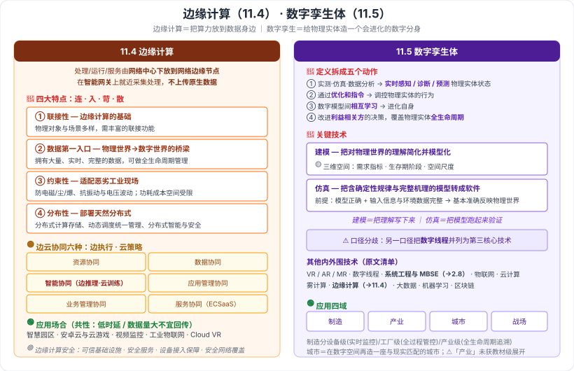

# 11.4 边缘计算概述 · 11.5 数字孪生体系概述

> 来源：网络取材（主线索 lcp0578/book-note 仓库 chapter11.md，见 CLAUDE.md「网络取材来源」）· 对应《系统架构设计师教程（第二版）》第 11 章 · 第 4–5 节
>
> 📌 主线索原文有：边缘计算定义、四个特点的**名称**、应用场合五项；数字孪生体定义、建模/仿真的说明、其他技术清单、应用四项**名称**。
> 📌 **主线索遗漏了 11.4 的「边云协同」与「边缘计算安全」两小节**——依据另一份**按教材小节编号组织**的笔记（11.4.1 概念 / 11.4.2 定义 / 11.4.3 特点 / **11.4.4 边云协同** / **11.4.5 安全** / 11.4.6 应用场合）补入。
> (检索补充) 来源：[CSDN·z2014z（11.4）](https://blog.csdn.net/z2014z/article/details/142614788)、[CSDN·huaqianzkh（数字孪生关键技术）](https://blog.csdn.net/huaqianzkh/article/details/138326965)、[CSDN·phmatthaus（数字孪生体）](https://blog.csdn.net/phmatthaus/article/details/134227690)。

---

## 一句话概括

- **11.4 边缘计算**：把计算从"中心"下放到"边上"，就近处理、不把原始数据全传回云——它是**数据的第一入口**。
- **11.5 数字孪生体**：给物理实体造一个**能实时同步、能自我进化**的数字模型，核心手段是**建模 + 仿真**。

---

# 11.4 边缘计算概述

## 一、边缘计算是什么 🔴（原文）

> 边缘计算将**数据的处理、应用程序的运行、甚至一系列功能服务的实现**，由**网络中心下放到网络边缘的节点**上。在网络边缘侧的**智能网关**上**就近采集并处理数据**，**不需要将大量未处理的原生数据上传到远处的大数据平台**。

**关键动作**：**下放** + **就近** + **不上传原生数据**。

### 🟢 几家机构的定义口径（检索补充，了解即可）

| 机构 | 侧重点 |
| --- | --- |
| **ECC**（边缘计算产业联盟） | 云计算在数据中心之外的**延伸**，含**云边缘、边缘云、云化网关**三类形态 |
| **ISO/IEC** | 把主要**处理和数据存储**放在**网络边缘节点**的**分布式计算形式** |
| **ETSI** | 在**移动网络边缘**提供 IT 服务，强调**靠近移动用户、减少时延** |
| **OpenStack** | 为开发者和服务提供商在**网络边缘侧**提供云服务和 IT 环境 |

---

## 二、边缘计算的四个特点 🔴（名称为原文，含义为检索补充）

| 特点 | 含义 | 一句话记 |
| --- | --- | --- |
| **联接性** | 边缘计算的**基础**；所联接物理对象与应用场景**多样**，需要丰富的联接功能 | **连得上**（是基础） |
| **数据第一入口** | 边缘计算是**物理世界到数字世界的桥梁**，是**数据的第一入口**，拥有**大量、实时、完整**的数据，可基于数据**全生命周期**做管理与价值创造 | **数据先到我这** |
| **约束性** | 需适配工业现场**恶劣的工作条件与运行环境**：防电磁、防尘、防爆、抗振动、抗电流/电压波动；对**功耗、成本、空间**要求高 | **环境苛刻，条件受限** |
| **分布性** | 部署天然**分布式**：需支持分布式计算与存储、分布式资源的**动态调度与统一管理**、分布式智能、分布式安全 | **天生分散** |

> **最容易考的一句**：**「联接性是边缘计算的基础」**；**「边缘计算是数据的第一入口」**。

---

## 三、边云协同：六种协同 🟡（主线索遗漏，检索补充）

| 协同 | 边缘侧干什么 | 云端干什么 |
| --- | --- | --- |
| **资源协同** | 提供计算/存储/网络/虚拟化等基础设施资源，具**本地资源调度管理**能力 | 下发资源调度管理**策略** |
| **数据协同** | 现场/终端**数据采集**，按规则或模型做**初步处理与分析**后上传 | **海量数据的存储、分析与价值挖掘** |
| **智能协同** | 按 AI 模型执行**推理**，实现分布式智能 | **集中模型训练**，把模型**下发**边缘 |
| **应用管理协同** | 提供应用**部署与运行环境**，管理本节点应用生命周期 | 提供应用**开发、测试环境**与生命周期管理 |
| **业务管理协同** | 提供**模块化、微服务化**的应用/数字孪生/网络实例 | 按客户需求做**业务编排** |
| **服务协同** | 实现部分 **ECSaaS** 服务 | 提供 SaaS 服务的**分布策略**与云端 SaaS 能力 |

> **记忆抓手**：六种协同都是「**边做执行、云做策略**」的分工——
> **资源**（边执行调度 / 云给策略）、**数据**（边采集初处理 / 云做海量分析）、**智能**（**边推理 / 云训练**，最经典）、**应用管理**（边跑 / 云开发测试）、**业务管理**（边给实例 / 云做编排）、**服务**（边 ECSaaS / 云 SaaS 策略）。

🟢 **边缘计算安全**（检索补充）：价值体现在提供**可信基础设施、安全服务、设备接入保障、安全网络覆盖**。

---

## 四、边缘计算的应用场合 🟢（原文，了解即可）

**智慧园区 · 安卓云与云游戏 · 视频监控 · 工业物联网 · Cloud VR**

> 共同点：都是**低时延**或**数据量巨大、不适合全量回传**的场景。

---

# 11.5 数字孪生体系概述

## 五、数字孪生体是什么 🔴（原文，一字不易背但要抓要素）

> **数字孪生体**是**现有或将有的物理实体对象的数字模型**，通过**实测、仿真和数据分析**来**实时感知、诊断、预测**物理实体对象的状态，通过**优化和指令**来调控物理实体对象的行为，通过相关**数字模型间的相互学习**来**进化自身**，同时改进**利益相关方**在物理实体对象**生命周期**内的决策。

**拆成五个动作记**：

| # | 动作 | 手段 |
| --- | --- | --- |
| 1 | **感知 · 诊断 · 预测**物理实体状态 | 实测、仿真、数据分析 |
| 2 | **调控**物理实体行为 | 优化和指令 |
| 3 | **进化自身** | 数字模型之间**相互学习** |
| 4 | **改进决策** | 服务于利益相关方 |
| 5 | 覆盖范围 | 物理实体的**整个生命周期** |

⚠️ 主线索原文此处写作「通过优化和**质量**来调控物理实体对象的行为」，检索到的多份笔记均作「优化和**指令**」。**疑似主线索笔误**，本笔记按「优化和指令」记录并标注，**未擅自认定**，待翻实体书核对。

> 🟡 常见通俗说法：数字孪生 = **「数字化双胞胎」**，实现**物理空间与数字空间的实时双向同步映射及虚实交互**。

---

## 六、数字孪生体的关键技术 🔴

### 6.1 建模（原文 + 检索补充）

- **作用**：把我们对物理世界的理解**简化并模型化**——是创建数字孪生体的**源头和核心**。
- **建模技术体系的三维空间**（🟡 原文）：**需求指标、生存期阶段、空间尺度**三个维度，构成数字孪生体建模技术体系的三维空间。
- 🟢 单一建模技术只能满足单个低层次需求；**复合的高层次需求需要多个数字孪生体与同一物理实体互动**（多视图模型）。

### 6.2 仿真（原文）

- **定义**：把包含了**确定性规律和完整机理**的**模型**，转化成**软件**的方式来**模拟物理世界**的一种技术。
- **前提条件**：**只要模型正确，并拥有完整的输入信息和环境数据**，就可以**基本准确**地反映物理世界的特性和参数。
- 🟢 作用：**验证和确认**我们对物理世界的理解是否正确有效，保证数字孪生体与物理实体形成**有效闭环**。

> **建模 vs 仿真 辨析**：**建模是"把理解写下来"，仿真是"把模型跑起来验证对不对"**。建模在前、仿真在后，二者合起来才闭环。

### 6.3 其他技术（原文清单）

VR、AR、**MR** 等增强现实技术、**数字线程**、**系统工程和 MBSE**、物联网、云计算、雾计算、**边缘计算**、大数据技术、机器学习、区块链——均为数字孪生体构建过程中的**内外围核心技术**。

⚠️ **口径分歧**：主线索把上述统一归为「其他技术」；检索到的资料则把「**基于数据融合的数字线程**」与建模、仿真**并列为三大核心技术**（数字线程负责支持**多视图模型间的协同**），并把「**系统工程与 MBSE**」称为数字孪生体的**顶层框架技术**（用数字化建模代替写文档做系统方案设计）。两种口径未核实哪个是教材原文，已按主线索为主、检索口径作补充标注。

> 📎 **跨章呼应**：**系统工程与 MBSE** 见第 2 章 2.8（MBSE 是教程第二版新增内容）；**边缘计算**即本章 11.4；**云计算/大数据**即本章 11.6。数字孪生是第 11 章各项技术的**汇合点**。

---

## 七、数字孪生体的应用 🟢（原文四项名称，说明为检索补充）

| 领域 | 要点 |
| --- | --- |
| **制造** | 工业领域分**设备级 / 工厂级 / 产业级**：设备级重**实时监控**，工厂级重**全过程生产管控**，产业级重**产品全生命周期追溯** |
| **产业** | ⚠️ 检索未获得可靠的教材级展开，未勉强填充 |
| **城市** | 在网络数字空间**再造一个与现实物理城市匹配对应的数字城市**，实现城市全要素**数字化/虚拟化**、全状态**实时化/可视化**、运行管理**协同化/智能化** |
| **战场** | 解决作战仿真中**态势理解滞后、物理模型无法更新**的问题（多源数据采集处理 → 孪生战场建模 → 模型动态更新 → 态势推演与决策） |

---

---

## 记忆钩子

- **边缘计算三个动作**：**下放**（中心→边缘）、**就近**（智能网关上采集处理）、**不上传原生数据**。
- **四特点口诀**：**连（联接性，是基础）· 入（数据第一入口）· 苛（约束性）· 散（分布性）**。
- **边云协同一句话**：**边执行、云策略**；最经典的一对是**智能协同——边推理、云训练**。
- **数字孪生定义五动作**：**感知诊断预测 → 调控 → 自我进化 → 改进决策 → 覆盖全生命周期**。
- **建模 vs 仿真**：**建模把理解写下来，仿真把模型跑起来**；仿真的前提是**模型正确 + 输入信息与环境数据完整**。

## 待核对 · 存疑

- ⚠️ **主线索遗漏 11.4.4 边云协同、11.4.5 边缘计算安全两小节**，本笔记据另一份按教材小节编号组织的笔记补入，**是否与教材内容一致未核实**（但小节编号体系吻合，可信度较高）。
- ⚠️ 数字孪生体定义中，主线索作「通过优化和**质量**来调控物理实体对象的行为」，检索来源均作「优化和**指令**」——**疑似主线索笔误**，待翻实体书核对。
- ⚠️ 数字孪生关键技术的**归类口径分歧**：主线索为「建模 / 仿真 / 其他技术」，检索来源为「建模 / 仿真 / 基于数据融合的数字线程 三大核心 + 系统工程与 MBSE 顶层框架 + 外围使能技术」。哪个是教材原文未核实。
- ⚠️ 数字孪生体应用四项中的「**产业**」，检索未找到可靠的教材级展开，**留空未填充**。
- ⚠️ 边缘计算四特点的具体含义、边云协同六种的分工描述均为检索补充（措辞高度一致，疑似同源于《边缘计算参考架构》类行业文档），**是否为教材原文措辞未核实**。
- ⚠️ 本节 🔴 判定未定位到确切真题年份/题号，依据为"原文完整给出 + 属典型名单/定义型考点"。

## 关键词

`边缘计算` `联接性` `数据第一入口` `约束性` `分布性` `边云协同` `资源协同` `数据协同` `智能协同` `应用管理协同` `业务管理协同` `服务协同` `智能网关` `Cloud VR` `数字孪生体` `数字化双胞胎` `建模` `仿真` `数字线程` `需求指标` `生存期阶段` `空间尺度` `MBSE` `数字孪生城市`
