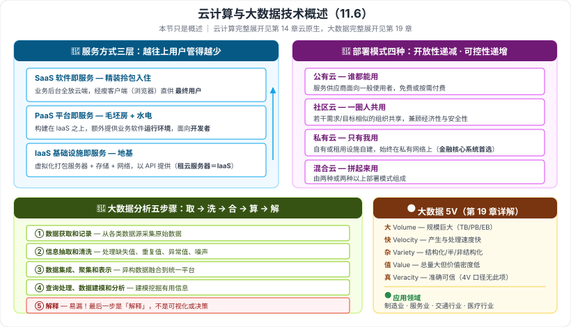

# 11.6 云计算和大数据技术概述

> 来源：网络取材（主线索 lcp0578/book-note 仓库 chapter11.md，见 CLAUDE.md「网络取材来源」）· 对应《系统架构设计师教程（第二版）》第 11 章 · 第 6 节
>
> 📌 主线索原文有：云计算**服务方式三项名称**、**部署模式四项名称**、**大数据分析五步骤（完整）**、大数据**应用领域四项名称**。云计算定义/特点、三种服务方式与四种部署模式的含义、大数据定义与特征均为 (检索补充)。
> (检索补充) 来源：[CSDN·qq_27523007（云计算和大数据技术）](https://blog.csdn.net/qq_27523007/article/details/139546321)、[阿里云开发者社区·四种部署模式对比](https://developer.aliyun.com/article/999023)、[阿里云开发者社区·IaaS/PaaS/SaaS](https://developer.aliyun.com/article/930304)。

---

## 一句话概括

本节是**云计算 + 大数据的名词概览**，考点集中在两组名单：**服务方式三层（IaaS/PaaS/SaaS）** 与 **部署模式四种（公有/社区/私有/混合）**，外加**大数据分析五步骤**。

> 📎 **跨章定位**：云计算在**第 14 章「云原生架构设计理论与实践」**、大数据在**第 19 章「大数据架构设计理论与实践」**有完整展开。本节只做**概述**，不必在此深挖。

---

# 一、云计算技术概述

## 1.1 云计算是什么 🟡（检索补充）

**定义**：一种基于**互联网**的计算方式——共享的**软硬件资源和信息**可以**按需**提供给计算机和其他设备。

**核心特性**（检索补充）：**按需自助服务、无处不在的网络接入、与位置无关的资源池、快速弹性、按使用付费**。

🟢 **关键技术：虚拟化**——对**物理实体资源进行抽象与隔离**的技术，以**最大化资源利用**为目的。

⚠️ 主线索原文未给出云计算的定义与特点，本段为检索补充；是否与教材措辞一致未核实。

---

## 1.2 云计算的服务方式：三层 🔴（名称为原文，含义为检索补充）

| 层次 | 全称 | 提供什么 | 主要用户 |
| --- | --- | --- | --- |
| **SaaS** | Software as a Service **软件即服务** | 把**一切业务运行的后台环境**放入云端，通过**瘦客户端（通常是 Web 浏览器）**直接向最终用户提供**应用程序** | **最终用户** |
| **PaaS** | Platform as a Service **平台即服务** | **构建在 IaaS 之上**，在基础架构之外**再提供业务软件的运行环境** | **开发者** |
| **IaaS** | Infrastructure as a Service **基础设施即服务** | 用**虚拟化技术**把服务器等计算平台连同**存储和网络**资源打包，以 **API 接口**形式提供 | **IT 管理 / 运维** |

> **记忆钩子（盖房子类比）**：
> **IaaS 给地基和水电（服务器/存储/网络）→ PaaS 给毛坯房和装修工具（运行环境）→ SaaS 给精装房拎包入住（直接用软件）。**
> **越往上，用户自己要管的越少。**
>
> **典型选择题套路**：「某企业**租用云服务器**部署应用属于哪种模式？」→ **IaaS**（租的是基础设施）。陷阱在 **PaaS 与 SaaS 混淆**——给的是**运行环境**就是 PaaS，给的是**现成软件**就是 SaaS。

---

## 1.3 云计算的部署模式：四种 🔴（名称为原文，含义为检索补充）

| 模式 | 定义 | 记忆点 |
| --- | --- | --- |
| **公有云** | 由**服务供应商**把应用程序、存储和其他资源作为服务提供给**一般使用者**；免费或**按需付费** | **谁都能用** |
| **社区云** | 由**若干个具有相似需求 / 目标的组织**共享同一套云基础设施（如行业联盟、政府机构间合作） | **一小圈人共用**；成本分摊人数比公有云少但**不止一个租户**，兼顾公有云的经济性与私有云的安全性 |
| **私有云** | 企业利用**自有或租用**的基础设施资源**自建**的云；可位于自有数据中心，也可由第三方托管，但**服务与基础设施始终在私有网络上** | **只有我用** |
| **混合云** | 由**两种或两种以上**部署模式组成的云（通常是公有云 + 私有云），数据与应用可在其间流动 | **拼起来用** |

> **一条线记牢**：**谁都能用（公有）→ 一圈人用（社区）→ 只有我用（私有）→ 拼起来用（混合）**，开放性递减、可控性递增。
>
> **典型选择题套路**：「**金融行业核心系统**优先选择哪种部署模式？」→ **私有云**（安全与合规优先）。

---

# 二、大数据技术概述

## 2.1 大数据是什么 🟡（检索补充）

**定义**：规模巨大、**无法用主流工具在合理时间内**处理、管理和分析的资料。

**特征（5V）**：

| 特征 | 含义 |
| --- | --- |
| **Volume 大容量** | 数据规模巨大（TB / PB / EB 级） |
| **Velocity 高速度** | 产生、采集、处理、分析的速度快，要求实时或近实时 |
| **Variety 多样性** | 来源与类型多样：**结构化 + 半结构化 + 非结构化** |
| **Value 价值** | 价值总量大但**密度低**，需从庞杂数据中挖掘 |
| **Veracity 真实性** | 数据源多渠道，需清洗与校验以保证准确可信 |

🟢 **数据三类型**：**结构化**（数据库中可直接存储）、**半结构化**（HTML、XML、JSON）、**非结构化**（文本、图片、音频、视频）。

⚠️ 主线索原文未给出大数据的定义与特征，本段为检索补充；部分资料只讲 **4V**（多样性 / 高速度 / 大容量 / 高价值），**是否含 Veracity 视版本而定**，已标注。教材对大数据的完整展开在**第 19 章**。

---

## 2.2 大数据分析的五个步骤 🔴（原文完整，本节最扎实的一处）

| # | 步骤 | 在做什么 |
| --- | --- | --- |
| 1 | **数据获取和记录** | 从各类数据源采集原始数据并记录 |
| 2 | **信息抽取和清洗** | 抽取所需信息，处理缺失值、重复值、异常值、噪声 |
| 3 | **数据集成、聚集和表示** | 把来源/格式/粒度各异的数据**融合到统一平台**并组织表示 |
| 4 | **查询处理、数据建模和分析** | 真正的分析与建模，挖掘有用信息 |
| 5 | **解释** | 把分析结果**解释**给使用者，形成可用于决策的结论 |

> **记忆钩子**：**取 → 洗 → 合 → 算 → 解**。
> 注意**最后一步是「解释」不是「可视化」/「决策」**——分析做完还得让人看懂，这是最容易被漏掉的一步。

---

## 2.3 大数据的应用领域 🟢（原文四项）

**制造业 · 服务业 · 交通行业 · 医疗行业**

---

---

## 记忆钩子

- **服务方式三层**：**IaaS 地基 → PaaS 毛坯 → SaaS 精装**；越往上用户管得越少。
- **部署模式四种**：**谁都能用（公有）→ 一圈人用（社区）→ 只有我用（私有）→ 拼起来用（混合）**。
- **大数据 5V**：**大（Volume）· 快（Velocity）· 杂（Variety）· 值（Value）· 真（Veracity）**。
- **大数据分析五步**：**取 → 洗 → 合 → 算 → 解**（最后一步是「解释」）。

## 待核对 · 存疑

- ⚠️ 云计算的**定义、特点、虚拟化**，三种服务方式与四种部署模式的**具体含义**，大数据的**定义与特征**——原始材料全部只有名称，含义均为通用资料补充，**是否与教材措辞一致未核实**。
- ⚠️ 大数据特征存在 **4V / 5V 两种口径**（是否含 Veracity 真实性），本笔记按 5V 记录并注明分歧；教材口径以**第 19 章**为准。
- ⚠️ 检索到一份备考资料称"云计算每年必考 3–5 题、案例分析常考传统架构上云、论文高频考云架构设计与优化"，但这是**备考博客的说法，未能核实到具体真题年份/题号**。🔴 判定依据为「IaaS/PaaS/SaaS 与四种部署模式属公认的基础必背名单」+ 该说法，仍**弱于第 5、8 章的真题级证据**。
- ⚠️ 主线索的「大数据技术概述」只有分析步骤与应用领域两项，教材 11.6.2 是否还有其他内容（如大数据处理系统面临的挑战）未能确认。

## 关键词

`云计算` `虚拟化` `SaaS` `PaaS` `IaaS` `软件即服务` `平台即服务` `基础设施即服务` `公有云` `社区云` `私有云` `混合云` `大数据` `5V` `Volume` `Velocity` `Variety` `Value` `Veracity` `数据获取和记录` `信息抽取和清洗` `数据集成聚集和表示` `查询处理数据建模和分析` `解释`
