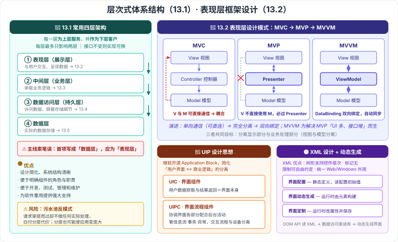

# 13.1 层次式体系结构概述 · 13.2 表现层框架设计

> 来源：网络取材（主线索 lcp0578/book-note 仓库 chapter13.md，见 CLAUDE.md「网络取材来源」）· 对应《系统架构设计师教程（第二版）》第 13 章 · 第 1–2 节
>
> 📌 主线索本两节有：分层定义两句、常用层次式架构的层名（**有笔误，见下**）、MVC/MVP/MVVM 三个模式名 + MVP 与 MVVM 的通信规则两句。**表现层组件设计、XML 设计表现层、UIP 设计思想、动态生成设计思想主线索完全没有**。
> (检索补充) 来源：[CSDN·z2014z（13.1）](https://blog.csdn.net/z2014z/article/details/142697863)、[CSDN·huaqianzkh（表现层设计模式）](https://blog.csdn.net/huaqianzkh/article/details/138975489)、[CSDN·zhongcaogen（表现层框架设计）](https://blog.csdn.net/zhongcaogen/article/details/136632122)、[腾讯云·UIP 与动态生成设计思想](https://cloud.tencent.com/developer/news/1428044)。

---

## 一句话概括

- **13.1**：**分层**——每一层**为上层服务、并作为下层的客户**；标准是**表现层 / 中间层 / 数据访问层 / 数据层**四层。
- **13.2**：表现层怎么组织——**MVC → MVP → MVVM** 三种设计模式的演进，外加 **XML 设计**、**UIP 框架**、**动态生成**三种思路。

---

# 13.1 层次式体系结构概述

## 一、什么是分层式体系结构 🔴（原文）

> 层次式体系结构设计是**将系统组成一个层次结构**，**每一层为上层服务，并作为下层客户**。
>
> 由于**每一层最多只影响两层**，同时只要**给相邻层提供相同的接口**，**允许每层用不同的方法实现**，同样为**软件重用**提供了强大的支持。

**三句话拆开记：**

| # | 要点 |
| --- | --- |
| 1 | **每一层为上层服务，并作为下层的客户**（承上启下） |
| 2 | **每一层最多只影响两层**（改动被局部化） |
| 3 | **接口不变则实现可换** → 支持**软件重用** |

🟡 **核心思想（检索补充）**：**关注点分离（separation of concerns）**——每层只负责本层逻辑，层间通过协议规定交互方式，内部接口主要**对相邻层可见**。

---

## 二、常用的层次式架构：四层 🔴

| 层 | 别名 | 职责 |
| --- | --- | --- |
| **表现层** | 展示层 | 与用户交互、呈现数据 |
| **中间层** | **业务层**（业务逻辑层） | 承载业务逻辑 |
| **数据访问层** | **持久层** | 访问数据、屏蔽存储细节 |
| **数据层** | — | 实际的数据存储 |

> ⚠️ **主线索笔误（重要）**：主线索写作「**数据层 / 中间层 / 访问层 / 数据层**」——**第一项"数据层"应为"表现层"**（数据层重复出现两次，且缺表现层）。检索来源均为「**表现层 / 中间层（业务层）/ 数据访问层（持久层）/ 数据层**」，且本章 13.2–13.5 的小节标题正好依次是**表现层 → 中间层 → 数据访问层 → 数据架构**，可与之互证。已按订正后的四层记录。

**记忆钩子**：本章 13.2–13.5 四节 = **从上往下把这四层各讲一遍**。

---

## 三、分层架构的优点与风险 🟡（检索补充）

**优点**：

- 设计**简化**、系统结构**清晰**
- 便于明确**组件的角色与职责**
- 便于**开发、测试、管理和维护**
- 提供强大的**软件重用**支持

**风险 / 注意**：

- ⚠️ 需规避「**污水池反模式**」（architecture sinkhole anti-pattern）——请求**穿层而过却不做任何实际处理**，白白付出分层代价。
- 分层可能使**应用变得庞大**。

---

# 13.2 表现层框架设计

## 四、表现层设计模式：MVC → MVP → MVVM 🔴（三个名称与两条通信规则为原文）

### 三者对照（本节最核心的表）

| 模式 | 第三方角色 | View 与 Model 的关系 | 关键机制 |
| --- | --- | --- | --- |
| **MVC** Model-View-Controller | **Controller 控制器** | **可以直接通信**（耦合的来源） | 控制器接收用户输入，调用模型和视图完成需求 |
| **MVP** Model-View-Presenter | **Presenter 主持者** | **不能直接通信**——「在 MVP 中 **View 并不直接使用 Model**，他们之间的通信是通过 **Presenter** 来进行的」（原文） | Presenter 做**唯一枢纽**转发 |
| **MVVM** Model-View-**ViewModel** | **ViewModel 视图模型** | **不能直接通信**——「在 MVVM 模式下 **View 和 Model 不能直接通信**，两者的通信只能通过 **ViewModel** 来实现」（原文） | **DataBinding 双向数据绑定**（自动同步） |

> 🔴 **演进主线（一句话记牢）**：
> **MVC 单向通信（V 与 M 可直连）→ MVP 完全分离（必须过 Presenter）→ MVVM 双向绑定（过 ViewModel，靠 DataBinding 自动同步）。**
>
> **三者的共同目标都是：分离显示部分与业务处理部分（视图与模型分离）。**

### 各自补充 🟡（检索补充）

| 模式 | 优点 | 局限 |
| --- | --- | --- |
| **MVC** | 支持**多种界面**扩展、易于维护、功能强大 | **View 与 Model 直接通信导致耦合**；业务逻辑易混杂在 Controller 中 |
| **MVP** | 模型与视图**完全分离**；**一个 Presenter 可用于多个视图**；**UI 逻辑易于测试** | **UI 种类变多时接口不断增加** |
| **MVVM** | 数据状态处理、数据绑定与转换交给 ViewModel；适合**数据驱动、操作频繁**的应用 | **双向绑定使问题定位困难** |

> **MVVM 的由来**：正是为解决 **MVP 中"UI 种类变多、接口不断增加"**的问题而提出的。

---

## 五、使用 XML 设计表现层 🟡（检索补充，主线索无）

**特点**：XML 标记用于定义**数据本身的结构和数据类型**。

**三条优点**：

1. **树形结构**天然支持**控件的层次关系**
2. **标记无限制**，架构师可**自由约定**
3. 可**统一 WebForm 与 WindowsForm 的外观**

---

## 六、表现层中的 UIP 设计思想 🔴（检索补充，主线索无）

**UIP（User Interface Process Application Block）**：微软社区开发的众多 Application Block 之一，**开源**；提供一个可扩展框架，用于**简化用户界面与商业逻辑代码的分离**，可用来写复杂的**用户界面导航和工作流处理**，能**复用在不同场景**并随应用增加而扩展。

### UIP 把表现层划分为两个子层 🔴

| 子层 | 全称 | 职责 |
| --- | --- | --- |
| **UIC** | User Interface **Components** | **用户数据获取和结果返回**（就是界面本身） |
| **UIPC** | User Interface **Process** Components | **协调界面的各个部分**，使其配合后台的活动（导航、工作流） |

> **一句话辨析**：**UIC 是"界面"，UIPC 是"界面背后的流程调度"。**
> **UIPC 的核心职责**：管理**信息流**、**事务处理**、**异常响应**，并实现**交互流程与设备的分离**。

**要解决的问题**：应用程序常用代码来管理用户界面，导致代码复杂、不易复用/维护/扩展；UIP 通过**分离工作流、导航、与商业服务的交互**等组成部分来解决。

---

## 七、表现层动态生成设计思想 🟡（检索补充，主线索无）

**基础技术**：基于 **XML** 的界面管理。

**三个核心部分**：

| 部分 | 做什么 |
| --- | --- |
| **界面配置** | **静态定义**，读取配置文件的初始值 |
| **界面动态生成** | **运行时**由元素**动态构建**界面 |
| **界面定制** | **运行时动态修改属性**并**保存**结果 |

**实现路径**：**DOM API 读取 XML → 数据访问类读取数据库 → 动态生成界面**。

**优势**：**代码与描述分离**，支持**多用户需求定制**，**易于系统迁移**。

---

---

## 记忆钩子

- **分层定义一句话**：**每一层为上层服务，并作为下层客户**；**每层最多只影响两层**；**接口不变则实现可换**（→ 软件重用）。
- **四层从上到下**：**表现层 → 中间层（业务层）→ 数据访问层（持久层）→ 数据层**，正好是本章 13.2–13.5 的顺序。
- **分层最大的坑**：**污水池反模式**——请求穿层而过却什么都不做。
- **表现层三模式演进**：**MVC 可直连 → MVP 必过 Presenter → MVVM 过 ViewModel + 双向绑定**；MVVM 是为解决 MVP「UI 种类多、接口不断增加」而生。
- **UIP 二分**：**UIC ＝界面本身，UIPC ＝界面背后的流程调度**（导航、工作流、事务、异常）。
- **动态生成三部分**：**界面配置（静态定义）→ 界面动态生成（运行时构建）→ 界面定制（运行时改并保存）**。

## 待核对 · 存疑

- ⚠️ **B 类 · 主线索笔误**：13.1「常用的层次式架构」主线索写作「**数据层 / 中间层 / 访问层 / 数据层**」，**第一项应为"表现层"**（数据层重复、缺表现层）。已按检索来源与本章小节顺序订正，**建议翻书确认**。
- ⚠️ 主线索另有两处轻微笔误：**13.4 编号写作「13、4」**（已在 `PROGRESS.md` 订正）、**「5 中数据访问模式」应为「5 种」**（下一单元处理）。
- ⚠️ **13.2 的四块内容里有三块主线索完全没有**（XML 设计表现层、UIP 设计思想、动态生成设计思想），全部为检索补充；其中"表现层组件设计"一节在检索来源中也未见展开，**可能仍有缺口**。
- ⚠️ 分层架构的优点清单、「污水池反模式」、MVC/MVP/MVVM 各自的优点与局限，均为检索补充，**是否为教材原文措辞未核实**。
- ⚠️ UIP 的定义与 UIC/UIPC 划分来自两个独立来源、措辞高度一致（疑同源于微软文档中译），**教材是否收录未核实**。
- ⚠️ 本节分级未定位到确切真题年份/题号；但 **MVC/MVP/MVVM 属公认的高频考点**（检索到有"软考架构案例分析—MVC、MVP 和 MVVM 分层架构模式"专题），🔴 判定较有把握。

## 关键词

`层次式体系结构` `分层` `关注点分离` `污水池反模式` `表现层` `中间层` `业务层` `数据访问层` `持久层` `数据层` `MVC` `MVP` `MVVM` `Presenter` `ViewModel` `DataBinding` `双向数据绑定` `XML设计表现层` `UIP` `UIC` `UIPC` `界面配置` `界面动态生成` `界面定制`
