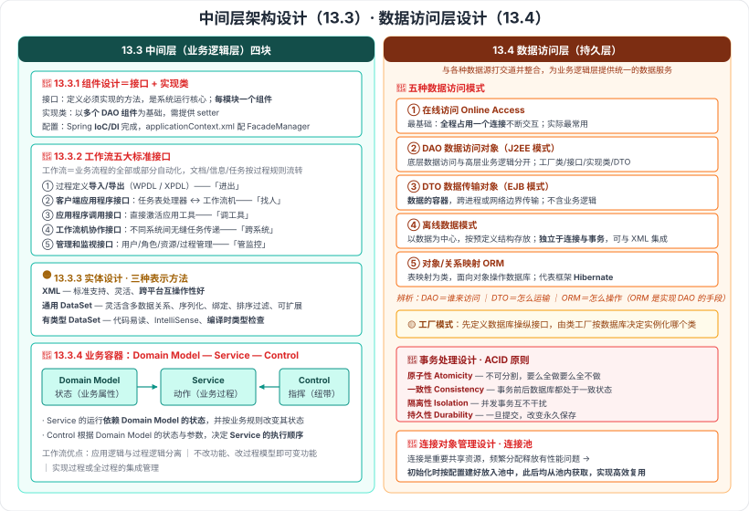

# 13.3 中间层架构设计 · 13.4 数据访问层设计

> 来源：网络取材（主线索 lcp0578/book-note 仓库 chapter13.md，见 CLAUDE.md「网络取材来源」）· 对应《系统架构设计师教程（第二版）》第 13 章 · 第 3–4 节
>
> 📌 主线索：**13.3 只有两个词**（"业务逻辑组件的实现类""业务逻辑组件的配置"）；**13.4 有五种数据访问模式的名称、一张 Hibernate 架构图（图片）、ACID 四原则**。其余全部为 (检索补充)。
> (检索补充) 来源：[CSDN·z2014z（13.3）](https://blog.csdn.net/z2014z/article/details/142705547)、[CSDN·zhongcaogen（数据访问层设计）](https://blog.csdn.net/zhongcaogen/article/details/136688449)、[CSDN·数据访问模式详解](https://blog.csdn.net/cooldream2009/article/details/147587822)。

---

## 一句话概括

- **13.3 中间层（业务层）**：业务逻辑怎么组织——**组件（接口+实现类）、工作流、实体、框架（Domain Model-Service-Control）**四块。
- **13.4 数据访问层（持久层）**：数据怎么访问——**五种数据访问模式**、**工厂模式**、**ORM/Hibernate**、**事务（ACID）**、**连接池**。

---

# 13.3 中间层架构设计

## 一、业务逻辑层组件设计 🔴

| 部分 | 要点 |
| --- | --- |
| **接口** | 定义业务逻辑组件**必须实现的方法**，是**系统运行的核心**；**按模块设计——每个模块一个业务逻辑组件** |
| **实现类**（原文提及） | 以**多个 DAO（Data Access Object）组件**作为**基础**；需为实现类提供对应的 **setter 方法** |
| **配置**（原文提及） | DAO 组件的初始化由 **Spring 的 IoC / DI 机制**完成；在 **applicationContext.xml** 中配置 **FacadeManager** 组件 |

> **记忆钩子**：**业务逻辑组件 = 接口（定契约）+ 实现类（靠 DAO 干活）**，两者由 **Spring 依赖注入**串起来。

---

## 二、业务逻辑层工作流设计 🔴（检索补充）

**工作流定义**：**业务流程的全部或部分自动化**，**文档、信息或任务**按照一定的**过程规则**流转。

### 工作流的五大标准接口 🔴

| 接口 | 名称 | 作用 |
| --- | --- | --- |
| **Interface 1** | **过程定义导入/导出** | 支持格式转换（**WPDL / XPDL** 标准） |
| **Interface 2** | **客户端应用程序接口** | **任务表处理器**与**工作流机**交互 |
| **Interface 3** | **应用程序调用接口** | **直接激活应用工具**执行活动 |
| **Interface 4** | **工作流机协作接口** | 不同系统间**无缝任务传递** |
| **Interface 5** | **管理和监视接口** | 用户 / 角色 / 资源 / 过程管理 |

> **记忆钩子**：**1 进出（过程定义导入导出）· 2 找人（客户端）· 3 调工具（应用调用）· 4 跨系统（协作）· 5 管监控（管理监视）**。

**工作流的优点**：

1. 将**应用逻辑与过程逻辑分离**
2. **不修改功能**即可通过**修改过程模型**改变系统功能
3. 实现**过程或全过程的集成管理**

---

## 三、业务逻辑层实体设计 🟡（检索补充）

**实体的特点**：

- 提供业务数据及相关功能的**状态编程访问**
- 可用**复杂架构数据**构建（可来自**多个数据库表**）
- 作为业务过程的 **I/O 参数**传递
- 可**序列化**以保持当前状态
- **不直接访问数据库**——由 **DAO 组件**提供数据
- **事务处理**由应用程序或业务过程启动

**三种表示方法对照**：

| 方法 | 优点 |
| --- | --- |
| **XML** | 标准支持、**灵活性强**、**跨平台互操作性好** |
| **通用 DataSet** | 灵活包含多数据关系、序列化、数据绑定、排序过滤、XML 互换性、开放式并发、可扩展 |
| **有类型 DataSet** | **代码易读**、**IntelliSense 支持**、**编译时类型检查** |

> **一句话辨析**：**XML 胜在跨平台，通用 DataSet 胜在灵活，有类型 DataSet 胜在类型安全（编译期就能查错）。**

---

## 四、业务逻辑层框架 🔴（检索补充）

**位置与作用**：位于系统的**中间层**，是**实现系统功能的核心**；采用**容器形式**便于开发、代码重用和管理。

### 业务容器的三层思想：Domain Model — Service — Control 🔴

| 组成 | 职责 |
| --- | --- |
| **Domain Model**（领域业务对象） | 仅包含**业务相关的属性**（是"状态"的载体） |
| **Service**（服务） | **业务过程的实现单元**，通过**接口和契约**联系 |
| **Control**（服务控制器） | **服务之间的纽带** |

**三者的互动关系（要点）**：

- **Service 的运行依赖 Domain Model 的状态**，并根据**业务规则改变其状态**。
- **Control 根据 Domain Model 的状态和参数**，决定 **Service 的执行顺序及相互关系**。

> **记忆钩子**：**Domain Model 是"数据/状态"，Service 是"动作"，Control 是"编排动作的指挥"**——目的是**降低耦合**。

---

# 13.4 数据访问层设计

> 数据访问层（**数据持久层**）负责与应用中的**各种数据源**打交道，并将它们**整合**起来，为**业务逻辑层**提供**统一的数据服务**。

## 五、五种数据访问模式 🔴（五个名称为原文）

| 模式 | 含义 | 特点 |
| --- | --- | --- |
| **在线访问**（Online Access） | **最基础**的数据访问模式：**占用一个数据库连接**，每个数据库操作都通过这个连接不断与后台数据源交互 | 实际开发中**最常用** |
| **DAO**（Data Access Object，数据访问对象） | **J2EE 设计模式**之一，把**底层数据访问操作**与**高层业务逻辑**分开 | 典型组件：**DAO 工厂类、DAO 接口、DAO 具体实现类、数据传输对象** |
| **DTO**（Data Transfer Object，数据传输对象） | **EJB 经典设计模式**：**数据的容器**，用于**跨不同进程或网络边界**传输数据 | **不包含具体业务逻辑**，只做内部一致性检查和基本验证 |
| **离线数据模式** | **以数据为中心**：数据从数据源获取后按**预定义结构**存放在系统中 | 对数据的操作**独立于后台连接或事务**；支持与 **XML** 集成 |
| **对象/关系映射**（ORM，Object/Relation Mapping） | 把数据库中的**表映射为程序中的类（对象）**，以**面向对象**的方式操作数据库 | 代表框架 **Hibernate** |

> **辨析（易混）**：
> - **DAO vs DTO**：**DAO 是"谁来访问数据"（操作的封装）**，**DTO 是"数据怎么运输"（数据的容器）**。
> - **DAO vs ORM**：**ORM 是"怎么操作数据库"（技术/框架）**，**DAO 是"谁来操作数据库"（设计模式）**；**ORM 是实现 DAO 的一种手段**。
> - **在线访问 vs 离线数据模式**：**在线全程占着连接**，**离线取回来就断开、操作独立于连接和事务**。

---

## 六、工厂模式在数据访问层的应用 🟡（检索补充）

为实现**对多种数据库的操作**：先定义一个**数据库操纵接口**，然后**根据数据库的不同，由类工厂决定实例化哪个类**。

> 一句话：**接口统一，工厂选实现**——换数据库不用改业务代码。

---

## 七、ORM 与 Hibernate 🟢

主线索此处**只有一张 Hibernate 架构图（图片）**，无文字说明。

⚠️ 检索到的 Hibernate 核心接口如下，但**来自通用 Hibernate 文档而非教材**，仅供理解：

| 接口 | 作用 |
| --- | --- |
| **Configuration** | 读取配置文件与映射文件 |
| **SessionFactory** | 创建 Session；**重量级、线程安全**，通常应用启动时创建一次、全应用共享 |
| **Session** | 执行 CRUD；**轻量级、非线程安全**，一次请求/一个工作单元用完即弃 |
| **Transaction** | 事务对象，用 **commit()** 让改动持久化 |
| **Query** | 执行 **HQL** 查询，由 `Session.createQuery()` 创建 |

---

## 八、事务处理设计：ACID 原则 🔴（原文）

| 原则 | 英文 | 含义 |
| --- | --- | --- |
| **原子性** | **Atomicity** | 事务是**不可分割**的最小单位，要么全做、要么全不做 |
| **一致性** | **Consistency** | 事务执行前后，数据库都必须处于**一致状态** |
| **隔离性** | **Isolation** | 并发事务之间**互不干扰** |
| **持久性** | **Durability** | 事务一旦提交，改变**永久保存** |

> **口诀**：**原子 · 一致 · 隔离 · 持久**（ACID）。
> ⚠️ 主线索只给出四个中英文名称，**含义为通用数据库常识补充**。

---

## 九、连接对象管理设计：连接池 🔴（检索补充）

**问题**：数据库**连接对象属于重要的共享资源**，**频繁分配与释放**会带来**性能问题**。

**做法（连接池）**：**系统初始化时依据配置创建连接并放入连接池内**，此后所使用的连接**均从该池内获取**，以实现**连接的高效复用**。

> **一句话**：**开机就把连接建好放池里，用的时候借、用完还，不反复建销毁。**

---

---

## 记忆钩子

- **业务逻辑组件**＝**接口（定契约）+ 实现类（靠 DAO 干活）**，Spring **IoC/DI** 注入，配置在 **applicationContext.xml**。
- **工作流五接口**：**1 进出 · 2 找人 · 3 调工具 · 4 跨系统 · 5 管监控**；工作流的核心价值是**应用逻辑与过程逻辑分离**。
- **业务容器三层**：**Domain Model（状态）— Service（动作）— Control（指挥）**。
- **五种数据访问模式**：**在线访问 · DAO · DTO · 离线数据模式 · ORM**；辨析记「**DAO 谁来访问、DTO 怎么运输、ORM 怎么操作**」。
- **在线 vs 离线**：**在线全程占连接，离线取完就断、操作独立于连接与事务**。
- **ACID**：**原子 · 一致 · 隔离 · 持久**。
- **连接池**：**初始化时建好放池里，借还复用**。

## 待核对 · 存疑

- ⚠️ **13.3 主线索只有两个词**（"业务逻辑组件的实现类""业务逻辑组件的配置"），本节 13.3.1–13.3.4 的全部内容为**单一来源**检索补充（一份按教材小节编号组织的笔记），**是否与教材一致未核实**。
- ⚠️ 工作流**五大标准接口**的名称与作用、**Domain Model-Service-Control** 三层思想，均来自该单一来源，措辞未与教材核对。
- ⚠️ 13.4 主线索的 **Hibernate 架构图仅为图片引用**，图中内容未知；本笔记列出的 Hibernate 核心接口**来自通用 Hibernate 文档，非教材内容**，已明确标注。
- ⚠️ **ACID 四原则主线索只给名称**，含义为通用数据库常识补充。
- ⚠️ 检索来源提到教材中有一张**五种数据访问模式的特点对比表（"表 2-15"）**，但**未能获得表格内容**；本笔记的对比是根据各来源的散述整理的。
- ⚠️ 13.4 的「**事务处理设计**」在检索来源中被付费墙遮挡，**除 ACID 外的内容未获得**。
- ⚠️ 主线索笔误：「**5 中数据访问模式**」应为「**5 种**」（已订正）。
- ⚠️ 本节分级未定位到确切真题年份/题号。

## 关键词

`业务逻辑层` `业务逻辑组件` `接口` `实现类` `IoC` `DI` `applicationContext.xml` `FacadeManager` `工作流` `WPDL` `XPDL` `工作流机` `任务表处理器` `业务实体` `DataSet` `业务容器` `Domain Model` `Service` `Control` `数据访问层` `持久层` `在线访问` `DAO` `DTO` `离线数据模式` `ORM` `对象关系映射` `Hibernate` `SessionFactory` `Session` `工厂模式` `事务` `ACID` `原子性` `一致性` `隔离性` `持久性` `连接池`
