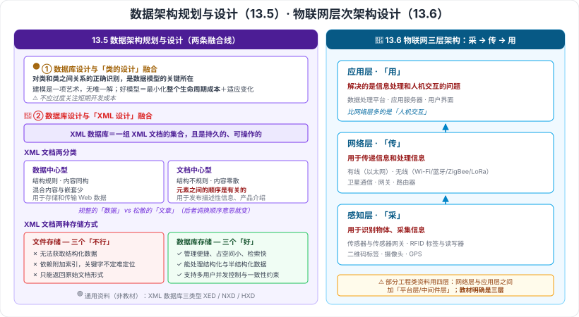

# 13.5 数据架构规划与设计 · 13.6 物联网层次架构设计

> 来源：网络取材（主线索 lcp0578/book-note 仓库 chapter13.md，见 CLAUDE.md「网络取材来源」）· 对应《系统架构设计师教程（第二版）》第 13 章 · 第 5–6 节
>
> 📌 主线索：**13.5 只有一句话**（XML 数据库的定义）；**13.6 有三层的名称 + 每层一句职责**（是主线索本章少数完整的地方）。
> (检索补充) 来源：[CSDN·huaqianzkh（数据架构规划与设计）](https://blog.csdn.net/huaqianzkh/article/details/139184271)、[CSDN·xingzuo_1840（第 13 章-05 数据架构规划与设计）](https://blog.csdn.net/xingzuo_1840/article/details/137126311)、[CSDN·物联网层次架构设计笔记](https://blog.csdn.net/u010986241/article/details/136752701)。

---

## 一句话概括

- **13.5**：数据层怎么规划——**数据库设计与"类设计"的融合**、**数据库设计与"XML 设计"的融合**两条线。
- **13.6**：物联网的分层——**感知层（采）→ 网络层（传）→ 应用层（用）**。

---

# 13.5 数据架构规划与设计

> 🟡 本节由两块融合构成（检索来源一致）：**数据库设计与类的设计融合**、**数据库设计与 XML 设计融合**。

## 一、数据库设计与类的设计融合 🟡（检索补充）

**核心理念**：

- **对类和类之间关系的正确识别，是数据模型的关键所在。**
- **建模本质上是一项艺术**——没有唯一解决方案，但存在**相对优秀**的模型。

**好的数据模型的判据**：

- 最小化**整个项目生命周期**的成本
- 能**适应系统的变化**
- ⚠️ **不应过度关注短期开发成本**

> 一句话：**建模看的是"整个生命周期"而不是"这次开发省多少事"。**

---

## 二、数据库设计与 XML 设计融合 🔴

### XML 数据库是什么（原文）

> **XML 数据库**是一组 **XML 文档的集合**，并且是**持久的**和**可操作的**。

### XML 文档的两种分类 🔴（检索补充）

| 类型 | 结构与内容特点 | 用途 |
| --- | --- | --- |
| **数据中心型文档** | 结构上**规则**、内容上**同构**；**混合内容和嵌套层次较少** | **存储和传输 Web 数据** |
| **文档中心型文档** | 结构**不规则**、内容**零散**；**混合内容较多**，**元素之间的顺序是有关的** | **发布描述性信息**、产品介绍 |

> **一句话辨析**：**数据中心型＝规整的"数据"，文档中心型＝松散的"文章"**；后者**顺序有意义**（文章调换段落意思就变了），前者顺序无所谓。

### XML 文档的两种存储方式 🔴（检索补充）

| 方式 | 局限 / 优势 |
| --- | --- |
| **文件存储方式** | ❌ 无法获取**结构化数据**；❌ 依赖**附加索引**，关键字不确定时**难以定位**；❌ 只能返回**原始文档**形式 |
| **数据库存储方式** | ✅ 管理便捷、**占用空间小**、**检索速度快**；✅ 能处理**结构化和半结构化**数据；✅ 支持**多用户并发控制**和**一致性约束** |

> **结论方向很明确**：**用数据库存 XML 优于用文件存**。

### 🟢 XML 数据库的三种类型（**通用资料，非教材内容**）

| 类型 | 做法 |
| --- | --- |
| **XML Enabled Database（XED）** | 把 XML 数据**映射到传统（关系）数据库**中存储 |
| **Native XML Database（NXD）** | **原生**支持 XML 文档的存储与查询，文档结构信息通常并入**索引结构**，可**按内容和按结构**两种方式查询 |
| **Hybrid XML Database（HXD）** | 原有关系/对象数据库**扩展后**能同时原生处理**关系数据与 XML 数据** |

⚠️ 该三分法来自通用英文资料，**教材是否收录未核实**，仅供理解。

---

# 13.6 物联网层次架构设计

## 三、物联网三层架构 🔴（三层名称与各层职责为原文）

| 层 | 原文职责 | 一字诀 | 🟡 涉及的技术与设备（检索补充） |
| --- | --- | --- | --- |
| **应用层** | **解决的是信息处理和人机交互的问题** | **用** | 数据处理平台、应用服务器、用户界面 |
| **网络层** | **用于传递信息和处理信息** | **传** | 有线（以太网）与无线（Wi-Fi、蓝牙、ZigBee、LoRa/LPWAN）、卫星通信、网关、路由器 |
| **感知层** | **用于识别物体、采集信息** | **采** | 传感器与传感器网关、**RFID 标签与读写器**、二维码标签、摄像头、GPS 等 |

> 🔴 **必背的三句原文**：
> - **感知层用于识别物体、采集信息。**
> - **网络层用于传递信息和处理信息。**
> - **应用层解决的是信息处理和人机交互的问题。**
>
> **一字诀：采 → 传 → 用**（自下而上）。
>
> ⚠️ **注意易错**：**网络层不是只"传"，原文写的是"传递信息和处理信息"**；而应用层是"**信息处理 + 人机交互**"。两层都提到"处理"，区别在于应用层多了**人机交互**。

⚠️ **口径分歧**：部分资料（尤其偏工程实践的文章）采用**四层架构**——在网络层与应用层之间插入 **平台层（中间件层）**，负责设备管理、数据汇聚、协议转换、数据清洗与预处理。**教材（主线索）明确是三层**，本笔记以**三层**为准，四层仅作了解。

📎 **跨章呼应**：物联网在**第 11 章 11.1（CPS 支撑技术）**、**11.5（数字孪生外围技术）**都出现过；11.4 边缘计算解决的正是"数据在哪算"的问题，与本节网络层/平台层的分工直接相关。

---

---

## 记忆钩子

- **数据建模一句话**：**对类和类之间关系的正确识别，是数据模型的关键所在**；好模型看的是**整个生命周期成本 + 适应变化**，不是短期开发成本。
- **XML 数据库定义**：**一组 XML 文档的集合，并且是持久的和可操作的**。
- **XML 文档两分类**：**数据中心型＝规整的数据（顺序无关）**，**文档中心型＝松散的文章（元素顺序有关）**。
- **XML 两种存储**：**文件存储三个"不行"**（拿不到结构化数据、靠附加索引难定位、只能返回原始文档）；**数据库存储三个"好"**（省空间检索快、能处理半结构化、支持并发与一致性约束）。
- **物联网三层一字诀**：**感知层"采" → 网络层"传" → 应用层"用"**；注意**网络层原文是"传递信息和处理信息"**，应用层是"**信息处理和人机交互**"。

## 待核对 · 存疑

- ⚠️ **13.5 主线索只有一句 XML 数据库定义**；本节两块内容（数据库设计与类的设计融合、与 XML 设计融合）均为检索补充。检索来源一致指出教材 13.5 就是这两块，但**具体措辞未核实**。
- ⚠️ **XML 数据库的三种类型（XED / NXD / HXD）来自通用英文资料，非教材内容**，已明确标注。
- ⚠️ 检索到的另一线索提到本章数据架构部分可能涉及**数据库设计基本步骤、反规范化、数据仓库**等内容，但这些在**第 6 章数据库设计基础知识**已系统学过；**教材 13.5 是否重复收录未核实**，本笔记未重复展开。
- ⚠️ **13.6 层数口径分歧**：教材（主线索）为**三层**（感知/网络/应用），部分工程类资料为**四层**（加平台层/中间件层）。已按三层记录并标注。
- ⚠️ 13.6 各层的"技术与设备"清单为检索补充（多来源一致但偏工程实践口径），**教材是否列出未核实**。
- ⚠️ 本节分级未定位到确切真题年份/题号。

## 关键词

`数据架构` `数据模型` `类的设计融合` `XML数据库` `数据中心型文档` `文档中心型文档` `文件存储` `数据库存储` `半结构化数据` `XED` `NXD` `HXD` `物联网` `IoT` `感知层` `网络层` `应用层` `RFID` `传感器网关` `ZigBee` `LoRa` `平台层`
