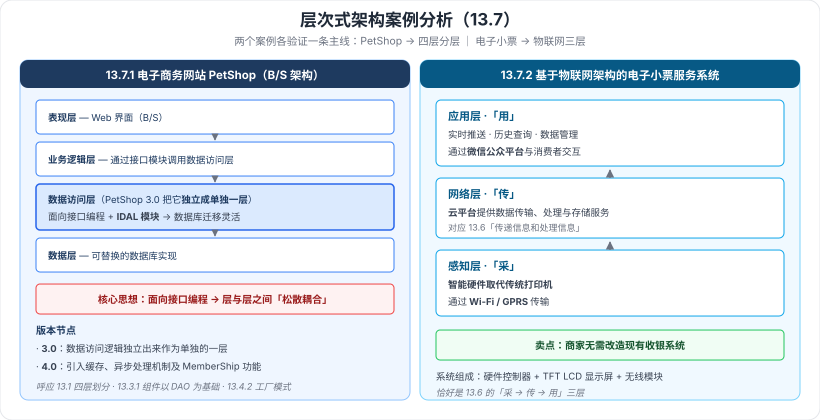

# 13.7 层次式架构案例分析

> 来源：网络取材（主线索 lcp0578/book-note 仓库 chapter13.md，见 CLAUDE.md「网络取材来源」）· 对应《系统架构设计师教程（第二版）》第 13 章 · 第 7 节
>
> 📌 **主线索本节完全空白**（只有标题，无任何内容）。全部内容为 (检索补充)，来源：[SegmentFault·赫凯（教程十三）](https://segmentfault.com/a/1190000046864505)。
> ✅ 该来源同时给出了**本章完整的子小节编号与标题**，据此确认 13.7 含**两个案例**：13.7.1 电子商务网站（PetShop）、13.7.2 基于物联网架构的电子小票服务系统。

---

## 一句话概括

两个案例分别验证本章的两条主线：**PetShop 验证"四层分层 + 面向接口编程"（13.1–13.5）**，**电子小票系统验证"物联网三层架构"（13.6）**。

---

## 一、13.7.1 电子商务网站（PetShop）🟡

**PetShop** 是微软用于展示 .NET 企业级应用架构的经典示例，采用 **B/S 架构**，经历了**多个版本的迭代**。

| 版本 | 关键改进 |
| --- | --- |
| **PetShop 3.0** | 把**数据访问逻辑独立出来作为单独的一层**——即本章 13.4 的**数据访问层** |
| **PetShop 4.0** | 引入**缓存**、**异步处理机制**及 **MemberShip** 功能 |

### 架构要点 🟡

- 采用**面向接口编程**思想，通过 **IDAL 模块**实现**数据库迁移的灵活性**（换数据库只换实现，不动业务代码）。
- **业务逻辑层通过接口模块调用数据访问层**，实现**松散耦合**。

> 📎 **与本章前面的呼应**：
> - "数据访问逻辑独立成层" ← **13.1 的四层划分**
> - "面向接口编程 + IDAL 换实现" ← **13.4.2 工厂模式在数据访问层的应用**（接口统一、工厂选实现）
> - "业务逻辑层经接口调用数据访问层" ← **13.3.1 业务逻辑组件以多个 DAO 组件为基础**

---

## 二、13.7.2 基于物联网架构的电子小票服务系统 🟡

**做的事**：把纸质小票变成电子小票，**商家无需改造现有收银系统**。

**系统组成**：**硬件控制器 + TFT LCD 显示屏 + 无线模块**。

**三层模型对应（正是 13.6 的三层）**：

| 层 | 本案例中做什么 |
| --- | --- |
| **感知层** | **智能硬件取代传统打印机**，通过 **Wi-Fi / GPRS** 传输 |
| **网络层** | **云平台**提供**数据传输、处理与存储**服务 |
| **应用层** | 提供**实时推送、历史查询和数据管理**等功能；通过**微信公众平台**与消费者交互 |

> **记忆钩子**：**感知层换打印机（采）→ 网络层上云（传）→ 应用层推微信（用）**，恰好是 13.6 的「**采 → 传 → 用**」。

---

## 三、附：本章完整子小节结构 🟢（检索补充，用于查漏）

| 小节 | 子小节 |
| --- | --- |
| **13.2 表现层框架设计** | 13.2.1 表现层设计模式 · 13.2.2 使用 XML 设计表现层（统一 Web Form 与 Windows Form 的外观）· 13.2.3 表现层中 UIP 设计思想 · 13.2.4 表现层动态生成设计思想 |
| **13.3 中间层架构设计** | 13.3.1 业务逻辑层组件设计 · 13.3.2 业务逻辑层工作流设计 · 13.3.3 业务逻辑层实体设计 · 13.3.4 业务逻辑层框架 |
| **13.4 数据访问层设计** | 13.4.1 5 种数据访问模式 · 13.4.2 工厂模式在数据访问层应用 · **13.4.3 ORM、Hibernate 与 CMP2.0 设计思想** · **13.4.4 灵活运用 XML Schema** · 13.4.5 事务处理设计 · 13.4.6 连接对象管理设计 |
| **13.7 层次式架构案例分析** | 13.7.1 电子商务网站（PetShop）· 13.7.2 基于物联网架构的电子小票服务系统 |

⚠️ **据此发现两处内容缺口**（本章笔记未覆盖或覆盖不足）：**13.4.3 中的 CMP2.0 设计思想**、**13.4.4 灵活运用 XML Schema**——检索均未获得教材级展开，已列入存疑。

---

---

## 记忆钩子

- **两个案例各验证一条主线**：**PetShop → 四层分层 + 面向接口编程**；**电子小票 → 物联网三层（采/传/用）**。
- **PetShop 的两个版本节点**：**3.0 把数据访问逻辑独立成层**，**4.0 加缓存 + 异步 + MemberShip**。
- **PetShop 的架构关键词**：**面向接口编程 · IDAL 模块 · 松散耦合 · 数据库迁移灵活**。
- **电子小票三层**：**换打印机（感知）→ 上云（网络）→ 推微信（应用）**；卖点是**商家无需改造现有收银系统**。

## 待核对 · 存疑

- ⚠️ **主线索本节完全空白**（只有标题），全部内容为**单一来源**检索补充，**未核实是否与教材一致**。
- ⚠️ **13.4.3「ORM、Hibernate 与 CMP2.0 设计思想」中的 CMP2.0** 与 **13.4.4「灵活运用 XML Schema」** 两处，检索均未获得教材级展开，**本章笔记存在缺口**。
- ⚠️ PetShop 各版本的改进点、IDAL 模块的具体做法，均为该单一来源的概括，**细节未核实**。
- ⚠️ 电子小票案例的系统组成与各层做法同为单一来源。
- ⚠️ 案例分析类小节在综合知识科目中通常权重较低，本节整体定 🟡/🟢，未设 🔴。

## 关键词

`PetShop` `B/S架构` `面向接口编程` `IDAL` `松散耦合` `缓存` `异步处理` `MemberShip` `电子小票` `物联网三层` `感知层` `网络层` `应用层` `云平台` `微信公众平台` `CMP2.0` `XML Schema`
