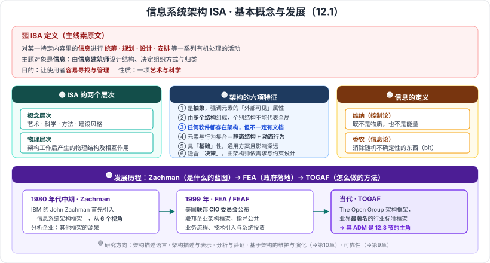

# 12.1 信息系统架构基本概念及发展

> 来源：网络取材（主线索 lcp0578/book-note 仓库 chapter12.md，见 CLAUDE.md「网络取材来源」）· 对应《系统架构设计师教程（第二版）》第 12 章 · 第 1 节
>
> 📌 **主线索本章仅 25 行**（比第 11 章还薄），12.1 只有**一段 ISA 定义**。信息的定义、架构六特征、两个层次、发展历程与研究方向均为 (检索补充)。
> (检索补充) 来源：[博客园·LXNRM（第 12 章全章笔记）](https://www.cnblogs.com/LXNRM/articles/18226102)、[CSDN·z2014z（12.1）](https://blog.csdn.net/z2014z/article/details/142736055)、[CSDN·huaqianzkh（概述和发展）](https://blog.csdn.net/huaqianzkh/article/details/138546080)，三来源相互独立、内容互相印证。

---

## 一句话概括

本节回答三件事：**什么是信息 → 什么是信息系统架构（ISA）→ 这套东西是怎么发展起来的（Zachman → FEA → TOGAF）**。

---

## 一、信息的定义 🟢（检索补充，了解即可）

| 提出者 | 说法 |
| --- | --- |
| **维纳**（控制论创始人） | 「信息就是信息，**既不是物质也不是能量**」 |
| **香农**（信息论奠基者） | 信息是「**用以消除随机不确定性的东西**」；确定信息量单位为 **比特 (bit)** |

**基本含义**：信息是对**客观事物的反映**，描述社会与自然界事物的特征、现象、本质及规律。

> 两句话对着记：**维纳讲"信息不是什么"，香农讲"信息干什么用"（消除不确定性）。**

---

## 二、信息系统架构（ISA）是什么 🔴

### 主线索原文定义

> **信息系统架构（Information System Architecture, ISA）**是指对某一**特定内容**里的**信息**进行**统筹、规划、设计、安排**等一系列**有机处理**的活动。
> 它的**主题对象是信息**，由**信息建筑师**来加以**设计结构、决定组织方式以及归类**，好让使用者与用户**容易寻找与管理**的一项**艺术与科学**。

**抓四个动词**：**统筹 · 规划 · 设计 · 安排**；**主题对象是"信息"**；落脚在**容易寻找与管理**；性质是**艺术与科学**。

### 🟡 另一组常见表述（检索补充）

> ISA 是一种**体系结构**，它反映了一个**政府、企业或事业单位**信息系统的**各个组成部分之间的关系**，以及**与业务、技术之间的关系**。

### 🟡 架构定义的三种经典表述（检索补充）

| # | 表述 |
| --- | --- |
| **定义 1**（多份笔记称教材采用此定义） | 软件或计算机系统的信息系统架构是该系统的**一个（或多个）结构**，而结构由**软件元素、元素的外部可见属性及它们之间的关系**组成 |
| **定义 2** | 为软件系统提供了**结构、行为和属性的高级抽象**，由**构成系统元素的描述、元素的相互作用、指导元素集成的模式及这些模式的约束**组成 |
| **定义 3** | 一个系统的**基础组织**，体现在：系统的**构件**，构件之间、**构件与环境之间的关系**，以及指导其**设计和演化的原则** |

> 📎 **跨章呼应**：定义 1、定义 3 与**第 7 章 7.1 软件架构概念**是同一套体系（构件 + 关系 + 指导原则）。本章的"信息系统架构"是把它落到**信息系统**这一具体对象上。

---

## 三、ISA 的两个层次 🟡（检索补充，两来源一致）

| 层次 | 内容 |
| --- | --- |
| **概念层次** | 包含**艺术、科学、方法和建设风格** |
| **物理层次** | 架构工作之后产生的**物理结构及其相互作用的结果** |

> 对应原文定义里的两半：「**艺术与科学**」是概念层次，「**设计结构、组织方式、归类**」的产物是物理层次。

---

## 四、架构的六项特征 🟡（检索补充，单一来源）

| # | 特征 |
| --- | --- |
| 1 | 架构是对系统的**抽象**，强调元素的「**外部可见**」属性 |
| 2 | 架构由**多个结构**组成，**个别结构不能代表**大型信息系统 |
| 3 | **任何软件都存在架构**，但不一定有文档表述 |
| 4 | **元素及行为的集合**构成架构内容，涵盖**静态结构和动态行为** |
| 5 | 架构具有「**基础**」性——通常解决通用方案且**影响深远** |
| 6 | 架构隐含「**决策**」——由架构师根据**需求和约束**进行设计 |

> 记忆抓手：**抽象（看外部可见）· 多结构 · 人人都有 · 静态+动态 · 基础性 · 决策性**。
> 第 3 条最容易出判断题：**"没有架构文档 ≠ 没有架构"**。

⚠️ 六项特征仅见于单一来源，措辞是否为教材原文未核实。

---

## 五、信息系统架构的发展历程 🟡（检索补充）

| 时间 | 里程碑 | 要点 |
| --- | --- | --- |
| **1980 年代中期** （另说 1987 年论文） | **IBM 的 John Zachman** 首先引入「**信息系统架构框架**」 | 提出从 **6 个视角**分析企业；被视为企业架构设计最权威的源头理论，是其他框架的源泉 |
| **1999 年** | 美国**联邦 CIO 委员会**公布**联邦企业架构框架（FEA / FEAF）** | 指导联邦机构间的公共业务流程、技术引入、信息流和系统投资 |
| **当代** | **TOGAF**（The Open Group 架构框架） | 业界**最著名**的行业标准架构框架 |

> **一条线记牢**：**Zachman（起源，多视角"是什么"的蓝图）→ FEA（政府落地）→ TOGAF（业界标准，"怎么做"的方法）**。
> 📎 **TOGAF 的 ADM 就是 12.3 节的主角**，本节埋的伏笔在下一节展开。

⚠️ Zachman 引入框架的时间，一份来源写「1980 年代中期」，另一份写「**1987 年**发表《信息系统架构框架》论文」，年份口径不一致，已并列标注。

---

## 六、ISA 的主要研究方向 🟢（检索补充，了解即可）

**架构描述语言 · 架构描述与表示 · 分析与验证 · 基于架构的维护与演化 · 可靠性研究**

> 📎 「基于架构的维护与演化」正是**第 10 章**的内容；「可靠性」是**第 9 章**的内容——本节是把前面几章串成一张研究地图。

---

---

## 记忆钩子

- **ISA 定义抓手**：四个动词**统筹·规划·设计·安排**，主题对象是**信息**，目的是**容易寻找与管理**，性质是**艺术与科学**。
- **两句信息定义**：**维纳说"不是物质也不是能量"，香农说"消除随机不确定性"**。
- **两个层次**：**概念层次讲艺术科学方法风格，物理层次讲做出来的结构**。
- **发展一条线**：**Zachman（6 视角，源头）→ FEA（1999，美国联邦）→ TOGAF（业界标准，引出 12.3 的 ADM）**。
- **架构六特征最易考的一条**：**任何软件都存在架构，但不一定有文档**。

## 待核对 · 存疑

- ⚠️ 主线索 12.1 **只有一段 ISA 定义**，本节其余全部为检索补充；三个来源相互印证，但**是否为教材原文措辞未核实**。
- ⚠️ **架构六项特征**仅见于**单一来源**，可信度中等。
- ⚠️ Zachman 引入信息系统架构框架的**年份口径不一**（1980 年代中期 vs 1987 年），已并列标注。
- ⚠️ 「信息的定义（维纳/香农）」被检索来源放在 12.1，但该内容与**第 3 章信息系统基础知识**主题重叠，**是否确属教材 12.1 未核实**。
- ⚠️ 检索来源提到"教材采用定义 1"，此说法**来自笔记作者的判断**，未核实。
- ⚠️ 本节分级未定位到确切真题年份/题号（与第 11 章同）。

## 关键词

`信息系统架构` `ISA` `信息建筑师` `维纳` `香农` `比特` `概念层次` `物理层次` `外部可见属性` `Zachman` `六视角` `FEA` `联邦企业架构框架` `TOGAF` `架构描述语言`
