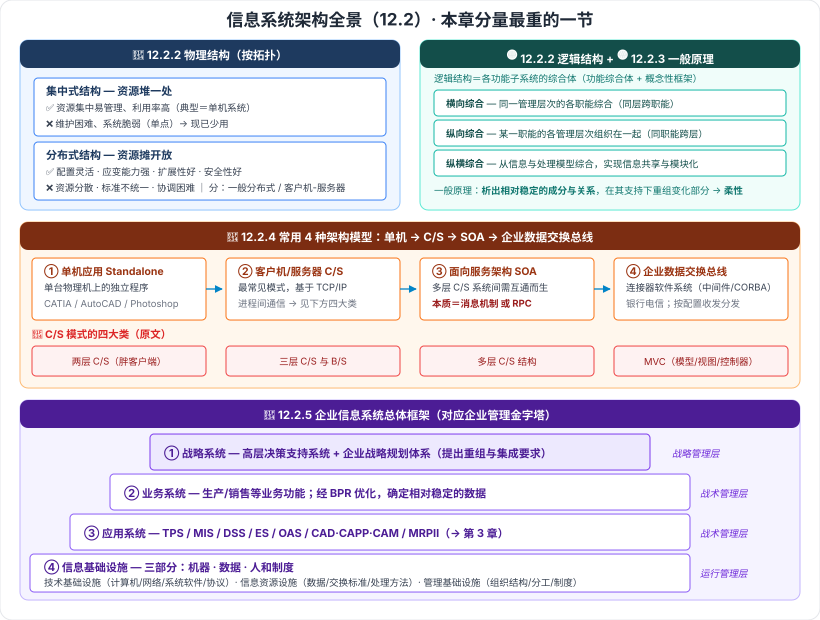

# 12.2 信息系统架构

> 来源：网络取材（主线索 lcp0578/book-note 仓库 chapter12.md，见 CLAUDE.md「网络取材来源」）· 对应《系统架构设计师教程（第二版）》第 12 章 · 第 2 节
>
> 📌 主线索本节只有**物理结构两项名称**和**四种架构模型的名称清单**（含 C/S 四大类与"SOA 本质是消息机制或 RPC"一句）。架构风格、逻辑结构、一般原理、企业信息系统总体框架**主线索完全没有**，据一份**按教材小节编号组织**的全章笔记（12.2.1 架构风格 / 12.2.2 架构分类 / 12.2.3 一般原理 / 12.2.4 常用 4 种架构模型 / 12.2.5 企业信息系统总体框架）补入。
> (检索补充) 来源：[博客园·LXNRM（第 12 章全章笔记）](https://www.cnblogs.com/LXNRM/articles/18226102)、[SegmentFault·赫凯（教程十二）](https://segmentfault.com/a/1190000046864514)、[CSDN·C/S 与 B/S 对比](https://blog.csdn.net/weixin_44074657/article/details/137125524)。

---

## 一句话概括

本节是**全章分量最重的一节**，回答「信息系统的架构长什么样」：先**按物理/逻辑两个维度分类**，再给出**四种常用架构模型**（单机 → C/S → SOA → 企业数据交换总线，本质是一条**由单机走向互联、由紧耦合走向松耦合**的演进线），最后用**企业信息系统总体框架四层**把它们装进企业的管理金字塔。

---

## 12.2.1 架构风格 🟡（检索补充）

**架构风格**：描述**特定应用领域**中**系统组织方式**的**惯用模式**。

> 📎 **跨章呼应**：架构风格的完整体系（数据流 / 调用返回 / 独立构件 / 虚拟机 / 仓库五大类）在**第 7 章 7.3** 与**第 1 章 1.1**已展开，本节不重复。

⚠️ 主线索无此小节，检索来源也只给出一句定义、未展开。

---

## 12.2.2 信息系统架构分类

### 一、物理结构（按拓扑分）🔴（两项名称为原文，优缺点为检索补充）

| 结构 | 做法 | 优点 | 缺点 |
| --- | --- | --- | --- |
| **集中式结构** | 资源**物理上集中**配置，典型为**单机系统** | 资源**集中易管理**、**利用率高** | **维护困难**、**系统脆弱**（单点）；**现已少用** |
| **分布式结构** | 通过**网络**联系资源，不同地点的资源可**共享** | **配置灵活、应变能力强、扩展性好、安全性好** | **资源分散**、**标准不统一**、**协调困难** |

**分布式又细分两类**（检索补充）：

- **一般分布式**：服务器提供**文件和数据服务**。
- **客户机/服务器**：服务器分为**文件服务器、数据库服务器、打印服务器**等；**客户机发起请求**、获取**加工后的信息**。

> **一句话辨析**：**集中式＝资源堆一处（好管但脆），分布式＝资源摊开放（灵活但难协调）。**

### 二、逻辑结构 🟡（检索补充）

**逻辑结构**指各种**功能子系统的综合体**，是**功能综合体**和**概念性框架**。

**三种结构综合方式：**

| 方式 | 做法 | 记忆点 |
| --- | --- | --- |
| **横向综合** | 把**同一管理层次**的**各职能**综合在一起 | **同层跨职能**（一横排） |
| **纵向综合** | 把**某一职能**的**各管理层次**组织在一起 | **同职能跨层**（一竖列） |
| **纵横综合** | 从**信息和处理模型**上综合，实现**信息共享和模块化** | **打通成一张网** |

> 记住"**横＝同层跨职能，纵＝同职能跨层，纵横＝信息共享 + 模块化**"即可。

---

## 12.2.3 信息系统架构的一般原理 🟡（检索补充）

> 析出**相对稳定**的组成成分与关系，在其支持下对**变化部分**重新组织，使系统具有**适应环境变化的柔性**。

**核心思想**：**把稳定的和易变的分开**——稳定的沉淀为架构骨架，易变的随需重组。这与第 10 章「演化」的思路一脉相承。

---

## 12.2.4 信息系统常用的 4 种架构模型 🔴（名称与 C/S 四大类为原文）

> **演进主线**：**单机（一台机器）→ C/S（客户端+服务器）→ SOA（系统之间互通）→ 企业数据交换总线（多系统统一接入）**。

### 模型一：单机应用模式（Standalone）🟢

运行在**单台物理机器**上的**独立程序**，可多进程 / 多线程。
**举例**：CATIA、AutoCAD、Photoshop 等。

### 模型二：客户机/服务器模式（Client/Server, C/S）🔴

**最常见**的信息系统模式，基于 **TCP/IP** 的进程间通信。

**C/S 的四大类（原文）：**

| # | 类型 | 要点 |
| --- | --- | --- |
| 1 | **两层 C/S** | 客户端 + 服务器两层；客户端负担重（**胖客户端**） |
| 2 | **三层 C/S 与 B/S 结构** | 在客户端与数据库之间加入**应用服务器/中间层**；B/S 把客户端换成**浏览器** |
| 3 | **多层 C/S 结构** | 继续拆分层次，适应更大规模系统 |
| 4 | **MVC 架构** | 把交互式应用拆为 **Model 模型 / View 视图 / Controller 控制器** |

**三层 C/S 与 B/S 的常见实现技术（原文清单，🟢 了解）**：

基于 **TCP/IP 自开发**（小系统）· **自定义消息机制**（支持大型系统）· 基于 **RPC** 编程 · 基于 **CORBA/IIOP** 协议 · 基于 **Java RMI** · 基于 **J2EE 的 JMS** · 基于 **HTTP** 协议（前端平面化传输）。

**MVC 三部分 🔴（检索补充）**：

| 部分 | 职责 |
| --- | --- |
| **Model 模型** | 业务逻辑与数据模型 |
| **View 视图** | 呈现层（通常是 HTML 等页面） |
| **Controller 控制器** | 接收请求、调度模型与视图 |

**C/S 与 B/S 对照 🟡（通用补充，辅助理解，非教材原文）**：

| 维度 | **C/S** | **B/S** |
| --- | --- | --- |
| 业务逻辑位置 | 分配到**客户端和服务器端** | **主要集中在服务器端** |
| 客户端 | 需**安装专用客户端**（胖客户端） | 只需**浏览器**，**零维护** |
| 适用范围 | **局域网**小范围 | **广域网 / 互联网** |
| 用户界面 | 形式**多样、个性化强** | 统一浏览器界面，**个性化受限** |
| 响应速度 | **快**（客户端可先行处理） | 相对**慢** |
| 系统维护 | 需维护**客户端**，成本高 | 主要维护**服务器端** |
| 安全性 | 高（可多层次权限校验） | 需额外优化 |

⚠️ 教材是否列出「两层 C/S 的具体缺点清单」未能获得，检索到的只是通用说法（客户端负担过重、更新部署困难、跨平台兼容性差、维护成本高），**未按教材口径写入**。

### 模型三：面向服务架构（SOA）模式 🔴

- **由来**：多层 C/S 系统之间需要**相互通信**，于是产生了 SOA。
- **Web Service**：面向服务架构在 **Web 应用**上的体现。
- **本质（原文原句，最像考点）**：**面向服务架构的本质是消息机制或者远程过程调用（RPC）**。

> 📎 **跨章呼应**：SOA 的完整展开在**第 15 章「面向服务架构设计理论与实践」**（9 节）。本节只需记住**由来**与**本质**两句。

### 模型四：企业数据交换总线 🔴

- **用在哪**：多用于**银行、电信**等**高度信息化**行业。
- **实质**：一个**连接器（Connector）软件系统**，基于**中间件**或 **CORBA/IIOP**。
- **主要功能**：按**预定义配置**，**接收与分发**数据、请求或回复。

> 一句话记：**数据交换总线＝企业内部各系统之间的"数据总机"，按配置收发与分发。**

---

## 12.2.5 企业信息系统的总体框架：四层 🔴（检索补充，两来源一致）

> 与**企业管理金字塔**一一对应，自上而下：

| 层 | 对应管理层次 | 内容 |
| --- | --- | --- |
| **① 战略系统** | **战略管理层** | 由**高层决策支持系统**和**企业战略规划体系**组成；向**业务系统提出重组要求**、向**应用系统提出集成要求** |
| **② 业务系统** | **战术管理层** | 完成各项**业务功能**的部分组成（生产、销售等）；通过**业务流程重组（BPR）**优化，确定**相对稳定的数据** |
| **③ 应用系统** | **战术管理层** | 即**应用软件**部分：**TPS、MIS、DSS、ES、OAS、CAD/CAPP/CAM、MRPⅡ** 等；包含**内部功能实现**和**外部界面**两部分 |
| **④ 信息基础设施** | **运行管理层** | 分三部分（见下） |

**信息基础设施的三部分 🔴**：

| 部分 | 内容 |
| --- | --- |
| **技术基础设施** | 计算机、网络、系统软件、支持性软件、协议等 |
| **信息资源设施** | 数据、交换形式标准、处理方法等 |
| **管理基础设施** | 组织结构、人员分工、管理方法与制度等 |

> **记忆钩子**：**上面定方向（战略），中间干活（业务）+ 用软件干活（应用），下面打地基（信息基础设施：技术 / 信息资源 / 管理）。**
> 三类基础设施记「**机器 · 数据 · 人和制度**」。

📎 应用系统里的 **TPS / MIS / DSS / ES / OAS** 正是**第 3 章 3.2–3.6** 学过的五类信息系统——本节把它们装进了企业总体框架的第三层。

⚠️ 一份来源把「业务系统和应用系统」合并称为"第二层"（同属战术管理层），另一份来源明确列为**四个方面**（战略系统 / 业务系统 / 应用系统 / 信息基础设施）。本笔记按**四层**记录并说明分歧。

---

---

## 记忆钩子

- **物理结构二分**：**集中式＝资源堆一处（好管但脆）**，**分布式＝资源摊开放（灵活但难协调）**。
- **逻辑结构三综合**：**横＝同层跨职能，纵＝同职能跨层，纵横＝信息共享 + 模块化**。
- **一般原理一句话**：**稳定的沉淀成骨架，易变的随需重组**，使系统有**适应环境变化的柔性**。
- **四种架构模型演进线**：**单机 → C/S → SOA → 企业数据交换总线**（一台机器 → 客户端服务器 → 系统间互通 → 多系统统一接入）。
- **C/S 四大类**：**两层 → 三层 C/S 与 B/S → 多层 → MVC**。
- **SOA 本质**（原文原句）：**消息机制或者远程过程调用（RPC）**。
- **总体框架四层**：**战略（定方向）→ 业务（干活）→ 应用（用软件干活）→ 信息基础设施（打地基：机器/数据/人和制度）**。

## 待核对 · 存疑

- ⚠️ **主线索本节只有物理结构两项名称 + 四种架构模型的名称清单**；12.2.1 架构风格、12.2.2 逻辑结构、12.2.3 一般原理、12.2.5 企业信息系统总体框架**主线索完全没有**，全部据另一份按教材小节编号组织的笔记补入，**是否与教材一致未核实**（但小节编号体系吻合）。
- ⚠️ **12.2.1 架构风格**只获得一句定义，教材本小节是否还有其他内容未知。
- ⚠️ 教材是否给出「**两层 C/S 结构的缺点清单**」未能获得；C/S 与 B/S 对照表为**通用资料**，非教材原文，仅作辅助理解。
- ⚠️ 企业信息系统总体框架的**层数口径不一**：一份来源作"第二层＝业务系统和应用系统"（三层描述 + 称四层架构），另一份明确为**四个方面**。已按四层记录并标注。
- ⚠️ MVC 三部分的职责描述为通用资料补充，非教材原文。
- ⚠️ 本节分级未定位到确切真题年份/题号（与第 11 章、12.1 同）。

## 关键词

`集中式结构` `分布式结构` `一般分布式` `客户机/服务器` `逻辑结构` `横向综合` `纵向综合` `纵横综合` `架构一般原理` `单机应用模式` `Standalone` `两层C/S` `三层C/S` `B/S` `多层C/S` `MVC` `模型视图控制器` `SOA` `Web Service` `RPC` `企业数据交换总线` `连接器` `CORBA/IIOP` `战略系统` `业务系统` `应用系统` `信息基础设施` `技术基础设施` `信息资源设施` `管理基础设施` `BPR`
