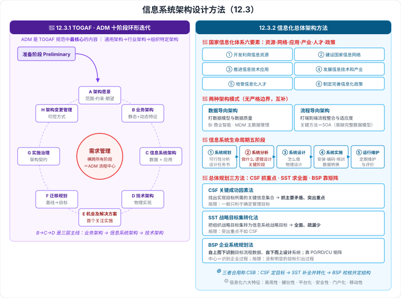

# 12.3 信息系统架构设计方法

> 来源：网络取材（主线索 lcp0578/book-note 仓库 chapter12.md，见 CLAUDE.md「网络取材来源」）· 对应《系统架构设计师教程（第二版）》第 12 章 · 第 3 节
>
> 📌 主线索本节**只有一句话**：ADM 的定义。TOGAF 概述、ADM 十阶段、以及整个 **12.3.2 信息化总体架构方法**均为 (检索补充)。
> (检索补充) 来源：[博客园·LXNRM（第 12 章全章笔记）](https://www.cnblogs.com/LXNRM/articles/18226102)、[CSDN·z2014z（12.3）](https://blog.csdn.net/z2014z/article/details/142737364)、[CSDN·信息系统战略规划方法](https://blog.csdn.net/zhongcaogen/article/details/136268129)。**两份教材笔记相互独立且小节结构一致**（12.3.1 ADM / 12.3.2 信息化总体架构方法）。

---

## 一句话概括

本节给出**两套方法**：**TOGAF 的 ADM**（怎么一步步开发企业架构——十阶段环形迭代）和**信息化总体架构方法**（信息化建设的要素、模式、生命周期与总体规划三法 CSF/SST/BSP）。

---

# 12.3.1 ADM 架构开发方法

## 一、TOGAF 概述 🟡（检索补充）

**TOGAF**：**开放式企业架构框架标准**，基于**迭代过程模型**，为标准、方法论和企业架构专业人员之间的沟通提供**一致性保障**。

### 四大目标 🟢

1. 让**所有用户使用相同语言**，打破沟通障碍
2. **避免被锁定**到专有解决方案
3. **节省时间和金钱**
4. 实现客观**投资回报（ROI）**

### TOGAF 9 的六个组件 🟡

| # | 组件 |
| --- | --- |
| 1 | **架构开发方法（ADM）**——**核心部分** |
| 2 | ADM **指南和技术** |
| 3 | 架构**内容框架** |
| 4 | **企业连续体**和工具 |
| 5 | TOGAF **参考模型**（TRM 和 Ⅲ-RM） |
| 6 | 架构**能力框架** |

> 六个组件里只需牢记一句：**ADM 是 TOGAF 最核心的内容**。

### 核心思想 🟢

**模块化架构** · **内容框架确保一致性** · **扩展指南支持多层级** · **灵活适应不同架构风格**。

---

## 二、ADM 架构开发方法 🔴

### 定义（主线索原文）

> **架构开发方法（Architecture Development Method, ADM）**为开发企业架构所需要执行的**各个步骤以及它们之间的关系**进行**详细定义**，同时它也是 **TOGAF 规范中最为核心的内容**。

### 架构的演进过程 🟢

**通用架构 → 行业架构 → 组织特定架构**（越来越具体）

### 十个阶段（环形流程，反复迭代）🔴 —— 本节最核心的名单

| 阶段 | 名称 | 关键动作 |
| --- | --- | --- |
| **准备阶段** | Preliminary | 为 ADM 实施做**准备**，建立架构框架基础 |
| **A** | **架构愿景** | **启动迭代**；设置**范围、约束、期望**；创建**架构愿景**；验证业务上下文；创建**架构工作说明书** |
| **B** | **业务架构** | 细化**基线与目标业务架构**；讲组织**如何满足业务目标**——静态特征（目标、组织结构、角色）+ 动态特征（流程、功能、服务）；技术：业务过程建模、业务目标建模、用例建模、**差距分析** |
| **C** | **信息系统架构** | 两个步骤（可**依次或并行**）：**数据架构**（主要信息类型与关系）+ **应用架构**（应用系统与应用间关系） |
| **D** | **技术架构** | 完成**系统基础设施**设计，定义架构解决方案的**物理实现**（硬件、软件、通信技术） |
| **E** | **机会及解决方案** | **第一个直接关注实施**的阶段；确定目标架构的**交付物**（项目、程序或文件） |
| **F** | **迁移规划** | 制订**详细实现和迁移计划**，完成**基线架构 → 目标架构**的转变 |
| **G** | **实施治理** | 定义实施项目的架构约束，提供**架构监督**，产生**架构契约** |
| **H** | **架构变更管理** | 确保以**可控方式**管理架构改变 |
| **需求管理** | Requirements Management | **横跨所有阶段**，是 **ADM 流程的中心**；识别、存储、插入/取出需求 |

> **必背两点**：
> 1. **需求管理位于环的正中心、贯穿所有阶段**（不是第 10 个顺序步骤）。
> 2. **阶段 E「机会及解决方案」是第一个直接关注实施的阶段**。
>
> **记忆钩子（按顺序）**：**准备 → 看愿景（A）→ 定业务（B）→ 定信息系统（C：数据 + 应用）→ 定技术（D）→ 找方案（E）→ 排计划（F）→ 管实施（G）→ 管变更（H）**，中间始终围着**需求管理**转。
>
> **B → C → D 是"三层架构"主线**：**业务架构 → 信息系统架构（数据 + 应用）→ 技术架构**，正好对应企业架构的经典分层。

### 三级迭代模式 🟡（检索补充）

**ADM 整体迭代 · 多阶段之间迭代 · 单阶段内部迭代**

### 范围界定的四个考虑因素 🟢

由企业根据以下确定：**团队所具备的组织权力**、**需要实现的目标**、**干系人诉求**、**可利用的人 / 资金 / 资源**。

---

# 12.3.2 信息化总体架构方法

## 三、信息化的基本概念 🟡

**信息化**：培育、发展以**智能化工具**为代表的**新生产力**并造福社会的**历史过程**。

### 国家信息化体系的六要素 🔴（检索补充）

| # | 要素 |
| --- | --- |
| 1 | **开发利用信息资源** |
| 2 | **建设国家信息网络** |
| 3 | **推进信息技术应用** |
| 4 | **发展信息技术和产业** |
| 5 | **培育信息化人才** |
| 6 | **制定完善信息化政策** |

> **口诀**：**资源 · 网络 · 应用 · 产业 · 人才 · 政策**。
> 抓两头记：**首要是"开发利用信息资源"，兜底是"制定完善信息化政策"**。

### 信息化的内涵（生产力）四方面 🟡

**信息网络体系**（信息资源、各种信息系统、公用网络平台）· **信息产业基础**（研发、制造、咨询服务）· **社会运行环境**（体制、政策法律、文化教育等）· **效用积累过程**（人才素质、现代化水平、生活质量提升）。

### 信息化的六大特征 🟡

**易用性 · 健壮性 · 平台化（灵活性、拓展性）· 安全性 · 门户化（整合性）· 移动性**

---

## 四、信息化工程建设方法

### 两种架构模式 🔴（检索补充，两来源一致）

| 模式 | 重点 | 关键方法 / 切入点 | 典型应用 | 风险 |
| --- | --- | --- | --- | --- |
| **数据导向架构** | **数据中心、数据对象本身**；关注**数据模型和数据质量** | 业务对象分析 → 关系分析 → 概念模型 → 逻辑/物理模型 | **BI 商业智能**建设；**主数据管理 MDM** 偏此类 | — |
| **流程导向架构** | **端到端流程整合**、对**流程变化的适应度** | 关键方法是 **SOA**；切入点：价值链分析 → 流程分析分解 → 业务组件规划 | 集成架构 → 系统架构 → 功能架构；通过组件划分识别服务、流程编排满足整合 | 易导致**缺乏完整数据模型**，只关注接口或服务元数据 |

> **两者不是对立的**：没有严格边界，**相互配合补充**。一句话记：**数据导向盯"数据长什么样"，流程导向盯"流程怎么跑通"**。

### 信息系统的生命周期：五阶段 🔴（检索补充，两来源一致）

| 阶段 | 别名 | 干什么 | 产出 |
| --- | --- | --- | --- |
| **① 系统规划** | — | 调查企业环境、目标与现行系统；确定信息系统**发展战略**；分析预测需求；给出**备选方案**并做**可行性分析** | 备选方案、**可行性分析报告**、**系统设计任务书** |
| **② 系统分析**（**做什么**） | **逻辑设计**阶段 | 按任务书详细调查现行系统，描述业务流程、指出局限；确定新系统**基本目标和逻辑功能要求**；提出**逻辑模型**。**是整个系统建设的关键阶段** | **系统说明书**（既给用户看、也是下阶段依据，需**通俗又准确**） |
| **③ 系统设计**（**怎么做**） | **物理设计**阶段 | 依系统说明书设计**技术实现方案**、**物理模型**；分**总体设计**与**详细设计** | **系统设计说明书** |
| **④ 系统实施** | — | 设备购置安装调试、程序编写调试、人员培训、数据转换、系统调试与转换；**多任务同时展开** | **实施进度报告**、**系统测试分析报告** |
| **⑤ 系统运行和维护** | — | 定期维护与评价，记录运行情况，按规格修改，评价工作质量与经济效益 | — |

> **最容易考的两组对照**：
> - **系统分析＝做什么＝逻辑设计**；**系统设计＝怎么做＝物理设计**。
> - **系统分析是整个系统建设的关键阶段**，产出**系统说明书**。

📎 **跨章呼应**：与**第 3 章 3.1.6 信息系统生命周期**、**第 5 章 5.1 软件过程模型**是同一套框架的不同粒度表述。

### 信息系统总体规划的三种方法 🔴（检索补充，多来源交叉印证）

| 方法 | 全称 | 做法 | 优点 | 局限 |
| --- | --- | --- | --- | --- |
| **CSF** | **关键成功因素法** | 找出实现目标所需的**关键信息集合** | **抓主要矛盾**，目标识别**突出重点**，与传统方法衔接好 | 一般**只利于确定管理目标** |
| **SST** | **战略目标集转化法** | 把**组织的战略目标集**转变为**信息系统战略目标** | 反映各种人的要求并**分层**，目标**比较全面、疏漏少** | **突出重点不如 CSF** |
| **BSP** | **企业系统规划法** | **自上而下识别**目标、流程、数据，**自下而上设计**系统；靠 **PO / RD / CU 矩阵**分析把企业目标转成系统目标 | **识别企业过程是 BSP 的中心**，可定义新系统支持企业过程 | **没有明显的目标引出过程** |

> **一句话辨析**：**CSF 抓重点，SST 求全面，BSP 靠矩阵（自上而下识别、自下而上设计）。**
>
> 🟢 三者结合使用称 **CSB 方法**：先用 **CSF** 确定目标 → 用 **SST** 补充完善并转为信息系统目标 → 用 **BSP** 校核并确定信息系统结构。
>
> 🟢 其他方法：企业信息分析与集成技术、投资回收法、零线预算法等。

---

---

## 记忆钩子

- **ADM 十阶段**：**准备 → A 愿景 → B 业务 → C 信息系统（数据+应用）→ D 技术 → E 机会与解决方案 → F 迁移规划 → G 实施治理 → H 变更管理**，**需求管理在正中心贯穿全程**。
- **两个必背细节**：**需求管理是 ADM 流程的中心（横跨所有阶段）**；**阶段 E 是第一个直接关注实施的阶段**。
- **B→C→D 三层主线**：**业务架构 → 信息系统架构 → 技术架构**。
- **信息化六要素口诀**：**资源 · 网络 · 应用 · 产业 · 人才 · 政策**。
- **两种架构模式**：**数据导向盯数据（BI、MDM），流程导向盯流程（SOA）**。
- **生命周期五阶段**：**规划 → 分析（做什么/逻辑设计，关键阶段）→ 设计（怎么做/物理设计）→ 实施 → 运维**。
- **总体规划三法**：**CSF 抓重点 · SST 求全面 · BSP 靠矩阵**；合起来叫 **CSB**。

## 待核对 · 存疑

- ⚠️ **主线索本节只有 ADM 的一句定义**，TOGAF 概述、十阶段细节、整个 12.3.2 均为检索补充；两份教材笔记独立且小节结构一致（可信度较高），但**措辞是否为教材原文未核实**。
- ⚠️ 两份来源对 **12.3.2 的组织略有出入**：一份给出"信息化 6 要素 + 内涵四方面 + 特征 6 种 + 架构模式 + 生命周期"，另一份多出**总体规划三方法（CSF/SST/BSP）**而未提六要素。本笔记做了**合并**，**教材实际收录范围未核实**。
- ⚠️ 信息化定义有两种表述（"构筑完善 6 个要素的国家体系" vs "培育发展以智能化工具为代表的新生产力并造福社会的历史过程"），已并列采用后者为主定义。
- ⚠️ **CSB 综合方法**与 **BSP 的 PO/RD/CU 矩阵**来自第三方资料（非教材笔记），仅作辅助理解。
- ⚠️ TOGAF"四大目标""核心思想""范围界定四因素"仅见于**单一来源**。
- ⚠️ 本节分级未定位到确切真题年份/题号（与本章其他节同）。

## 关键词

`TOGAF` `ADM` `架构开发方法` `准备阶段` `架构愿景` `业务架构` `信息系统架构` `技术架构` `机会及解决方案` `迁移规划` `实施治理` `架构变更管理` `需求管理` `架构契约` `差距分析` `信息化六要素` `数据导向架构` `流程导向架构` `MDM` `SOA` `系统规划` `系统分析` `逻辑设计` `系统设计` `物理设计` `系统实施` `系统运行和维护` `系统说明书` `CSF` `关键成功因素法` `SST` `战略目标集转化法` `BSP` `企业系统规划法` `CSB`
