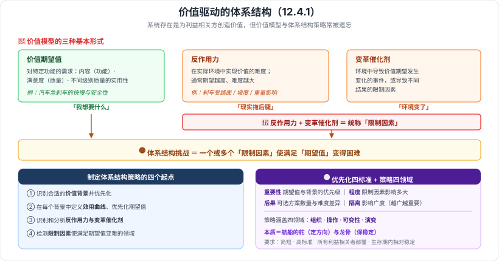

# 12.4 信息系统架构案例分析

> 来源：网络取材（主线索 lcp0578/book-note 仓库 chapter12.md，见 CLAUDE.md「网络取材来源」）· 对应《系统架构设计师教程（第二版）》第 12 章 · 第 4 节
>
> 📌 主线索本节**只有三个案例的标题**。三个案例的内容均为 (检索补充)，来源：[博客园·LXNRM（第 12 章全章笔记）](https://www.cnblogs.com/LXNRM/articles/18226102)、[CSDN·xingzuo_1840（第 12 章案例分析）](https://blog.csdn.net/xingzuo_1840/article/details/136858192)。
> ⚠️ **12.4.2 与 12.4.3 两个案例，检索到的内容都很单薄**（一份来源直接标注"待分析"），本节以 **12.4.1 价值驱动的体系结构**为主。

---

## 一句话概括

三个案例分别演示：**怎么用"价值"驱动架构决策（12.4.1）**、**Web 服务如何落到具体行业标准上（12.4.2 医疗 HL7）**、**怎么以服务为中心做企业整合（12.4.3）**。考点密度最高的是第一个。

---

# 12.4.1 价值驱动的体系结构 —— 连接产品策略与体系结构

## 背景

系统之所以存在，是为**利益相关方创造价值**；但理想往往无法完全实现，而**价值模型和体系结构策略**在开发中**常常被遗忘**。

---

## 一、价值模型的三种基本形式 🔴

| 形式 | 含义 | 教材举例（刹车） |
| --- | --- | --- |
| **价值期望值** | 对**特定功能的需求**；包括**内容（功能）**、**满意度（质量）**、**不同级别质量的实用性** | 汽车急刹车的**快慢和安全性** |
| **反作用力** | 系统在**实际环境**中实现价值的**难度**；通常**期望越高、难度越大** | 刹车结果取决于**路面、坡度、重量**等 |
| **变革催化剂** | 环境中**导致价值期望发生变化的事件**，或导致不同结果的限制因素 | — |

> 🔴 **必记的一句合并**：**反作用力 + 变革催化剂 = 限制因素（统称）**。
>
> **一句话辨析**：**期望值是"我想要什么"，反作用力是"现实拖后腿"，变革催化剂是"环境变了让我想要的也变了"。**

---

## 二、体系结构挑战 🟡

**定义**：**一个或多个限制因素**使**满足期望值变得困难**。

### 制定体系结构策略的四个起点

1. **识别**合适的**价值背景**并**优先化**
2. 在每个背景中**定义效用曲线**并**优先化期望值**
3. **识别和分析**反作用力与变革催化剂
4. **检测**限制因素使满足期望值变难的**领域**

### 优先化的四项标准 🟡

| 标准 | 含义 |
| --- | --- |
| **重要性** | 期望值的优先级、背景的相对优先级 |
| **程度** | 限制因素的**影响程度** |
| **后果** | 可供选择的**方案数量**及**难度差异** |
| **隔离** | **影响广度**——影响越广，重要性越高 |

> 口诀：**重要性 · 程度 · 后果 · 隔离**（要不要管 → 有多严重 → 有没有退路 → 波及多广）。

---

## 三、体系结构策略 🟡

针对**高优先级**的方法制定**指导原则**，涵盖四个领域：**组织 · 操作 · 可变性 · 演变**。

**本质（很好的比喻）**：

> 体系结构策略像**航船的舵和龙骨**——**舵确定方向，龙骨提供稳定性**。
> 它应当**简短**、**高标准**、**被所有利益相关者理解**，并在**系统生存期内相对稳定**。

---

## 四、价值模型与体系结构的九点联系 🟢（了解即可）

1. 软件密集型产品**存在的意义是提供价值**
2. 价值融合了**边际效用**的理解与目标间的**相对重要性**；**目标折中极其重要**
3. 价值**多层面存在**，含目标系统作为价值提供者
4. **高层价值模型可导致下层变化**，是**演化原则**的重要依据
5. 每个**价值群**的价值模型同类；**不同环境有不同期望**
6. 开发**赞助商**对满足不同价值背景的需要有**不同优先级**
7. **体系结构挑战由环境因素对期望的影响引起**
8. 体系结构方法通过**克服最高优先级的挑战**实现价值最大化
9. 体系结构策略由**高优先级方法综合得出**，总结共同的规则、政策、原则

---

# 12.4.2 Web 服务在 HL7 上的应用 —— Web 服务基础实现框架 🟢

⚠️ 检索内容非常单薄，仅得到以下要点（**单一来源**，未核实）：

- **HL7 模型**采用**参考信息模型**生成具体的**领域信息模型**。
- 体系结构包含两个核心功能：**商业逻辑** 与 **Web 服务适配器**。
- **适配器**负责**消息分发与确认**：**发送端配置 SOAP**，**接收端验证消息**。

> 📎 HL7 是**医疗卫生信息交换标准**；本案例演示的是把 **SOA/Web Service（12.2 模型三）**落到具体行业标准上。

---

# 12.4.3 以服务为中心的企业整合 🟢

⚠️ 检索内容同样单薄（**单一来源**，未核实）：

- **基本步骤**：**业务分析 → 服务建模 → IT 环境分析 → 架构设计**（→ 系统开发）。
- **涉及技术**：**信息服务、事件服务、流程服务、传输服务**的集成模式。

> 该案例贯穿从**业务分析到服务建模、到架构设计、到系统开发**的整个生命周期，是 **SOA 的实践演示**，完整方法论见**第 15 章**。

---

---

## 记忆钩子

- **价值模型三形式**：**价值期望值（我想要什么）· 反作用力（现实拖后腿）· 变革催化剂（环境变了）**；后两者合称**限制因素**。
- **体系结构挑战**＝**一个或多个限制因素使满足期望值变得困难**。
- **优先化四标准**：**重要性 · 程度 · 后果 · 隔离**。
- **体系结构策略四领域**：**组织 · 操作 · 可变性 · 演变**；本质是**舵（定方向）与龙骨（保稳定）**，要**简短、高标准、人人能懂、生存期内稳定**。
- **三个案例的角色**：**12.4.1 讲怎么决策（价值驱动）· 12.4.2 讲行业落地（HL7 + Web 服务）· 12.4.3 讲企业整合（SOA 实践）**。

## 待核对 · 存疑

- ⚠️ **主线索本节只有三个案例标题**，全部内容为检索补充。
- ⚠️ **12.4.2 Web 服务在 HL7 上的应用**与 **12.4.3 以服务为中心的企业整合**内容严重不足：一份来源直接标注"待分析"，另一份只给出三四句概括，均为**单一来源**、未核实。这是本章最大的内容缺口。
- ⚠️ 12.4.1 中「体系结构挑战的评估标准（限制因素对期望值的影响：积极/消极，高中低等级）」仅一份来源提到，本笔记未展开。
- ⚠️ 「效用曲线」一词出现在制定策略的起点中，但检索未获得其定义与画法。
- ⚠️ 本节分级未定位到确切真题年份/题号；案例分析章节在综合知识科目中通常权重较低，故整体定 🟡/🟢，仅价值模型三形式定 🔴。

## 关键词

`价值驱动的体系结构` `价值期望值` `反作用力` `变革催化剂` `限制因素` `体系结构挑战` `效用曲线` `重要性` `程度` `后果` `隔离` `体系结构策略` `舵和龙骨` `HL7` `参考信息模型` `Web服务适配器` `SOAP` `以服务为中心的企业整合` `服务建模`
