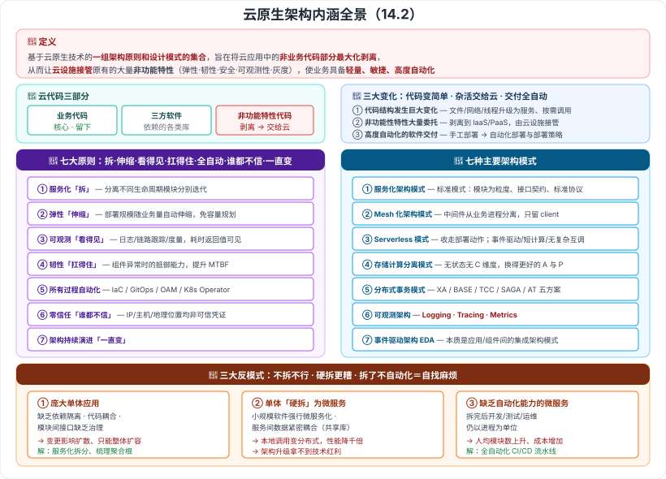

# 14.1 云原生架构产生背景 · 14.2 云原生架构内涵

> 来源：网络取材（主线索 lcp0578/book-note 仓库 chapter14.md，见 CLAUDE.md「网络取材来源」）· 对应《系统架构设计师教程（第二版）》第 14 章 · 第 1–2 节
>
> 📌 主线索：**14.1 只有"云原生带来的价值"四条**；**14.2 有定义原文、三大变化的名称、七大原则的名称、七种架构模式的名称**（Serverless 适用场景与可观测三方面有展开）。各原则/模式的**含义**与**三大反模式**为 (检索补充)。
> (检索补充) 来源：[博客园·LXNRM（第 14 章全章笔记）](https://www.cnblogs.com/LXNRM/articles/18226107)、[CSDN·云原生架构设计理论与实践](https://blog.csdn.net/weixin_43833540/article/details/139164822)、[知乎·浅谈云原生架构的 7 个原则](https://zhuanlan.zhihu.com/p/391131266)。

---

## 一句话概括

**云原生架构 = 把应用里的"非业务代码"最大化剥离出去，交给云设施接管**（弹性、韧性、安全、可观测、灰度……），让业务代码变得**轻量、敏捷、高度自动化**。

---

# 14.1 云原生架构产生背景

## 一、云原生是什么意思 🟡（检索补充）

**Cloud Native ＝ Cloud（云端）+ Native（原生设计）**——一开始就为"跑在云上"而设计。

**核心目标**：**最大程度复用资源，提升效率和生产力**，实现「**降本增效**」。

## 二、发展历程与各阶段的问题 🟡（检索补充）

| 阶段 | 遗留问题 |
| --- | --- |
| **烟囱模式** | 部门**各自为政**，**数据无法共享** |
| **瀑布式流程** | **信息不对称**，开发周期长，**调整难度大** |
| **敏捷开发** | 只解决了**开发效率**，**未与运维打通** |
| **DevOps** | **容器、微服务**等技术为其提供了**前提条件** |

> **一条线记牢**：**烟囱（不通）→ 瀑布（太慢）→ 敏捷（只快了开发）→ DevOps（开发运维打通，靠容器+微服务落地）**。

---

## 三、云原生架构为企业带来的价值 🟡（原文四条）

| # | 价值 | 关键词 |
| --- | --- | --- |
| 1 | 支持**多元算力**，满足不同场景个性化算力需求，基于**软硬协同架构**提供**极致性能的云原生算力**；基于**多云治理和边云协同**打造**分布式泛在计算平台**，构建**容器、裸机、虚拟、函数**等多种形态的统一计算资源；以「**应用**」为中心打造资源调度与管理平台，提供**一键式部署**、**可感知应用的智能化调度**、全访问监控与运维 | **算力 + 平台 + 以应用为中心** |
| 2 | 通过 **DevSecOps** 应用开发模式实现**敏捷开发**，提升迭代速度、高速响应用户需求并**保证全流程安全**；服务集成提供**侵入和非侵入两种模式**，实现新老应用有机协同、「**立而不破**」 | **DevSecOps + 立而不破** |
| 3 | 帮助企业**管好数据**，构建数据运营能力，实现**数据资产化沉淀与价值挖掘**，并借助 **AI** 赋能应用，实现业务的**智能升级** | **数据 + AI** |
| 4 | 结合云平台的**企业级安全服务和安全合规能力**，保障应用在云上**安全构建**、业务**安全运行** | **安全合规** |

> **四条压缩成一句**：**算力平台化 · 开发 DevSecOps 化 · 数据 AI 化 · 安全合规化。**

---

# 14.2 云原生架构内涵

## 四、云原生架构的定义 🔴（原文，必背）

> 从技术的角度，**云原生架构**是基于**云原生技术**的**一组架构原则和设计模式的集合**，旨在将云应用中的**非业务代码部分**进行**最大化的剥离**，从而让**云设施接管**应用中原有的大量**非功能特性**（如**弹性、韧性、安全、可观测性、灰度**等），使业务**不再有非功能性业务中断困扰**的同时，具备**轻量、敏捷、高度自动化**的特点。

**拆解记忆：**

| 要素 | 内容 |
| --- | --- |
| **是什么** | 一组**架构原则**和**设计模式**的集合 |
| **做什么** | **最大化剥离非业务代码** |
| **谁来接管** | **云设施** |
| **接管什么** | 非功能特性：**弹性、韧性、安全、可观测性、灰度** |
| **得到什么** | **轻量、敏捷、高度自动化** |

## 五、云代码的三部分 🔴（检索补充，理解定义的钥匙）

| 部分 | 说明 |
| --- | --- |
| **业务代码** | 实现业务逻辑（**核心，要留下**） |
| **三方软件** | 依赖的各类库 |
| **处理非功能特性的代码** | 高可用、安全、可观测性等（**要剥离出去**） |

---

## 六、云原生带来的三大变化 🔴（三个名称为原文，含义为检索补充）

| 变化 | 传统架构 | 云原生架构 |
| --- | --- | --- |
| **① 代码结构发生巨大变化** | 需要考虑**文件、网络、线程**等元素，掌握分布式处理与复杂网络技术 | 这些**升级为服务、按需调用**；不再需要掌握文件分布式处理与复杂网络技术 → **业务开发更敏捷更快** |
| **② 非功能性特性大量委托** | 开发时需**大量代码**实现非功能特性 | 大量非功能特性**剥离到 IaaS 和 PaaS**，由**云设施接管**，降低业务代码复杂度 |
| **③ 高度自动化的软件交付** | **手工部署**，顺序复杂 | **自动化部署**与**部署策略** |

> **三句话**：**代码变简单 · 杂活交给云 · 交付全自动。**

---

## 七、云原生架构的七大原则 🔴（名称为原文，含义为检索补充）

| # | 原则 | 含义 | 一句话记 |
| --- | --- | --- | --- |
| 1 | **服务化原则** | 代码规模超出小团队范围时需拆分；含**微服务架构、小服务架构**；好处是**分离不同生命周期的模块**分别迭代 | **拆** |
| 2 | **弹性原则** | 系统**部署规模随业务量自动伸缩**，**无需事先容量规划**（量上来加节点，量下去关闲置节点） | **伸缩** |
| 3 | **可观测原则** | 通过**日志、链路跟踪、度量**等手段，使多次服务调用的**耗时、返回值、参数**清晰可见；可下钻到 SQL 请求、节点拓扑、网络响应等细节 | **看得见** |
| 4 | **韧性原则** | 软件所依赖的**软硬件组件出现异常**时表现出的**抵御能力**；核心目标是**提升平均无故障时间 MTBF**；手段含**异步化、重试、限流、降级、熔断、反压、主从、集群、容灾** | **扛得住** |
| 5 | **所有过程自动化原则** | 让自动化工具**理解交付目标和环境差异**，实现整个**软件交付和运维**的自动化；工具如 **IaC、GitOps、OAM、Kubernetes Operator** | **全自动** |
| 6 | **零信任原则** | **默认不信任网络内部和外部的任何人/设备/系统**，基于**认证和授权**重构访问控制的信任基础；**IP 地址、主机、地理位置均非可信凭证** | **谁都不信** |
| 7 | **架构持续演进原则** | 架构具备**持续演进**的能力 | **一直变** |

> **口诀**：**拆（服务化）· 伸缩（弹性）· 看得见（可观测）· 扛得住（韧性）· 全自动 · 谁都不信（零信任）· 一直变（持续演进）。**
>
> ⚠️ **易混**：**可观测（能看见问题）** vs **韧性（出问题也扛得住）**——前者是"知道"，后者是"抗住"。

---

## 八、主要架构模式（七种）🔴

| # | 模式 | 要点 |
| --- | --- | --- |
| 1 | **服务化架构模式** | **云时代构建云原生应用的标准架构模式**：以**应用模块**为颗粒度划分软件，以**接口契约**定义业务关系，以**标准协议**确保互联互通；典型是**微服务、小服务**。意义：**代码模块与部署关系分离**，每个接口可**独立扩缩容**、**单独升级**提升迭代效率。要求配套**自动化能力和治理能力** |
| 2 | **Mesh 化架构模式** | 把**中间件框架从业务进程中分离**，业务进程只保留 **client 部分**；**流量控制、安全等由 Mesh 进程完成**；业务代码**无需中间件包** |
| 3 | **Serverless 模式** | 「**收走部署动作**」，开发者不关心应用运行地点；有流量时云启动进程，处理完自动关闭。**适用（原文）：事件驱动的数据计算任务、计算时间短的请求/响应应用、没有复杂相互调用的长周期任务**；**不适用**：有状态应用、长期后台密集计算、频繁外部 I/O |
| 4 | **存储计算分离模式** | **无状态应用没有 C（一致性）维度**，从而获得更好的 **A 和 P**；暂态数据、结构化与非结构化数据交由云服务保存；某些状态可用**时间日志 + 快照**快速恢复 |
| 5 | **分布式事务模式** | 见下方五种方案对照 |
| 6 | **可观测架构** | 三方面：**Logging / Tracing / Metrics**，见下 |
| 7 | **事件驱动架构（EDA）** | **本质上是一种应用/组件间的集成架构模式**（原文）；事件具有 **schema**，支持 QoS 保障 |

> ⚠️ **主线索笔误**：把第 2 项写作「**Mesh 化架构原则**」，但它列在「主要架构模式」之下，应为「**Mesh 化架构模式**」。已订正。

### 8.1 分布式事务模式的五种方案 🔴（检索补充）

| 方案 | 特点 |
| --- | --- |
| **XA 模式** | **一致性强**但**性能差** |
| **基于消息的最终一致性（BASE）** | **性能高**但**通用性有限** |
| **TCC 模式** | 事务**隔离性可控**、高效，但**代码侵入性强** |
| **SAGA 模式** | **无 try 阶段**，**维护成本高** |
| **SEATA 的 AT 模式** | **高性能、无代码工作量、支持自动回滚** |

> **一句话串**：**XA 强一致慢 · BASE 快但挑场景 · TCC 可控但侵入 · SAGA 无 try 但难维护 · AT 高性能零侵入。**

### 8.2 可观测架构的三方面 🔴（原文，必背）

| 方面 | 原文表述 |
| --- | --- |
| **Logging（日志）** | 提供**多个级别**（verbose / debug / warning / error / fatal）的**详细信息跟踪**，由**应用开发者主动提供** |
| **Tracing（链路跟踪）** | 提供**一个请求从前端到后端的完整调用链路跟踪**，**对于分布式场景尤其有用** |
| **Metrics（度量）** | 提供对系统**量化的多维度度量** |

> 🟡 补充：需选择合适的开源框架（**Open Tracing、Open Telemetry** 等），并为各组件定义清晰的 **SLO**（并发度、耗时、可用时长、容量等）。

### 8.3 事件驱动架构的应用场景 🟡（检索补充）

**增强服务韧性**（异步集成，下游故障不影响上游）· **CQRS 模式**（命令用事件发起、查询用同步 API）· **数据变化通知** · **构建开放式接口**（提供者不关心订阅者）· **事件流处理**（大量事件数据分析）。
**典型适用**：事件触发响应、**IoT 传感器数据处理**。

---

## 九、典型的云原生架构反模式（三大反例）🔴（检索补充）

| 反模式 | 问题 | 后果 / 解决 |
| --- | --- | --- |
| **① 庞大单体应用** | **缺乏依赖隔离**、**代码耦合**、**模块间接口缺乏治理** | **变更影响扩散**、开发进度难协调、单模块故障影响全体、**扩容只能整体扩**；解决：服务化拆分，**梳理聚合根**、清晰定义模块边界 |
| **② 单体应用"硬拆"为微服务** | 小规模软件强行微服务化；服务间**数据紧密耦合（共享数据库）**；**本地调用变分布式调用，性能下降千倍** | **架构升级难以获得技术红利** |
| **③ 缺乏自动化能力的微服务** | 拆完之后开发/测试/运维**仍以进程为单位** | **人均负责模块数上升**、工作量增大、**开发成本增加**；解决：建立**全自动化的 CI/CD 流水线** |

> **一句话记牢**：**不拆（庞大单体）不行，硬拆（数据还耦合）更糟，拆了不配自动化（CI/CD）等于自找麻烦。**

---

---

## 记忆钩子

- **定义抓五点**：**一组架构原则和设计模式** → **最大化剥离非业务代码** → **云设施接管** → **弹性/韧性/安全/可观测/灰度** → **轻量、敏捷、高度自动化**。
- **云代码三部分**：**业务代码（留）· 三方软件 · 非功能特性代码（剥）**。
- **三大变化**：**代码变简单 · 杂活交给云 · 交付全自动**。
- **七大原则口诀**：**拆 · 伸缩 · 看得见 · 扛得住 · 全自动 · 谁都不信 · 一直变**。
- **可观测三方面**：**Logging（多级别日志，开发者主动提供）· Tracing（前端到后端完整调用链，分布式尤其有用）· Metrics（量化多维度度量）**。
- **分布式事务五方案**：**XA 强一致慢 · BASE 快但挑场景 · TCC 可控但侵入 · SAGA 无 try 难维护 · AT 高性能零侵入**。
- **三大反模式**：**不拆不行 · 硬拆更糟 · 拆了不自动化等于自找麻烦**。

## 待核对 · 存疑

- ⚠️ **B 类 · 主线索笔误**：主要架构模式中把「**Mesh 化架构模式**」写作「**Mesh 化架构原则**」（它列在"主要架构模式"之下，且其余六项都叫"模式"）。已订正。
- ⚠️ **七大原则的具体含义、七种架构模式中除 Serverless 适用场景与可观测三方面之外的全部展开、三大反模式**，主线索均只有名称或完全没有，为检索补充；来源之间措辞高度一致（疑同源于**阿里云原生架构白皮书**），**教材是否逐字收录未核实**。
- ⚠️ **分布式事务五种方案（XA/BASE/TCC/SAGA/AT）**为检索补充且偏工程实践口径，**教材是否列出这五种未核实**。
- ⚠️ 14.1 的发展历程（烟囱 → 瀑布 → 敏捷 → DevOps）与各阶段问题为**单一来源**。
- ⚠️ 主线索 14.1 的四条价值文字较散，本笔记做了**归纳与提炼**（"算力平台化/开发 DevSecOps 化/数据 AI 化/安全合规化"为本笔记的概括，非教材原文）。
- ⚠️ 本节分级未定位到确切真题年份/题号；但检索到的备考资料称**云计算相关内容每年必考 3–5 题**（见 11.6 的存疑说明，同为博客说法未核实），本章密度高的 🔴 判定基于此 + 原文完整列出的名单。

## 关键词

`云原生` `Cloud Native` `降本增效` `烟囱模式` `DevOps` `DevSecOps` `立而不破` `非业务代码剥离` `云设施接管` `业务代码` `三方软件` `非功能特性` `服务化原则` `弹性原则` `可观测原则` `韧性原则` `MTBF` `所有过程自动化原则` `IaC` `GitOps` `OAM` `零信任原则` `架构持续演进原则` `服务化架构模式` `Mesh化架构模式` `Serverless模式` `存储计算分离模式` `分布式事务模式` `XA` `BASE` `TCC` `SAGA` `AT` `可观测架构` `Logging` `Tracing` `Metrics` `SLO` `事件驱动架构` `EDA` `CQRS` `庞大单体应用` `硬拆微服务`
