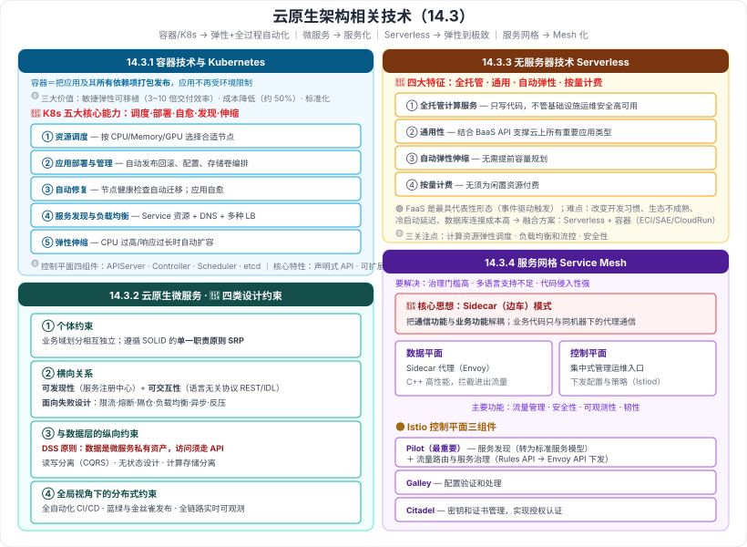

# 14.3 云原生架构相关技术

> 来源：网络取材（主线索 lcp0578/book-note 仓库 chapter14.md，见 CLAUDE.md「网络取材来源」）· 对应《系统架构设计师教程（第二版）》第 14 章 · 第 3 节
>
> 📌 主线索本节有：**容器技术 → 容器编排 → Kubernetes 五大核心能力（完整展开，是主线索本章最详细的一处）**；以及"云原生微服务 → 服务网格 → Istio"三个名称。其余为 (检索补充)。
> (检索补充) 来源：[博客园·LXNRM（第 14 章全章笔记）](https://www.cnblogs.com/LXNRM/articles/18226107)、[CSDN·云原生架构设计理论与实践](https://blog.csdn.net/weixin_43833540/article/details/139164822)。

---

## 一句话概括

云原生的四项支撑技术，正好对应 14.2 的原则落地：**容器/K8s（弹性、自动化）→ 微服务（服务化）→ 无服务器（弹性到极致）→ 服务网格（把治理能力下沉，Mesh 化）**。

---

## 14.3.1 容器技术

### 一、容器是什么、价值在哪 🟡（检索补充）

**容器**：作为**标准化的软件基础单元**，把**应用及其所有依赖项打包发布**，应用不再受环境限制，可在**不同计算环境间快速、可靠地运行**。

> 大白话：**把软件运行需要的依赖全部和软件打包在一起。**

**三大核心价值**：

| 价值 | 体现 |
| --- | --- |
| **敏捷、弹性、可移植** | **3～10 倍交付效率**提升，快速迭代、**低成本试错** |
| **成本降低** | **部署密度提升 + 弹性**，可降低约 **50% 计算成本** |
| **标准化** | **应用与底层环境解耦**，平滑运行在不同基础设施上 |

🟢 **Kubernetes 已取代 Docker 成为容器编排的事实标准。**

---

### 二、容器编排：Kubernetes 的五大核心能力 🔴（原文完整，本节最扎实的一处）

> **Kubernetes 提供了分布式应用管理的核心能力：**

| # | 能力 | 原文要点 |
| --- | --- | --- |
| 1 | **资源调度** | 根据应用请求的资源量（**CPU、Memory 或 GPU** 等设备资源），在集群中**选择合适的节点**来运行应用 |
| 2 | **应用部署与管理** | 支持应用的**自动发布与回滚**，以及相关**配置的管理**；也可以**自动化存储卷的编排**，让**存储卷与容器应用的生命周期相关联** |
| 3 | **自动修复** | 能**监测集群中所有宿主机**，当宿主机或 OS 出现故障，**节点健康检查会自动进行应用迁移**；也支持**应用的自愈**，极大简化运维管理复杂性 |
| 4 | **服务发现与负载均衡** | 通过 **Service 资源**出现各种应用服务，结合 **DNS** 和多种**负载均衡机制**，支持容器化应用之间的相互通信 |
| 5 | **弹性伸缩** | 检测业务承担的负载，若 **CPU 利用率过高或响应时间过长**，可对业务**自动扩容** |

> **口诀**：**调度（挑机器）· 部署（发/回滚/存储卷）· 自愈（迁移+自愈）· 发现（Service+DNS+LB）· 伸缩（按负载扩容）。**

### 三、Kubernetes 的控制平面四组件与三大核心特性 🟡（检索补充）

**控制平面四组件**：**APIServer · Controller · Scheduler · etcd**

**三大核心特性**：

| 特性 | 说明 |
| --- | --- |
| **声明式 API** | 开发者**关注应用自身**；支持 **Deployment、StatefulSet、Job** 等不同资源类型 |
| **可扩展性架构** | 基于一致的**开放 API**，支持 **CRD、Operator** 等三方扩展 |
| **可移植性** | 通过 **Load Balance Service、CNI、CSI** 等抽象，**屏蔽底层基础设施差异** |

---

## 14.3.2 云原生微服务

### 四、微服务的背景与挑战 🟡（检索补充）

- **单体模式的问题**：项目大、参与人多时，**效率严重下滑**。
- **微服务拆分**：根据**业务逻辑的相对独立性**把单体拆开。
- **微服务带来的挑战**：**远程调用、容量预估、负载均衡、集成测试、部署运维**。

### 五、微服务的四类设计约束 🔴（检索补充，本节最像考点的一处）

| 约束 | 要点 |
| --- | --- |
| **① 微服务个体约束** | **业务域划分应相互独立**；遵循 SOLID 中的**单一职责原则（SRP）** |
| **② 微服务间的横向关系** | **可发现性**（服务发布/扩容时依赖方如何感知 → 引入**服务注册中心**）+ **可交互性**（如何调用 → 采用**与语言无关的远程调用协议**：REST 或基于 **IDL** 的二进制协议）；并需**面向失败设计**（限流、熔断、隔仓、负载均衡、协程、Rx 模型、异步调用、反压） |
| **③ 微服务与数据层的纵向约束** | **DSS 原则**——**数据是微服务的私有资产，访问必须通过对应微服务的 API**；**读写分离**（CQRS）；**无状态设计**；**计算存储分离**（有状态服务把数据下沉到分布式存储） |
| **④ 全局视角下的分布式约束** | **全自动化 CI/CD 流水线**；支持**蓝绿、金丝雀**等发布策略；**全链路、实时、多维度的可观测能力**；中心化监控系统 |

> **记忆钩子**：**个体（独立、单一职责）→ 横向（能被发现、能被调用、能扛失败）→ 纵向（数据私有、读写分离、无状态）→ 全局（CI/CD + 发布策略 + 可观测）。**

### 六、主要微服务技术框架 🟡（检索补充，了解出处即可）

| 框架 | 来源 | 特点 |
| --- | --- | --- |
| **Apache Dubbo** | **阿里巴巴** | 高性能 RPC、透明接口、智能负载均衡、服务治理 |
| **Spring Cloud** | 开源社区 | 配置管理、服务发现、断路器、路由、代理 |
| **Eclipse MicroProfile** | Java 微服务规范 | 指标、API 文档、健康检查、容错、分布式跟踪 |
| **Tars** | **腾讯** | 多语言支持、高性能、完整开发框架与管理平台 |
| **SOFAStack** | **蚂蚁金服** | 金融级分布式架构中间件、最佳实践 |
| **DAPR** | **微软** | 可移植运行时、事件驱动、支持有状态/无状态微服务 |

---

## 14.3.3 无服务器技术（Serverless）

### 七、Serverless 的四大特征 🔴（检索补充）

| # | 特征 |
| --- | --- |
| 1 | **全托管的计算服务**——客户只需编写代码，**无需关心基础设施的开发/运维/安全/高可用** |
| 2 | **通用性**——结合 **BaaS API** 能支撑云上所有重要的应用类型 |
| 3 | **自动弹性伸缩**——**无需提前进行容量规划** |
| 4 | **按量计费**——**无须为闲置资源付费** |

> **口诀**：**全托管 · 通用 · 自动弹性 · 按量计费。**

### 八、函数计算（FaaS）与落地难点 🟢（检索补充）

- **FaaS 是最具代表性的 Serverless 产品形态**：把应用逻辑拆为多个**函数**，通过**事件驱动**触发（例：OSS 的上传/删除事件自动触发函数处理）。
- **普及困难**：函数编程以**事件驱动**方式，**改变了应用架构与开发习惯**；**生态仍不够成熟**；细颗粒度运行引发新挑战（**冷启动延迟**、**数据库连接成本高**）。
- **融合方案**：把 **Serverless 计算与容器技术融合**——容器化应用可无差别运行在开发机、自建机房、公有云（如阿里 **ECI / SAE**、Google **CloudRun**）。

### 九、Serverless 的三个关键技术关注点 🟡（检索补充）

| 关注点 | 要点 |
| --- | --- |
| **计算资源弹性调度** | 需识别应用特征做「**白盒**」调度；负载上升及时**扩容**、下降及时**回收**；放置算法要兼顾**容错、资源利用率、性能、数据驱动** |
| **负载均衡和流控** | 资源调度服务是**关键链路**（每秒近百万调度请求）；需**分片分散到多台机器**避免单点瓶颈；**流量隔离控制**保证服务质量 |
| **安全性** | 平台可执行**任意用户代码**，需从**权限管理、网络安全、数据安全、运行时安全**全面保障 |

---

## 14.3.4 服务网格（Service Mesh）

### 十、要解决的三个问题 🟡（检索补充）

1. **微服务治理难度大、技术门槛高**（分布式跟踪、熔断降级、灰度发布等）
2. **多语言支持不足**，跨语言调用困难
3. **代码侵入性强**（如 Spring Cloud 的 Eureka、Feign 等组件）

### 十一、核心思想：Sidecar 模式 🔴（检索补充）

**Sidecar 模式（边车模式）**：把服务的**通信功能**与**业务功能****解耦分离**——负载、限流、服务发现等通信功能交给 **Sidecar 代理**，**业务代码只与同机器下的代理通信**。

**为什么叫"服务网格"**：**每个服务实例都有一个 Sidecar 代理与之配对**，服务间通信都经过 Sidecar，部署图上表现为**代理交叉连接形成网格状**。

### 十二、架构组成 🔴

| 平面 | 内容 |
| --- | --- |
| **数据平面** | **Sidecar 代理**（真正转发流量） |
| **控制平面** | **集中式的管理运维入口**（下发配置与策略） |

**主要功能**：**流量管理**（负载均衡、流量控制、路由）· **安全性**（认证、授权、加密）· **可观测性**（监控、追踪、日志）· **韧性**（熔断、重试、超时）。

> **传统微服务 vs 服务网格**：传统是**应用直接调用、需集成客户端库**；服务网格是**通过 Sidecar 代理中介，解耦应用与通信逻辑**——正是 14.2 的 **Mesh 化架构模式**。

### 十三、Istio 🟡（主线索只给了名称）

**数据平面：Envoy**

- 用 **C++** 开发的**高性能代理**，**拦截所有进出服务的流量**。
- 内置：负载均衡、TLS 终止、服务发现、HTTP/2 & gRPC 代理、熔断、健康检查、流量拆分、故障注入等；支持 **WebAssembly** 可插拔扩展。

**控制平面：Istiod（单进程多模块）**

| 组件 | 职责 |
| --- | --- |
| **Pilot** | **最重要的组件**——**服务发现**（通过平台适配器把注册平台数据转换为**标准服务模型**）+ **流量路由及服务治理**（通过 **Rules API** 指定流量规则，转换为 **Envoy API** 下发） |
| **Galley** | 负责**配置验证和处理** |
| **Citadel** | 负责**密钥和证书管理**，实现**授权认证** |

> **一句话评价**：Istio 把**分散在应用内的复杂性统一抽象**出来，但**架构相对复杂**，需权衡**维护成本与收益**。

---

---

## 记忆钩子

- **四项技术对应四条原则**：**容器/K8s → 弹性 + 全过程自动化；微服务 → 服务化；Serverless → 弹性到极致；服务网格 → Mesh 化 + 可观测。**
- **K8s 五大核心能力口诀**：**调度 · 部署 · 自愈 · 发现 · 伸缩**。
- **K8s 控制平面四组件**：**APIServer · Controller · Scheduler · etcd**。
- **微服务四类约束**：**个体（独立+单一职责）→ 横向（可发现 + 可交互 + 面向失败）→ 纵向（数据私有 DSS + 读写分离 + 无状态）→ 全局（CI/CD + 蓝绿金丝雀 + 可观测）**。
- **Serverless 四特征**：**全托管 · 通用 · 自动弹性 · 按量计费**。
- **服务网格**：**Sidecar 把"通信"从"业务"里拆出来**；**数据平面＝Sidecar 代理（Envoy）**，**控制平面＝集中管理入口（Istiod：Pilot/Galley/Citadel）**。

## 待核对 · 存疑

- ⚠️ **主线索本节只有 Kubernetes 五大核心能力是完整的**（其余仅"容器技术/云原生微服务/服务网格/Istio"几个名称）；容器价值、K8s 控制平面与核心特性、微服务四类约束与技术框架、Serverless 全部、服务网格与 Istio 全部，**均为检索补充**。
- ⚠️ 检索来源之间措辞高度一致（**疑同源于阿里云原生架构白皮书 / Istio 官方文档中译**），**教材是否逐字收录未核实**。
- ⚠️ 容器"3～10 倍交付效率""降低 50% 计算成本"等**量化数字**来自单一来源，**未核实**。
- ⚠️ **微服务技术框架六种**（Dubbo/Spring Cloud/MicroProfile/Tars/SOFAStack/DAPR）的归属与特点为单一来源，教材是否列出未核实。
- ⚠️ Istio 的组件划分（Pilot/Galley/Citadel）在不同 Istio 版本中有变化（新版已合并入 Istiod），**教材采用哪个版本口径未核实**。
- ⚠️ 本节分级未定位到确切真题年份/题号；**K8s 五大核心能力**因是主线索唯一完整展开处而定 🔴，把握相对较大。

## 关键词

`容器` `Docker` `Kubernetes` `容器编排` `资源调度` `应用部署与管理` `自动修复` `服务发现与负载均衡` `弹性伸缩` `APIServer` `Controller` `Scheduler` `etcd` `声明式API` `CRD` `Operator` `CNI` `CSI` `云原生微服务` `单一职责原则` `服务注册中心` `IDL` `DSS原则` `CQRS` `无状态设计` `蓝绿发布` `金丝雀发布` `Dubbo` `Spring Cloud` `Tars` `SOFAStack` `DAPR` `Serverless` `BaaS` `FaaS` `函数计算` `冷启动` `服务网格` `Service Mesh` `Sidecar` `边车模式` `数据平面` `控制平面` `Istio` `Envoy` `Istiod` `Pilot` `Galley` `Citadel`
