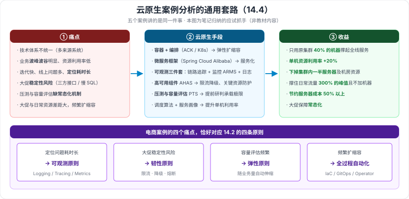

# 14.4 云原生架构案例分析

> 来源：网络取材（主线索 lcp0578/book-note 仓库 chapter14.md，见 CLAUDE.md「网络取材来源」）· 对应《系统架构设计师教程（第二版）》第 14 章 · 第 4 节
>
> 📌 **主线索本节完全空白**（只有标题）。全部内容为 (检索补充)，来源：[博客园·LXNRM（第 14 章全章笔记）](https://www.cnblogs.com/LXNRM/articles/18226107)（给出五个案例的名称）、[CSDN·某旅行公司云原生改造](https://blog.csdn.net/huaqianzkh/article/details/139387629)、[CSDN·某电商业务云原生改造](https://blog.csdn.net/huaqianzkh/article/details/139454030)。
> ⚠️ 五个案例中**只拿到两个的内容**，另三个未获得（见存疑）。

---

## 一句话概括

五个案例讲的是同一件事：**业务波动大 / 迭代慢 / 稳定性差 / 资源浪费 → 用容器 + 微服务 + 可观测 + 弹性 → 省钱、扛住峰值、加快迭代。**

---

## 一、本节包含的五个案例 🟢

| # | 案例 |
| --- | --- |
| 1 | **某旅行公司云原生改造** |
| 2 | **云原生技术助力某汽车公司数字化转型实践** |
| 3 | **某快递公司核心业务系统改造** |
| 4 | **某电商业务改造** |
| 5 | **某体育用品公司基于云原生的业务中台构建** |

---

## 二、案例一：某旅行公司云原生改造 🟡

### 改造前的两个问题

| 问题 | 说明 |
| --- | --- |
| **技术体系不统一** | **两个前身公司**各自有**不同技术体系**的构建、发布等系统，需要在技术层面**收敛** |
| **业务波动性大** | 在线旅行业务在**节假日、每日时段**上都有突出的**波峰波谷**特性，对技术资源整体利用率影响很大 |

### 改造效果（分两阶段）

| 阶段 | 效果 |
| --- | --- |
| **第一阶段** | 订单业务仅用**之前独享机器集群 40% 的机器**完成全线服务支撑；**单机资源利用率提升 20%**；**下掉了集群内一半的服务器**及相应机房资源 |
| **第二阶段** | 支持**屡次创纪录的峰值流量且无需新增机器**；成功撑住**爆款应用带来的日常流量 300% 的峰值流量** |

> 🟢 技术要点：涉及**调度算法**与**自研的服务画像技术**（作为调度属性）。
>
> 📎 对应 14.2 的 **弹性原则**——**部署规模随业务量自动伸缩、无需事先容量规划**。

---

## 三、案例四：某电商业务云原生改造 🟡

### 改造前的四个问题

1. **开发运维压力**：系统开发迭代快，**线上问题较多**，**定位问题耗时长**
2. **稳定性风险**：频繁大促，稳定性保障压力大，**第三方接口和慢 SQL** 存在导致严重线上故障的风险
3. **容量评估缺陷**：压测与系统容量评估工作**相对频繁**，**缺乏常态化机制**支撑
4. **资源成本**：大促所需资源与日常资源**相差较大**，需要**频繁扩缩容**

### 改造方案用到的技术

**容器服务 ACK · Spring Cloud Alibaba · 性能测试服务 PTS · 应用高可用服务 AHAS · 链路追踪 · 应用实时监控服务 ARMS**

### 改造效果

| 维度 | 效果 |
| --- | --- |
| **高可用** | 利用 **AHAS 限流降级**功能对关键资源防护，确保大促平稳 |
| **容量评估** | 通过 **PTS + ARMS** 做单机与整体容量评估，**提前研判业务承载极限** |
| **大促保障** | 建立标准流程与应急机制，实现**大促保障常态化** |
| **成本优化** | 利用容器**快速弹性扩缩容**，**节约服务器成本 50% 以上** |

> 📎 四个问题恰好对应 14.2 的四条原则：**定位问题耗时长 → 可观测；稳定性风险 → 韧性；容量评估 → 弹性；频繁扩缩容 → 所有过程自动化。**

---

## 四、案例的通用套路（应试抓手）🟡

> 两个案例可以抽象成同一条链路，**论文与案例分析题都能套用**：

| 环节 | 常见内容 |
| --- | --- |
| **① 痛点** | 技术体系不统一 · 业务波峰波谷明显 · 迭代快问题定位慢 · 大促稳定性风险 · 资源浪费 |
| **② 云原生手段** | **容器 + 编排**（弹性扩缩容）· **微服务框架**（服务化）· **可观测三件套**（链路追踪 + 监控 + 日志）· **高可用组件**（限流降级）· **压测与容量评估** |
| **③ 收益** | **资源利用率提升**（如单机 +20%）· **服务器/成本下降**（如减半、省 50%）· **扛住数倍峰值流量**（如 300%）· **保障常态化** |

---

---

## 记忆钩子

- **案例通用三段式**：**痛点（波动/慢/不稳/浪费）→ 手段（容器弹性 + 微服务 + 可观测 + 限流降级）→ 收益（省钱 + 扛峰值 + 常态化）**。
- **旅行公司的两个数字**：**只用 40% 的机器、单机利用率 +20%、下掉一半服务器**；**撑住日常流量 300% 的峰值**。
- **电商的一个数字**：**节约服务器成本 50% 以上**。
- **电商四个痛点对应四条原则**：**定位慢→可观测 · 不稳定→韧性 · 容量评估→弹性 · 频繁扩缩容→全过程自动化**。

## 待核对 · 存疑

- ⚠️ **主线索本节完全空白**（只有标题），全部内容为检索补充。
- ⚠️ **五个案例只获得两个的内容**（旅行公司、电商）；**某汽车公司数字化转型、某快递公司核心业务系统改造、某体育用品公司业务中台建设三个案例的内容未获得**，是本章最大缺口。
- ⚠️ 已获得的两个案例均为**单一来源**，各项数字（40%、20%、一半、300%、50%）**未与教材核实**。
- ⚠️ 「案例的通用套路」一节是**本笔记自行归纳的应试抓手，非教材内容**，已明确标注。
- ⚠️ 案例分析类小节在综合知识科目中通常权重较低，本节整体定 🟡/🟢，未设 🔴。

## 关键词

`云原生改造` `技术体系收敛` `波峰波谷` `资源利用率` `峰值流量` `业务中台` `ACK` `Spring Cloud Alibaba` `PTS` `AHAS` `ARMS` `限流降级` `容量评估` `大促保障常态化`
