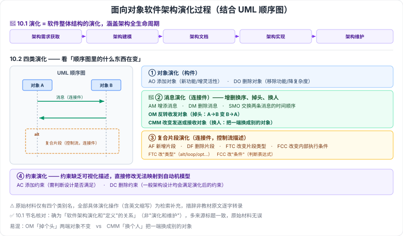

# 10.1–10.2 软件架构演化和定义的关系 · 面向对象软件架构演化过程

> 来源：网络取材（主线索 lcp0578/book-note 仓库 chapter10.md，见 CLAUDE.md「网络取材来源」）· 对应《系统架构设计师教程（第二版）》第 10 章 · 第 1–2 节
>
> ✅ **节名核对说明**：10.1 的标题是「软件架构演化和**定义**的关系」（不是"演化和维护"）——虽然本章章名为"演化和维护"，但该节讲的是"演化"与"软件架构**定义/生命周期**"的关系，多个独立来源（[博客园·辣香牛肉面](https://www.cnblogs.com/LXNRM/articles/18226099)、[CSDN·g984160547](https://blog.csdn.net/g984160547/article/details/140522109)）标题一致，**原始材料无误**。
>
> ⚠️ 10.1 原始材料仅一句话（演化的重要性三条为检索补充）；10.2 原始材料**只有四个类别名**，全部具体演化操作为检索补充（[CSDN·z2014z](https://blog.csdn.net/z2014z/article/details/142421584)），措辞非教材原文逐字转录。

---

# 10.1 软件架构演化和定义的关系

## 核心命题 🔴（原文）

**软件架构的演化就是软件整体结构的演化**，演化过程**涵盖软件架构的全生命周期**，包括：

**软件架构需求的获取 → 软件架构建模 → 软件架构文档 → 软件架构实现 → 软件架构维护**

> 这句话把"演化"和第 7 章的"架构生命周期"直接绑定：演化不是某一个阶段的事，而是贯穿全生命周期的（参见 [[7.1-软件架构概念]]）。

## 架构演化的重要性三条 🟡（检索补充）

1. 软件架构作为软件系统的**骨架**支撑着整个软件系统，是软件系统具备诸多好特性的重要保障。
2. 软件架构作为**软件蓝图**，为人们宏观管控软件系统的整体复杂性和变化性提供了一条有效途径——基于软件架构进行的**检测和修改成本相对较低**。
3. 软件架构的演化可以更好地保证软件演化的**一致性和正确性**，明显降低软件演化的成本。

---

# 10.2 面向对象软件架构演化过程 🟡

面向对象软件架构的演化过程主要**结合 UML 顺序图**，从四个方面展开（原文给出四个类别名，具体操作为检索补充）：

| 类别 | 在架构中的角色 | 具体演化操作 |
| --- | --- | --- |
| **对象演化** | 构件 | AO / DO |
| **消息演化** | 连接件 | AM / DM / SMO / OM / CMM |
| **复合片段演化** | 连接件 | AF / DF / FTC / FCC |
| **约束演化** | — | AC / DC |

## 1. 对象演化（构件）

在顺序图中，构件的实体就是**对象**。会对架构设计的动态行为产生影响的演化只有两种：

| 缩写 | 全称 | 含义 |
| --- | --- | --- |
| **AO** | AddObject | 添加新对象——实现新功能或增加架构灵活性 |
| **DO** | DeleteObject | 删除现有对象——移除功能或降低架构复杂度 |

## 2. 消息演化（连接件）🔴

| 缩写 | 全称 | 含义 |
| --- | --- | --- |
| **AM** | AddMessage | 增添一条新消息——对象之间需要增加新的交互行为时 |
| **DM** | DeleteMessage | 删除消息——移除交互行为 |
| **SMO** | SwapMessageOrder | **交换两条消息的时间顺序**——需要改变两个交互行为之间关系时 |
| **OM** | OverturnMessage | **反转消息的发送对象与接收对象**——需要修改某个交互行为本身时 |
| **CMM** | ChangeMessageModule | **改变消息的发送或接收对象**——需要修改某个交互行为本身时 |

> **易混辨析**：**OM 是"掉个头"**（原来 A→B，变成 B→A，两端还是这两个对象）；**CMM 是"换个人"**（把发送方或接收方换成另一个对象）。

## 3. 复合片段演化（连接件）

复合片段是**对象交互关系的控制流描述**，属于连接件范畴。

| 缩写 | 全称 | 含义 |
| --- | --- | --- |
| **AF** | AddFragment | 在消息上新增复合片段——增添新的控制流 |
| **DF** | DeleteFragment | 删除复合片段——移除控制流 |
| **FTC** | FragmentTypeChange | 改变复合片段**类型**——改变控制流 |
| **FCC** | FragmentConditionChange | 改变复合片段内部**执行条件** |

## 4. 约束演化

约束**缺乏可视化描述**，直接修改无法映射到自动机模型。

| 缩写 | 全称 | 含义 |
| --- | --- | --- |
| **AC** | AddConstraint | 直接添加新约束信息，需判断设计是否满足 |
| **DC** | DeleteConstraint | 直接移除约束信息，一般架构设计均会满足演化后的约束 |

> ⚠️ 检索来源提到"任何演化都可能产生**波及效应**，需要全面验证架构的正确性和时态属性"，原文未见此句，作为背景了解。

---

---

## 记忆钩子

- 10.1 一句话：**演化 = 整体结构的演化，覆盖架构全生命周期**（需求获取→建模→文档→实现→维护）。
- 10.2 四类演化按"UML 顺序图里的什么东西在变"来记：**对象**在变（构件）→ **消息**在变（连接件）→ **复合片段**在变（控制流，也是连接件）→ **约束**在变（看不见的规则）。
- 消息演化五操作记"**增删换序、掉头、换人**"：AM 增、DM 删、SMO 换序、OM 掉头（收发两端对调）、CMM 换人（换掉一端的对象）。

## 关键词

`软件架构演化` `架构全生命周期` `面向对象架构演化` `UML顺序图` `对象演化` `AO` `DO` `消息演化` `AM` `DM` `SMO` `OM` `CMM` `复合片段演化` `AF` `DF` `FTC` `FCC` `约束演化` `AC` `DC`
