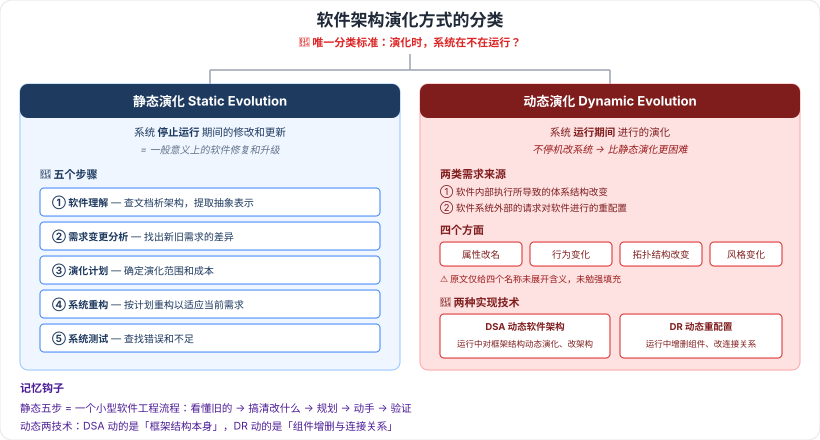

# 10.3 软件架构演化方式的分类

> 来源：网络取材（主线索 lcp0578/book-note 仓库 chapter10.md，见 CLAUDE.md「网络取材来源」）· 对应《系统架构设计师教程（第二版）》第 10 章 · 第 3 节
>
> ✅ 本节原始材料**内容最完整**（静态演化五步骤、动态演化四方面与两项技术均为原文），标 (检索补充) 的少数条目来自 [腾讯云·架构师之路](https://cloud.tencent.cn/developer/article/2323746)、[CSDN·huaqianzkh](https://blog.csdn.net/huaqianzkh/article/details/137837446)。

---

## 分类标准 🔴（原文）

针对软件架构的演化过程**是否处于系统运行时期**，将软件架构演化分为：

| 类型 | 定义 |
| --- | --- |
| **静态演化** (Static Evolution) | 系统**停止运行期间**的修改和更新，即一般意义上的**软件修复和升级** |
| **动态演化** (Dynamic Evolution) | 系统**运行期间**进行的演化 |

> 一句话记牢：**分类的唯一标准是"演化时系统在不在跑"。**

---

## 10.3.1 软件架构静态演化 🔴

### 五个步骤（原文完整）

| # | 步骤 | 要点 |
| --- | --- | --- |
| 1 | **软件理解** | 查阅软件文档，分析软件架构，识别系统组成元素及其相互关系，**提取系统的抽象表示形式** |
| 2 | **需求变更分析** | 静态演化往往由**用户需求变化、系统运行出错、运行环境改变**引起，需找出新需求与原有需求的差异 |
| 3 | **演化计划** | 分析原系统，**确定演化范围和成本**，选择合适的演化计划 |
| 4 | **系统重构** | 根据演化计划对系统进行重构，使之适应当前的需求 |
| 5 | **系统测试** | 对演化后的系统进行测试，查找其中的错误和不足之处 |

> 记忆钩子：**理解 → 分析 → 计划 → 重构 → 测试**，本质上就是一个小型的软件工程流程（先看懂旧的，再搞清要改什么，再规划，再动手，最后验证）。

⚠️ 检索补充：静态演化需求分两类——**设计时演化需求**（架构开发和实现过程中对原有架构的调整）与**运行前演化需求**（软件发布后因运行环境变化而做的修改升级）。原文未见此二分，作为背景了解。

⚠️ 原文此处配有"静态演化过程模型"图片（StaticEvolution.png）无文字说明，图中内容未知。

---

## 10.3.2 软件架构动态演化 🔴

### 两类需求来源（原文）

1. 软件**内部执行**所导致的体系结构改变
2. 软件系统**外部的请求**对软件进行的重配置

### 动态演化的四个方面（原文）

| 方面 | 含义 |
| --- | --- |
| **属性改名** | — |
| **行为变化** | — |
| **拓扑结构改变** | — |
| **风格变化** | — |

> ⚠️ 原文仅给出四个名称，未展开具体含义，检索也未找到可靠的教材级展开，**未勉强填充**。四个词按字面理解即可：改属性 → 改行为 → 改结构（连接关系）→ 改风格（整体范式）。

### 实现动态演化的两种技术 🔴（原文列出名称，含义为检索补充）

| 技术 | 全称 | 含义（检索补充） |
| --- | --- | --- |
| **DSA** | Dynamic Software Architecture（动态软件架构） | 允许在**运行过程中对框架结构做动态演化、对架构进行修改** |
| **DR** | Dynamic Reconfiguration（动态重配置） | 允许在**运行过程中增加删除组件、修改连接关系**等 |

⚠️ 检索补充（原文未见）：
- DSA 的基本实现原理——使 DSA 在可运行应用系统中以一类**有状态、有行为、可操作的实体**显式表示出来，并被整个运行环境共享，作为系统运行的依据。
- 动态重配置模式包括：**主从模式、中央控制模式、客户端/服务器模式、分布式控制模式**（单一来源，可信度中等）。

---

## 静态 vs 动态 辨析 🔴

| 对比角度 | 静态演化 | 动态演化 |
| --- | --- | --- |
| 系统状态 | **停止运行**期间 | **运行**期间 |
| 通俗理解 | 一般意义的软件**修复和升级** | 不停机改系统 |
| 难度 | 相对容易 | **更困难**（要在不停止系统功能的前提下完成） |
| 关键内容 | 五步骤（理解/需求变更分析/计划/重构/测试） | 四方面（属性改名/行为变化/拓扑结构改变/风格变化）+ 两技术（DSA/DR） |

---

---

## 记忆钩子

- 分类标准只有一条：**演化的时候系统在不在运行**。停机改 = 静态，边跑边改 = 动态。
- 静态演化五步骤：**理解 → 分析 → 计划 → 重构 → 测试**（看懂旧的 → 搞清改什么 → 规划 → 动手 → 验证）。
- 动态演化两技术记"**DSA 改架构、DR 改配置**"：DSA 动的是框架结构本身，DR 动的是组件增删与连接关系。

## 关键词

`静态演化` `动态演化` `软件理解` `需求变更分析` `演化计划` `系统重构` `系统测试` `属性改名` `行为变化` `拓扑结构改变` `风格变化` `DSA` `动态软件架构` `DR` `动态重配置`
