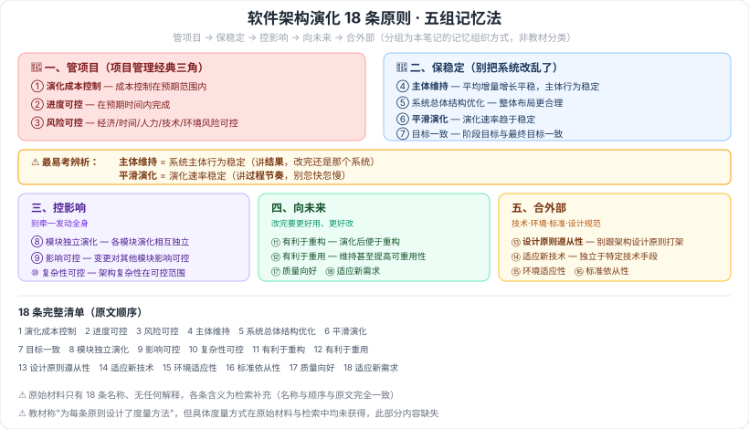

# 10.4 软件架构演化原则

> 来源：网络取材（主线索 lcp0578/book-note 仓库 chapter10.md，见 CLAUDE.md「网络取材来源」）· 对应《系统架构设计师教程（第二版）》第 10 章 · 第 4 节
>
> ⚠️ 原始材料**只有 18 条原则的名称**，无任何解释。各条含义为检索补充（[CSDN·baidu_39879830](https://blog.csdn.net/baidu_39879830/article/details/138400551) 等），措辞非教材原文逐字转录，但 18 条的**名称与顺序与原始材料完全一致**，可信度较高。
>
> ⚠️ 检索来源提到教材"为每条原则设计了简单而有效的**度量方法**"，原始材料与检索均未给出具体度量方式，此部分内容缺失。

---

## 总览 🟡

本节提出 **18 条**架构演化的核心原则，并为每条原则设计了度量方法，用于从系统整体层面评估和指导架构演化。

> **应试策略**：18 条逐条死记性价比低，多数原则**顾名思义**。建议按下面的分组理解，重点记住分组逻辑和几条名字不那么直白的（主体维持、平滑演化、设计原则遵从性）。

---

## 分组记忆（本总结的组织方式，非教材分类）

### 一、项目管理三要素：成本 / 进度 / 风险 🔴

| # | 原则 | 含义 |
| --- | --- | --- |
| 1 | **演化成本控制原则** | 演化成本要控制在预期的范围之内 |
| 2 | **进度可控原则** | 架构演化要在预期的时间内完成 |
| 3 | **风险可控原则** | 演化中的**经济、时间、人力、技术、环境**风险在可控范围内 |

> 这三条对应项目管理的经典三角（成本-进度-风险），最容易记。

### 二、稳定性：别把系统改乱了 🔴

| # | 原则 | 含义 |
| --- | --- | --- |
| 4 | **主体维持原则** | 软件演化的**平均增量的增长须保持平稳**，保证软件系统**主体行为稳定** |
| 5 | 系统总体结构优化原则 | 使演化后的软件系统整体结构（布局）**更加合理** |
| 6 | **平滑演化原则** | 软件的**演化速率趋于稳定** |
| 7 | 目标一致原则 | 架构演化的**阶段目标和最终目标要一致** |

> ⚠️ **易混**：**主体维持**说的是"系统主体行为稳定"（改的过程中系统还是那个系统）；**平滑演化**说的是"演化速率稳定"（改的节奏别忽快忽慢）。一个讲**结果**，一个讲**过程节奏**。

### 三、影响面控制：别牵一发动全身 🟡

| # | 原则 | 含义 |
| --- | --- | --- |
| 8 | 模块独立演化原则 | 软件中各模块自身的演化最好**相互独立** |
| 9 | 影响可控原则 | 一个模块发生变更，给**其他模块带来的影响在可控范围内** |
| 10 | 复杂性可控原则 | 必须控制架构的复杂性，保障软件复杂性在可控范围内 |

### 四、面向未来：改完要更好用、更好改 🟡

| # | 原则 | 含义 |
| --- | --- | --- |
| 11 | 有利于重构原则 | 使演化后软件架构**便于重构** |
| 12 | 有利于重用原则 | 演化最好能维持、甚至**提高整体架构的可重用性** |
| 17 | 质量向好原则 | 使所关注的某个质量指标或质量指标的综合效果**变得更好** |
| 18 | 适应新需求原则 | 很容易适应**新的需求变更** |

### 五、外部符合性：技术、环境、标准、设计规范 🟡

| # | 原则 | 含义 |
| --- | --- | --- |
| 13 | **设计原则遵从性原则** | 架构演化最好**不能与架构设计原则冲突** |
| 14 | 适应新技术原则 | 软件要**独立于特定的技术手段**，可运行于不同平台 |
| 15 | 环境适应性原则 | 演化后的软件版本比较容易适应**新的硬件环境和软件环境** |
| 16 | 标准依从性原则 | 演化**不违背相关质量标准** |

---

## 18 条完整清单（按原文顺序，便于对照）

1. 演化成本控制原则
2. 进度可控原则
3. 风险可控原则
4. 主体维持原则
5. 系统总体结构优化原则
6. 平滑演化原则
7. 目标一致原则
8. 模块独立演化原则
9. 影响可控原则
10. 复杂性可控原则
11. 有利于重构原则
12. 有利于重用原则
13. 设计原则遵从性原则
14. 适应新技术原则
15. 环境适应性原则
16. 标准依从性原则
17. 质量向好原则
18. 适应新需求原则

---

---

## 记忆钩子

- 18 条按**五组**记，比逐条背高效得多：**管项目**（成本/进度/风险）→ **保稳定**（主体维持/结构优化/平滑演化/目标一致）→ **控影响**（模块独立/影响可控/复杂性可控）→ **向未来**（利于重构/利于重用/质量向好/适应新需求）→ **合外部**（设计原则/新技术/环境/标准）。
- 最容易考辨析的一组：**主体维持**（系统主体行为稳定，讲结果）vs **平滑演化**（演化速率稳定，讲节奏）。
- 名字最不直白的一条：**设计原则遵从性原则**——意思很简单，就是"演化别跟原来的架构设计原则打架"。

## 关键词

`软件架构演化原则` `演化成本控制` `进度可控` `风险可控` `主体维持` `系统总体结构优化` `平滑演化` `目标一致` `模块独立演化` `影响可控` `复杂性可控` `有利于重构` `有利于重用` `设计原则遵从性` `适应新技术` `环境适应性` `标准依从性` `质量向好` `适应新需求`
