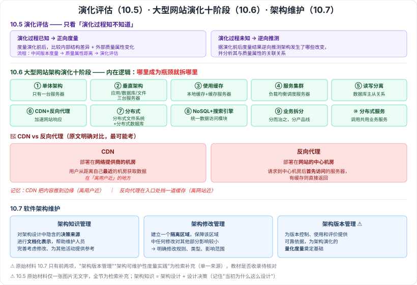

# 10.5–10.7 演化评估方法 · 大型网站架构演化实例 · 软件架构维护

> 来源：网络取材（主线索 lcp0578/book-note 仓库 chapter10.md，见 CLAUDE.md「网络取材来源」）· 对应《系统架构设计师教程（第二版）》第 10 章 · 第 5–7 节
>
> ⚠️ 10.5 原始材料**只有一张图片引用**（ArchitecturalEvolutionAssessment.png）无任何文字，全节为检索补充（[博客园·辣香牛肉面](https://www.cnblogs.com/LXNRM/articles/18226099)）。10.6 原始材料完整（十阶段），直接采用。10.7 原始材料只有两段（架构知识管理、架构修改管理），**遗漏了架构版本管理等内容**，已按检索补充并标注。

---

# 10.5 软件架构演化评估方法 🟡

按**演化过程是否已知**分两类（检索补充，原文仅图片）：

| 类型 | 做法 |
| --- | --- |
| **演化过程已知**的评估 | 对架构演化**前后进行度量**，比较内部结构差异和外部质量属性变化 |
| **演化过程未知**的评估 | 根据架构演化前后的度量结果**逆向推测**出架构发生了哪些改变，并分析这些改变与架构相关质量属性的关联关系 |

## 演化过程已知时的基本流程（三步）

**架构演化中间版本度量 → 架构质量属性距离 → 架构演化评估**

用途：架构修改**影响分析**、**监控**演化过程、分析**关键**演化过程。

> ⚠️ 原文的图片标题为"**演化过程未知**时的架构演化评估过程示意图"，说明教材至少对"未知"这一类配有流程图；上述"已知/未知"二分与三步流程均为检索补充，教材原文措辞与图中细节未能核实。

---

# 10.6 大型网站系统架构演化实例 🟡

一条从单机到分布式的完整演进路线（原文完整，十个阶段）：

| 阶段 | 名称 | 关键动作 |
| --- | --- | --- |
| 一 | **单体架构** | 只有一台服务器 |
| 二 | **垂直架构** | 拆成三台：**应用服务器 + 数据库服务器 + 文件服务器** |
| 三 | 使用缓存改善网站性能 | **本地缓存** + 专门的**缓存服务器** |
| 四 | 使用服务集群改善并发处理能力 | 引入**负载均衡调度服务器** |
| 五 | **数据库读写分离** | 配置两台数据库的**主从关系** |
| 六 | 使用**反向代理和 CDN** 加速响应 | 见下方辨析 |
| 七 | 使用**分布式文件系统和分布式数据库** | — |
| 八 | 使用 **NoSQL 和搜索引擎** | 非关系数据库（NoSQL）+ 非数据库查询技术（搜索引擎）；应用服务器通过**统一数据访问模块**访问各种数据 |
| 九 | **业务拆分** | 用**分而治之**的手段把整个网站业务分成不同的**产品线** |
| 十 | **分布式服务** | 通过**分布式服务调用共用业务服务**完成具体业务操作 |

## 🔴 CDN vs 反向代理（原文明确对比，最可能考）

| | 部署位置 | 作用 |
| --- | --- | --- |
| **CDN** | 部署在**网络提供商的机房** | 用户请求网站服务时，可从**距离自己最近**的网络提供商机房获取数据 |
| **反向代理** | 部署在**网站的中心机房** | 用户请求到达中心机房后**首先访问**的服务器；若反向代理中缓存着用户请求的资源，直接返回给用户 |

> 记忆抓手：**CDN 在"离用户近"的地方，反向代理在"离网站近"的地方**——一个把内容推到边缘，一个在入口处挡一道缓存。

---

# 10.7 软件架构维护 🟡

## 组成部分

| 组成 | 内容 |
| --- | --- |
| **架构知识管理**（原文） | 对架构设计中所**隐含的决策来源**进行**文档化表示**，进而在架构维护过程中帮助维护人员对架构的修改进行完善的考虑，并能为其他软件架构的相关活动提供参考 |
| **架构修改管理**（原文） | 主要做法是**建立一个隔离区域**，保障该区域中任何修改对其他部分的影响比较小、甚至没有影响；为此需要明确**修改规则、修改类型，以及可能的影响范围和副作用** |
| **架构版本管理**（⚠️ 检索补充） | 为演化的版本控制、使用和评价提供可靠依据，为架构演化的**量化度量**奠定基础 |
| **架构可维护性度量实践**（⚠️ 检索补充） | 教材中有此内容，但检索到的笔记也未展开具体度量方式 |

⚠️ **原始材料只有前两项**（架构知识管理、架构修改管理），后两项为检索补充（单一来源），教材是否收录及具体内容待核对。

> **架构知识 = 架构设计 + 设计决策**（检索补充）——知识管理的价值在于把"**当初为什么这么设计**"记录下来，否则后来的维护者只能看到结果、看不到理由。

---

---

## 记忆钩子

- 10.5 二分只看一件事：**演化过程知不知道**。知道 → 正向度量前后对比；不知道 → 靠度量结果**逆向推测**改了什么。
- 10.6 十阶段的内在逻辑是"**哪里成为瓶颈就拆哪里**"：一台机器不够 → 拆服务（二）→ 读慢 → 加缓存（三）→ 并发不够 → 加集群（四）→ 数据库扛不住 → 读写分离（五）→ 用户远 → CDN/反向代理（六）→ 单库单文件系统不够 → 分布式（七）→ 关系库不擅长的场景 → NoSQL/搜索引擎（八）→ 业务太杂 → 拆业务（九）→ 服务复用 → 分布式服务（十）。
- 10.7 三件事：**知识管理**（记住为什么这么设计）、**修改管理**（建隔离区，控制影响）、**版本管理**（为量化度量打基础）。

## 关键词

`架构演化评估` `演化过程已知` `演化过程未知` `质量属性距离` `单体架构` `垂直架构` `缓存` `服务集群` `负载均衡` `读写分离` `CDN` `反向代理` `分布式文件系统` `NoSQL` `搜索引擎` `业务拆分` `分布式服务` `架构知识管理` `架构修改管理` `架构版本管理` `隔离区域`
