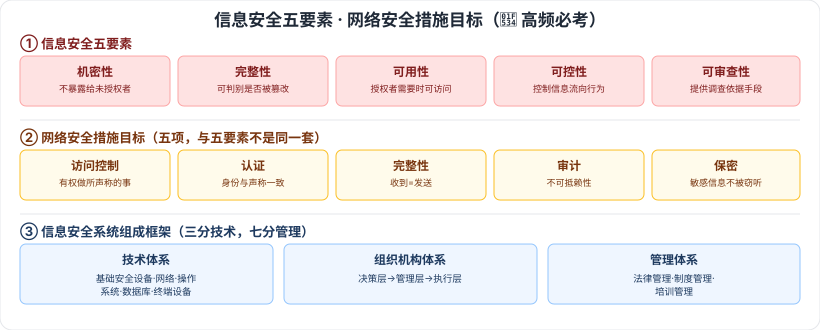

# 4.1 信息安全基础知识 · 4.2 信息系统安全的作用与意义 · 4.3 信息安全系统的组成框架

> 来源：网络取材（主线索 lcp0578/book-note 仓库 + 检索资料交叉印证，见 CLAUDE.md「网络取材来源」）· 对应《系统架构设计师教程（第二版）》第 4 章 · 第 1–3 节

## 一句话概括

信息安全五要素（机密性/完整性/可用性/可控性/可审查性）+ 网络安全措施目标五项（访问控制/认证/完整性/审计/保密）是本章开篇的**高频必考点**，检索确认反复出现在真题中；信息安全系统组成框架 = 技术体系 + 组织机构体系（决策/管理/执行三层）+ 管理体系（法律/制度/培训，"三分技术七分管理"）。

---

## 4.1 信息安全基础知识

### 4.1.1 信息安全的概念

🔴 **信息安全五要素**（检索确认历年真题高频必考，常与"不可否认性"作混淆项一起考）：

| 要素 | 定义 |
| --- | --- |
| 🔴 机密性 | 确保信息不暴露给未授权的实体或进程 |
| 🔴 完整性 | 只有得到允许的人才能修改数据，并且能够判别出数据是否已被篡改 |
| 🔴 可用性 | 得到授权的实体在需要时可访问数据，即攻击者不能占用所有资源而阻碍授权者的工作 |
| 🔴 可控性 | 可以控制授权范围内的信息流向及行为方式 |
| 🔴 可审查性 | 对出现的信息安全问题提供调查的依据和手段 |

🟡 信息安全的范围：**设备安全、数据安全、内容安全、行为安全**。

### 4.1.2 信息存储安全

| 方面 | 要点 |
| --- | --- |
| 🟡 信息使用的安全 | 用户的标识与验证；用户存取权限限制（**隔离控制法**、**限制权限法**） |
| 🟢 系统安全监控 | —— |
| 🟢 计算机病毒防治 | —— |

### 4.1.3 网络安全

🟡 网络安全威胁五类：**非授权访问、信息泄露或丢失、破坏数据完整性、拒绝服务功能、利用网络传播病毒**。

🔴 **安全措施的目标**（五项，检索确认与五要素同为高频考点，注意与信息安全五要素区分——这是"网络安全语境"下的五个目标）：

| 目标 | 定义 |
| --- | --- |
| 🔴 访问控制 | 确保会话对方（人或计算机）有权做它所声称的事情 |
| 🔴 认证 | 确保会话对方的资源（人或计算机）与它声称的一致 |
| 🔴 完整性 | 确保接收到的信息与发送的一致 |
| 🔴 审计 | 确保任何发生的交易在事后可以被证实，发信者和收信者都认为交换发生过，即**不可抵赖性** |
| 🔴 保密 | 确保敏感信息不被窃听 |

---

## 4.2 信息系统安全的作用与意义

⚠️ **存疑**：网络取材主线索原文本节完全空白，多方检索（CSDN、腾讯云、知乎）均未找到可信转录内容，判断为综述性描述、非考试重点，各笔记普遍略过。本节暂不填充，待用户翻实体书核对后补充。

---

## 4.3 信息安全系统的组成框架

### 4.3.1 技术体系

🟡 基础安全设备、计算网络安全、操作系统安全、数据库安全、终端设备安全。

### 4.3.2 组织机构体系

⚠️ 原始材料本节空白，以下为检索补充（多个独立来源表述高度一致，供参考）：组织机构体系是信息系统安全的**组织保障系统**，由机构、岗位、人事机构三个模块构成；机构设置分三个层次：**决策层、管理层、执行层**。

### 4.3.3 管理体系

⚠️ 原始材料本节空白，以下为检索补充（多个独立来源表述高度一致，供参考）：管理是信息系统安全的**灵魂**（"三分技术、七分管理"），管理体系由三部分组成：

- **法律管理**：依国家法律法规规范约束系统主体及其外界关联行为
- **制度管理**：依据必要的安全需求制定内部规章制度
- **培训管理**：确保信息系统安全的前提

---

## 记忆钩子

- 信息安全五要素记口诀：**机（密）完（整）可（用）可（控）可（审）**——"机完可可可"，前三个是经典 CIA 三元组（Confidentiality/Integrity/Availability）扩展，后两个是"管得住、查得出"。
- 安全措施目标五项和五要素**不是同一套**，容易混——安全措施目标多了"认证"、少了"可控性/可审查性"，重叠的是完整性；审计目标的核心是"不可抵赖性"。
- 组成框架"技术+组织+管理"对应"**用什么防、谁来防、靠什么管**"。

## 关键词

`信息安全五要素` `机密性` `完整性` `可用性` `可控性` `可审查性` `安全措施目标` `访问控制` `认证` `审计` `不可抵赖性` `保密` `组织机构体系` `管理体系`
